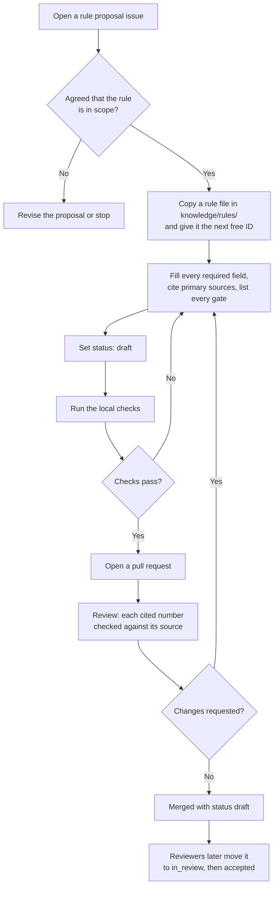

# Contributing

Thanks for helping. The project is in its documentation phase: the design is being written down before code. That makes some contributions especially useful right now.

## Useful right now

- **Check the evidence.** Pick a claim in the [claim verification](docs/research/claim-verification.md) and confirm or correct it against the primary source.
- **Propose a rule.** Suggest a food interaction with human dose-response evidence. See [Proposing a rule](#proposing-a-rule).
- **Challenge a rule.** If a rule overstates its evidence, open an [evidence challenge](https://github.com/dev-nobytes-io/Grocy-Bioavaiability-and-Interactions-Reccomendation-Engine/issues/new?template=evidence_challenge.yml).
- **Verify a data source licence.** Several entries in the [licence manifest](knowledge/sources/license-manifest.yaml) are marked unverified.
- **Answer or sharpen an open question.** See [docs/open-questions.md](docs/open-questions.md).
- **Describe your Grocy setup.** How many products, how many with barcodes, whether you track quantities. Leave out anything personal.

## Before you start

1. Read [SAFETY.md](SAFETY.md). It sets the boundary for every change.
2. Read the [product principles](docs/product/principles.md).
3. For anything larger than a fix, open an issue first so the approach can be agreed.

## Never post health data

Do not put your own or anyone else's health information, lab results, medication lists or genetic data in an issue, pull request or commit. Use made-up examples.

## Proposing a rule

A rule is a curated, evidence-graded statement about how one food component changes the effect of another. Rules are the only thing that can produce a suggestion. See [the rule model](docs/architecture/rule-model.md) and the [evidence policy](docs/science/evidence-policy.md).

1. Open a [rule proposal issue](https://github.com/dev-nobytes-io/Grocy-Bioavaiability-and-Interactions-Reccomendation-Engine/issues/new?template=rule_proposal.yml) and get agreement that the rule is in scope.
2. Copy an existing file in `knowledge/rules/` and give it the next free ID.
3. Fill in every required field. Cite primary sources by PubMed identifier (PMID) or digital object identifier (DOI). Give the dose that produced the effect and the population it was measured in.
4. List every safety gate that applies. When unsure, add the gate. A reviewer can remove it with evidence.
5. Set `status: draft`. Reviewers move it forward.
6. Run the checks below and open a pull request.

This flowchart shows the path a new rule takes from idea to accepted rule.



## Decision records

Significant changes need a decision record. [GOVERNANCE.md](GOVERNANCE.md) lists what counts. Copy [the template](docs/decisions/template.md), number it with the next free number, and set its status to Proposed.

## Writing style

- Plain English. Short sentences.
- Expand an abbreviation the first time a document uses it. Add new terms to the [glossary](docs/glossary.md).
- Cite sources with links. A number without a source will be removed.
- Mark anything undecided as **Proposed** and link the related open question.

## Local checks

The same checks run in continuous integration on every pull request. The workflow is [checks.yml](.github/workflows/checks.yml).

```sh
# Validate knowledge files against their schemas
pip install check-jsonschema
check-jsonschema --schemafile knowledge/schema/rule.schema.json knowledge/rules/*.yaml
check-jsonschema --schemafile knowledge/schema/gates.schema.json knowledge/gates/gates.yaml
check-jsonschema --schemafile knowledge/schema/sources.schema.json knowledge/sources/license-manifest.yaml
check-jsonschema --schemafile knowledge/schema/profile.schema.json knowledge/examples/*.yaml

# Check relative links and anchors
python3 scripts/check_links.py

# Lint Markdown
npx --yes markdownlint-cli2@0.23.3 "**/*.md"

# Render every Mermaid diagram (needs the Mermaid CLI and a Chromium browser)
npm install -g @mermaid-js/mermaid-cli
python3 scripts/check_mermaid.py
```

## Pull requests

- Keep each pull request to one purpose.
- Use a short, imperative subject line, such as "Add tea timing rule".
- Fill in the pull request template, including the conflict-of-interest line.
- Expect review comments on evidence. They are about the source, not about you.

## Licensing of contributions

By contributing you agree that your contribution is licensed under the same terms as the directory it lands in. That is [Apache-2.0](LICENSE) outside `knowledge/` and [Creative Commons Attribution 4.0 (CC BY 4.0)](knowledge/LICENSE) inside it. There is no separate contributor agreement.

Do not paste data from sources whose licence forbids redistribution. The [data sources](docs/architecture/data-sources.md) page lists which are which.
