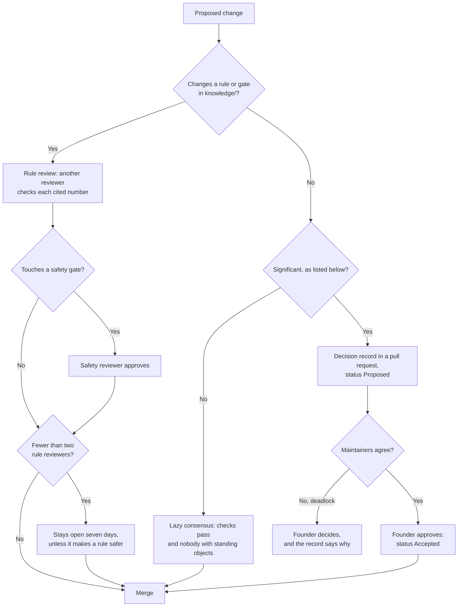

# Governance

This project is founder-led while it is small. This page says who decides what, how decisions are recorded, and how that changes as more people join.

## Roles

| Role | Who | Can do |
|---|---|---|
| **Founder and lead maintainer** | [@dev-nobytes-io](https://github.com/dev-nobytes-io) | Final say on scope, architecture, safety policy and governance. Merges any change. |
| **Maintainer** | Appointed by the founder | Reviews and merges changes in their area. Triages issues. |
| **Rule reviewer** | Anyone with relevant expertise who has reviewed at least three rule changes well | Reviews changes to `knowledge/`. Their approval counts toward the rule-review requirement below. |
| **Safety reviewer** | A maintainer or rule reviewer named in [CODEOWNERS](.github/CODEOWNERS) for safety files | Must approve any change to safety gates or [SAFETY.md](SAFETY.md). |
| **Contributor** | Anyone | Opens issues and pull requests. |

Today the founder holds every role. The review requirements below still apply, with the time-based fallbacks noted.

## How decisions are made

This flowchart shows the main path each kind of change takes; one change can need more than one path.

**Ordinary changes** such as documentation fixes, small code changes and new issues use lazy consensus. A maintainer merges once checks pass and nobody with standing has objected.

**Significant decisions** get a decision record in [docs/decisions/](docs/decisions/README.md). A decision is significant if it:

- changes the intended purpose in [SAFETY.md](SAFETY.md);
- adds, removes or weakens a safety gate;
- changes the evidence policy;
- adds a data source with a new licence type;
- changes the architecture, storage or primary language;
- changes this governance document.

A decision record starts as **Proposed** in a pull request. It becomes **Accepted** when the founder approves it. Anyone may comment. If maintainers disagree and cannot resolve it, the founder decides and the record says why.

## Knowledge changes

Rules in `knowledge/` can hurt people if they are wrong, so they get stricter review than code. The full process is in the [evidence policy](docs/science/evidence-policy.md). In short:

1. Every new or changed rule cites primary sources by PubMed identifier (PMID) or digital object identifier (DOI).
2. A reviewer other than the author checks each cited number against the source.
3. A change that touches a safety gate needs a safety reviewer's approval.
4. While the project has fewer than two rule reviewers, a rule pull request stays open for seven days before merge so others can check it.
5. A fix that makes a rule *safer*, such as adding a gate or withholding a suggestion, may merge immediately.

## Conflicts of interest

Anyone proposing or reviewing a rule states any financial tie to a supplement, food, testing or nutrition company. The pull request template asks. A tie does not disqualify anyone. Hiding one does.

## Becoming a maintainer or reviewer

Sustained, careful contributions earn nomination. Any maintainer may nominate. The founder approves. Maintainers who are inactive for six months move to emeritus and can return on request.

## Changing this document

Open a pull request with a decision record. The founder approves.

When the project has three or more active maintainers, the founder will propose a move from founder-led decisions to a maintainer vote. That proposal will be its own decision record.

## Related

- [CONTRIBUTING.md](CONTRIBUTING.md): how to contribute
- [CODE_OF_CONDUCT.md](CODE_OF_CONDUCT.md): how to behave
- [SECURITY.md](SECURITY.md) and [SAFETY.md](SAFETY.md): how to report problems
- [Glossary](docs/glossary.md): abbreviations and project terms
