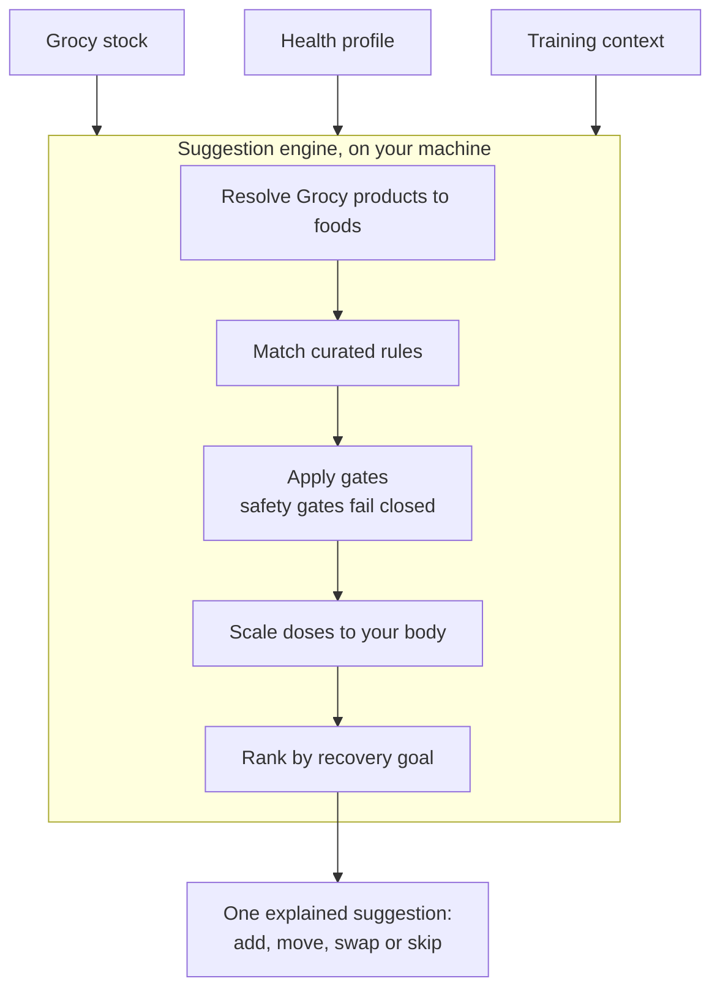
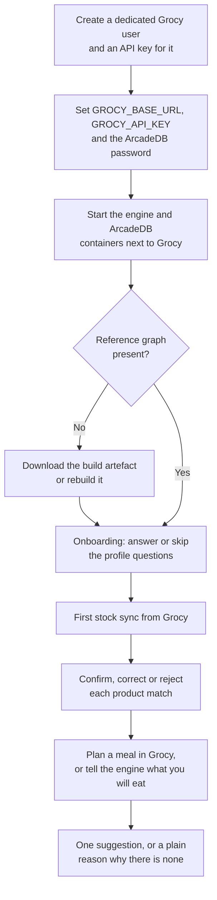
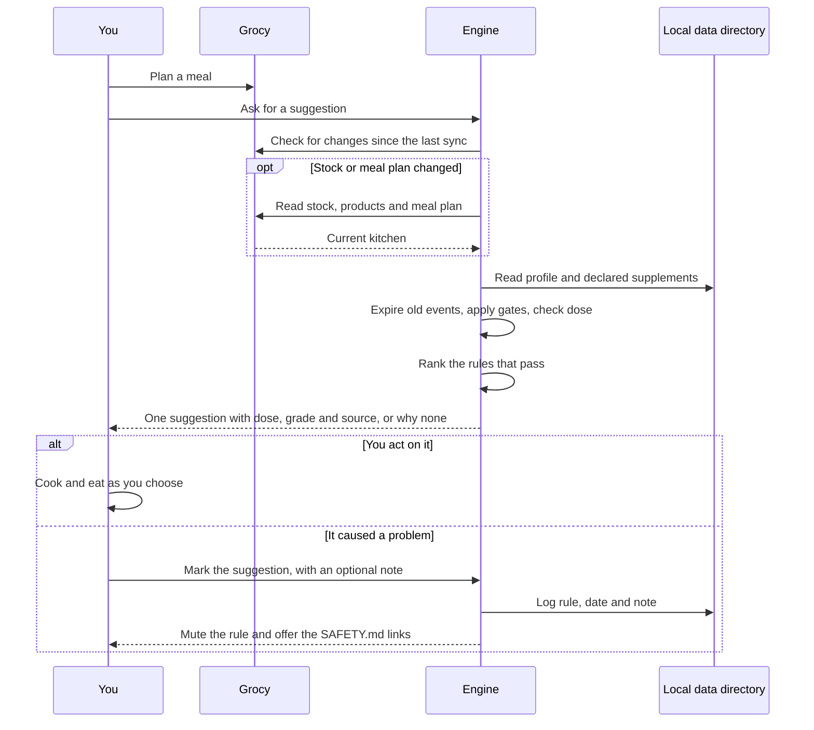

# Grocy Bioavailability and Interactions Recommendation Engine

A self-hosted tool, designed to help people who train recover better using the food already in their own kitchen. It is planned to read your stock from Grocy, a household inventory application, and suggest one small change to a meal, with an evidence grade. It is designed to run on your own machine: your health profile never leaves it, and there is no telemetry.

> [!NOTE]
> **Status: documentation phase.** There is no runnable code yet. The design is being written down and reviewed first. See the [roadmap](docs/product/roadmap.md) for what comes next. New here? Start with [Where to start reading](#where-to-start-reading).

<!-- Two separate callouts. -->

> [!WARNING]
> **Not medical advice.** This project does not diagnose, treat, cure or prevent any disease. Read [SAFETY.md](SAFETY.md) before acting on anything it produces.

**Contents**

- [The idea](#the-idea)
- [How it works](#how-it-works)
- [An example suggestion](#an-example-suggestion)
- [Installation](#installation) (not built yet)
- [Configuration](#configuration) (not built yet)
- [User guide](#user-guide) (not built yet)
- [What is decided](#what-is-decided)
- [Where to start reading](#where-to-start-reading)
- [Contributing](#contributing)
- [Licence](#licence)

## The idea

Recovery means being ready for the next session and still adapting to training. A knowledge graph links foods to the nutrients and compounds they contain. The graph proposes; only curated rules, each with an evidence grade, decide what you see (proposed in architecture decision record (ADR) [0007](docs/decisions/0007-graph-proposes-rules-decide.md)). Your health information (allergies, intolerances, conditions, medicines, supplements, life stage and body measurements) shapes a suggestion but is never the thing being treated. Each suggestion is one of four kinds: **add**, **move**, **swap** or **skip**. It always comes with a dose, a grade and a source.

## How it works

A gate is a check against your health profile that can hold a suggestion back. In the design, gates run before anything is ranked. If a safety gate's question has not been answered, the gate assumes the worst and withholds the suggestion. Tolerance gates, such as lactose intolerance, offer a swap, add a note or withhold ([safety model](docs/science/safety-model.md#evaluation-order)).



## An example suggestion

This example is built from draft rule [R-0006](knowledge/rules/R-0006-post-training-protein-dose.yaml). The rule has not been reviewed. Only accepted rules will produce suggestions, so it would not be shown to you until it is reviewed and accepted.

> **Add**, in the meal after training
>
> Build your post-training meal around a protein food from your kitchen, such as eggs or yoghurt, in the amount shown for your body weight.
>
> *Amount scaled to your body weight.*

| Part | Value |
|---|---|
| Dose | 0.25 to 0.4 grams of protein per kilogram of body mass, in one meal |
| Window | Within 120 minutes after training |
| Grade | B: several independent lab trials agree. They measured muscle building in the hours after a meal, not long-term muscle gain. |
| Gates | Reduced kidney function, inherited metabolic disorders, declared food allergies, coeliac disease or gluten sensitivity, eating disorder history, lactose intolerance |
| Sources | Kerksick 2017, PubMed identifier (PMID) [28919842](https://pubmed.ncbi.nlm.nih.gov/28919842/); Witard 2014, PMID [24257722](https://pubmed.ncbi.nlm.nih.gov/24257722/); and four more in the rule file |

## Installation

> [!IMPORTANT]
> **The engine is not built yet.** The steps in this section describe the target design, so that it can be reviewed from your side as a user. The commands will not work until the engine is built and packaged. Milestone M4 delivers the first suggestion engine; packaging has no milestone yet. See the [roadmap](docs/product/roadmap.md). A public release, such as a published container image or add-on, may also wait on a regulatory opinion. See [Q-29](docs/open-questions.md). Only [Install for contributors](#install-for-contributors-works-today) works today.

Values marked **Proposed** are not fixed by any design document yet. They may change before release.

This flowchart shows the planned path from preparing Grocy, including an application programming interface (API) key, to your first suggestion.



### What you need

- A running Grocy instance that you can administer. You need to create a user and an API key in it.
- A machine that can run containers. The design runs two processes next to your existing Grocy: one for the engine and one for ArcadeDB, the graph database that holds the reference graph ([architecture overview](docs/architecture/overview.md#deployment-shape)).

The design packages the engine as a container image first. A Home Assistant add-on is a likely second target. Disk and memory needs are not yet known.

### Prepare Grocy

The engine only reads from Grocy by default. These steps follow [Grocy integration](docs/architecture/grocy-integration.md#access-and-configuration).

1. In Grocy, create a new user just for the engine.
2. Give that user none of the stock, shopping list, recipe editing or master-data editing permissions. Grocy has no read-only permission.
3. Sign in to Grocy as that user and create an API key. Grocy creates API keys for the user who is signed in.
4. Keep the key out of any repository, screenshot or log. The engine reads it from the environment only.

You do not need to do this yet. There is nothing to connect until the engine is built.

> [!CAUTION]
> Whether a Grocy user with no permissions can still read every endpoint the engine needs is **unverified**. It will be tested in milestone M3. These steps may change.

### Run the engine (Proposed)

**Proposed:** a Compose file like the one below would start both processes. The file name `.env`, the file name `compose.yaml` and the variable names in these steps are **Proposed**. See [Configuration](#configuration).

1. Make a new folder for the engine.
2. In that folder, create a file named `.env` with two lines: `GROCY_API_KEY=<the key from Prepare Grocy>` and `ARCADEDB_PASSWORD=<a long password you choose>`.
3. Never commit this file or paste it anywhere.
4. Save the Compose file below as `compose.yaml` in the same folder.

```yaml
# compose.yaml. Proposed. Not built yet. Will not work today.
services:
  engine:
    image: <engine-image>:<version>        # name undecided, see Q-34
    environment:
      GROCY_BASE_URL: <your-grocy-url>     # see the note below
      GROCY_API_KEY: ${GROCY_API_KEY}      # from your .env file
      ENGINE_LOOKUPS_ENABLED: "false"      # Proposed, default off
      ENGINE_DATA_DIR: /data               # Proposed
      ARCADEDB_URL: http://arcadedb:2480   # Proposed
      ARCADEDB_PASSWORD: ${ARCADEDB_PASSWORD}  # Proposed, from your .env file
    volumes:
      - ./engine-data:/data                # your profile and logs live here
    ports:
      - "127.0.0.1:8080:8080"              # only if the interface is a local web page (Q-32); port Proposed
    depends_on:
      - arcadedb
  arcadedb:
    image: arcadedata/arcadedb:26.9.1      # Proposed, not verified
    environment:
      JAVA_OPTS: "-Darcadedb.server.rootPassword=${ARCADEDB_PASSWORD}"  # Proposed, not verified
    volumes:
      - ./arcadedb-data:/home/arcadedb/databases  # Proposed, not verified
```

Everything in this file is **Proposed**, including `ENGINE_LOOKUPS_ENABLED`, which [Grocy integration](docs/architecture/grocy-integration.md#access-and-configuration) marks Proposed. The engine image name is a placeholder, because the project name is still open in [Q-34](docs/open-questions.md). The ArcadeDB image, the `JAVA_OPTS` password setting and the `/home/arcadedb/databases` path follow ArcadeDB's own container conventions, not a project design document. They must be checked against the pinned release. ArcadeDB itself is Proposed in [ADR-0006](docs/decisions/0006-arcadedb-graph-store.md), pinned to release 26.9.1 or later, and depends on a spike that has not run yet.

`GROCY_BASE_URL` is the address of Grocy as the engine container sees it. If Grocy runs on the same machine, `localhost` will not work from inside the container. Whether the address includes `/api` is not decided yet (**Proposed**).

You would then run `docker compose up -d` in the same folder. The interface form, command line or local web page, is not decided yet ([Q-32](docs/open-questions.md)).

### Get the reference graph (Proposed)

The reference graph links foods to nutrients and compounds. The design ships it as a build artefact that you can download or rebuild ([architecture overview](docs/architecture/overview.md#deployment-shape)).

- **Download.** **Proposed:** fetch the published artefact and load it into ArcadeDB. Where it is published is not decided yet.
- **Rebuild.** Milestone M1 requires that a clean checkout rebuilds the graph from pinned source versions with one command ([knowledge graph](docs/architecture/knowledge-graph.md#build-pipeline)). That command is not named yet.
- **Optional local sources.** Some sources, such as FooDB and the Human Metabolome Database, are not redistributable. You may import them on your own machine if you wish. Their records are tagged, and export tooling refuses them ([data sources](docs/architecture/data-sources.md#tiers)).

### Install for contributors (works today)

Today you can run the documentation and knowledge-base checks. They are the checks in [CONTRIBUTING.md](CONTRIBUTING.md#local-checks). Continuous integration runs them with pinned versions (check-jsonschema 0.38.2, Mermaid CLI 12.0.0, Python 3.11, Node.js 22); see [checks.yml](.github/workflows/checks.yml). The commands below use the same pinned tool versions. You need Python 3 and Node.js.

```sh
# Validate knowledge files against their schemas
pipx install check-jsonschema==0.38.2   # or pip install inside a virtual environment
check-jsonschema --schemafile knowledge/schema/rule.schema.json knowledge/rules/*.yaml
check-jsonschema --schemafile knowledge/schema/gates.schema.json knowledge/gates/gates.yaml
check-jsonschema --schemafile knowledge/schema/sources.schema.json knowledge/sources/license-manifest.yaml
check-jsonschema --schemafile knowledge/schema/profile.schema.json knowledge/examples/*.yaml

# Check relative links and anchors
python3 scripts/check_links.py

# Lint Markdown
npx --yes markdownlint-cli2@0.23.3 "**/*.md"

# Render every Mermaid diagram
# Needs the Mermaid CLI and a Chromium browser; set PUPPETEER_EXECUTABLE_PATH if Puppeteer did not download one
npm install -g @mermaid-js/mermaid-cli@12.0.0
python3 scripts/check_mermaid.py
```

## Configuration

> [!NOTE]
> **Not built yet.** This section describes the target design. Nothing here can be set today.

The engine is configured by environment variables ([architecture overview](docs/architecture/overview.md#deployment-shape)). Only `GROCY_BASE_URL` and `GROCY_API_KEY` are fixed by the design documents. `ENGINE_LOOKUPS_ENABLED` is named in [Grocy integration](docs/architecture/grocy-integration.md#access-and-configuration), but its behaviour and its off default are **Proposed**. The rest are **Proposed** names that are not yet in the design documents.

| Variable | What it does | Default | Status |
|---|---|---|---|
| `GROCY_BASE_URL` | Address of your Grocy instance. | None, required | Fixed by [Grocy integration](docs/architecture/grocy-integration.md#access-and-configuration) |
| `GROCY_API_KEY` | API key of the dedicated Grocy user. Sent only to Grocy, in the `GROCY-API-KEY` header. Never logged. | None, required | Fixed by [Grocy integration](docs/architecture/grocy-integration.md#access-and-configuration) |
| `ENGINE_LOOKUPS_ENABLED` | Set to `true` to allow external lookups. | `false` | **Proposed** in [Grocy integration](docs/architecture/grocy-integration.md#access-and-configuration); the name is in the design docs; the off default is open ([Grocy integration, open questions](docs/architecture/grocy-integration.md#open-questions)) |
| `ENGINE_OLS_FALLBACK_ENABLED` | Allow the European Bioinformatics Institute (EBI) Ontology Lookup Service (OLS) as a fallback for matching product names. Needs lookups on. | `false` | **Proposed**; behaviour in [Grocy integration](docs/architecture/grocy-integration.md#entity-resolution); whether the fallback is allowed at all is open ([Grocy integration, open questions](docs/architecture/grocy-integration.md#open-questions)); name not in the design docs |
| `ENGINE_GROCY_WRITEBACK_ENABLED` | Write matched food identifiers back to Grocy userfields (custom fields you can add to products in Grocy). The Grocy permission this needs is not worked out. | `false` | **Proposed**, [Q-19](docs/open-questions.md); name not in the design docs |
| `ENGINE_POLL_INTERVAL_MINUTES` | How often the engine checks Grocy for changes. It also checks before each suggestion. | `5` | **Proposed** in [Grocy integration](docs/architecture/grocy-integration.md#sync); name not in the design docs |
| `ENGINE_DATA_DIR` | Folder for your profile, product matches, stock snapshots and suggestion log. | `/data` in the container | **Proposed**; the design places this data on your machine ([architecture overview](docs/architecture/overview.md#three-layers-of-knowledge)) but sets no folder |
| `ENGINE_EARLY_EVIDENCE_OPT_IN` | Allow grade C rules, always shown with an "early evidence" label. May become a profile setting instead. | `false` | **Proposed**, [Q-11](docs/open-questions.md); name not in the design docs |
| `ARCADEDB_URL` | Address of the ArcadeDB server. | `http://arcadedb:2480` | **Proposed**, [ADR-0006](docs/decisions/0006-arcadedb-graph-store.md); name not in the design docs |
| `ARCADEDB_USER`, `ARCADEDB_PASSWORD` | ArcadeDB login. Keep the password out of any repository. | `root`, none | **Proposed**, [ADR-0006](docs/decisions/0006-arcadedb-graph-store.md); names not in the design docs |

### Health profile

Your health profile is a local file on your machine. It is never uploaded, synced or sent ([health profile](docs/science/health-profile.md)). **Proposed:** it lives in the data directory as `profile.yaml`. The design says only that the profile is a local file ([health profile](docs/science/health-profile.md#five-promises)).

- **Created by onboarding.** The engine asks body and training questions first, then yes or no questions for each category of health flag.
- **Every field is optional.** You can skip any question.
- **Skipping a safety question keeps related suggestions off.** A skipped safety question is stored as unknown. The engine then withholds the suggestions that depend on it, and says which. For example: "You skipped the kidney question, so protein top-ups and creatine will not be suggested."
- **Editable at any time.** You can change or delete any answer later.

To see the shape before you start, read the fictional [example profile](knowledge/examples/profile.example.yaml) and its [schema](knowledge/schema/profile.schema.json). Never share your own profile in an issue or pull request.

### Privacy settings

Your health profile, stock and product names stay on your machine ([Grocy integration](docs/architecture/grocy-integration.md#privacy)). There is no telemetry.

| Setting | What leaves your machine |
|---|---|
| Lookups off (the **Proposed** default) | Nothing. |
| Lookups on | Only a barcode, sent to Open Food Facts. |
| Lookups on, plus the OLS fallback | A barcode to Open Food Facts, and a normalised generic name such as "lemon" to the EBI OLS. |
| Grocy write-back on | Nothing leaves beyond your Grocy server. The engine writes matched food identifiers to your own Grocy. |

No quantities, dates, prices or health data are ever sent, under any setting.

Downloading the container images or the reference graph (**Proposed**, see [Get the reference graph](#get-the-reference-graph-proposed)) contacts where they are published, but sends no data about you. You can avoid the graph download by rebuilding the graph locally.

## User guide

> [!NOTE]
> **Not built yet.** This guide describes how the engine is designed to behave, so you can judge the design as a user.

### First run

1. **Onboarding.** Answer or skip the profile questions described in [Health profile](#health-profile). At the end you see a summary of which gates are active ([onboarding](docs/science/health-profile.md#onboarding)).
2. **Confirm your products.** The engine reads your Grocy stock. For each product it shows up to three candidate matches in FoodOn, an open food ontology. You confirm one, pick another, or reject them all. Nothing is matched silently, even a strong barcode match ([entity resolution](docs/architecture/grocy-integration.md#entity-resolution)).

A rejected product gives no suggestions. If the FoodOn release or the Grocy product name changes, a match becomes stale, and you confirm it again.

### Getting a suggestion

The engine takes the meal from today's Grocy meal plan: a recipe with its ingredients, or a single product. If nothing is planned, it asks what you will eat ([the planned meal](docs/architecture/grocy-integration.md#the-planned-meal)). Where the engine learns what you actually ate is still open ([Q-18](docs/open-questions.md)). When a suggestion appears, and in which interface, is still open ([Q-32](docs/open-questions.md)).

Training context matters. Some rules apply only before or after a session. They need the session times from the training part of your profile ([rule model](docs/architecture/rule-model.md#training-context)).

You get at most one suggestion per meal. It shows:

- **the kind:** add, move, swap or skip;
- **the dose**, scaled to your body mass where the rule says so;
- **the evidence grade**: A or B, or C with an "early evidence" label if you opt in ([evidence policy](docs/science/evidence-policy.md#what-each-grade-may-do); **Proposed**, [Q-11](docs/open-questions.md));
- **the first source**, with a link;
- **the reason**, and any **label**, such as "early evidence" for grade C;
- **any gate note**, such as a lactose-free swap.

This sequence diagram shows a typical day of use.



### When nothing is suggested

Silence is often correct. Common reasons:

- **A safety gate applies, or its question is unanswered.** The engine says which answer held the suggestion back, without scolding. For example: "Not suggested because the medicines question is unanswered. You can answer it in your profile." ([safety model](docs/science/safety-model.md))
- **A recent event is active.** For example, a recent stomach upset pauses some additions for 14 days.
- **Your stock cannot reach the dose.** Whether the engine then stays silent or suggests a partial dose is open (**Proposed**, [Q-25](docs/open-questions.md)).
- **Grocy cannot convert the product's unit to grams,** so a rule that needs grams cannot fire ([Grocy integration](docs/architecture/grocy-integration.md#failure-modes)).
- **The rule needs a supplement you do not have.** Supplement-dose rules fire only when the supplement is in your Grocy stock or declared in your profile. The engine never suggests buying anything ([rule model](docs/architecture/rule-model.md#supplement-rules)).
- **The product match is not confirmed.**
- **The rule's grade is not allowed.** Grade C needs your opt-in. Grade D never produces a suggestion (**Proposed**, [Q-11](docs/open-questions.md)).
- **No rule is accepted yet.** Only rules with status `accepted` produce suggestions. All eleven current rules in [knowledge/rules](knowledge/rules/) are drafts.

Foods your diet excludes are removed quietly, with no message.

### Keeping your profile current

- **Recent events expire on their own.** A recent gastrointestinal illness shapes suggestions for 14 days. A fever or infection is kept as context for 14 days, antibiotics for 30 and an injury or operation for 56. The day counts are design choices, not findings ([Q-10](docs/open-questions.md)).
- **Declare your supplements** as amount ranges. They feed the upper-limit ledger, which caps suggested amounts. If a supplement is in stock but not declared, the engine asks about it.
- **Body mass is optional.** If you choose to give your weight, per-kilogram doses use it, and you can change it at any time. Without it, the suggestion is shown without a scaled amount (**Proposed**, [Q-09](docs/open-questions.md)).
- **Add upcoming training sessions,** so timed rules can apply.

### Telling the engine something went wrong

**Proposed:** you can mark a suggestion as having caused a problem, with an optional note. The mark is stored only on your machine, and that rule stops being shown to you until you unmute it. Nothing is sent automatically ([adverse-event channel](docs/science/safety-model.md#adverse-event-channel)).

The engine does not interpret symptoms. If something worries you, talk to a clinician.

To report a problem with a rule itself, follow [SAFETY.md](SAFETY.md#reporting-a-safety-problem). If the report does not need anyone's health details, open a public safety concern issue. If it does, report it privately. Never post personal health data in public.

### Removing your data

1. Stop the engine and ArcadeDB containers, then remove them so their logs go too.
2. Delete the engine's data directory. **Proposed:** it holds your profile, product matches, stock snapshots and suggestion log.
3. Delete the ArcadeDB data folder too. Where resolved products and other household data are stored is not decided yet. [ADR-0006](docs/decisions/0006-arcadedb-graph-store.md) allows for them to sit in the graph store. Until that is decided, delete both folders to remove everything.
4. Delete the `.env` file that holds your keys.
5. In Grocy, delete the engine's API key and its user. If write-back was off, your Grocy data was never changed. If you turned it on, remove the engine's userfields from your products too.

## What is decided

Significant choices are recorded as ADRs. The [decision index](docs/decisions/README.md) explains the process.

| ADR | Decision | Status |
|---|---|---|
| [0001](docs/decisions/0001-record-decisions.md) | Record significant decisions as ADRs | Accepted |
| [0002](docs/decisions/0002-licensing.md) | License code under Apache-2.0 and the knowledge base under Creative Commons Attribution 4.0 (CC BY 4.0) | Accepted |
| [0003](docs/decisions/0003-open-source-self-hosted.md) | Build an open-source, self-hosted, local-first tool | Accepted |
| [0004](docs/decisions/0004-knowledge-graph-first.md) | Build the knowledge graph first, with competency questions as exit criteria | Accepted |
| [0005](docs/decisions/0005-full-advice-with-safety-gates.md) | Allow full advice, including removals, behind safety gates | Accepted |
| [0006](docs/decisions/0006-arcadedb-graph-store.md) | Use ArcadeDB as the graph store, with conditions | Proposed |
| [0007](docs/decisions/0007-graph-proposes-rules-decide.md) | Only curated rules produce suggestions; the graph proposes | Proposed |
| [0008](docs/decisions/0008-python-for-pipelines.md) | Use Python for importers, pipelines and analysis | Proposed |
| [0009](docs/decisions/0009-recovery-goal-and-health-profile.md) | Optimise recovery for people who train, informed by a full health profile | Accepted |
| [0010](docs/decisions/0010-grade-evidence-at-tested-dose.md) | Grade evidence at the tested dose; supplement-dose-only is a firing condition | Proposed |

Questions still waiting for a decision are in [open questions](docs/open-questions.md).

## Where to start reading

The [documentation index](docs/README.md) lists every document.

- **New here:** [scope](docs/product/scope.md), then [product principles](docs/product/principles.md), then the [roadmap](docs/product/roadmap.md).
- **Want to contribute evidence:** [evidence policy](docs/science/evidence-policy.md), [recovery nutrition](docs/science/recovery-nutrition.md), [rule model](docs/architecture/rule-model.md) and the [knowledge base](knowledge/README.md).
- **Want to build:** [architecture overview](docs/architecture/overview.md), [knowledge graph design](docs/architecture/knowledge-graph.md), [Grocy integration](docs/architecture/grocy-integration.md) and [data sources](docs/architecture/data-sources.md).
- **Want to understand safety:** [SAFETY.md](SAFETY.md), the [safety model](docs/science/safety-model.md) and the [health profile](docs/science/health-profile.md).

## Contributing

Read [CONTRIBUTING.md](CONTRIBUTING.md) first. Never post your own or anyone else's health data. Open an issue with one of the [issue forms](https://github.com/dev-nobytes-io/Grocy-Bioavaiability-and-Interactions-Reccomendation-Engine/issues/new/choose): rule proposal, evidence challenge, safety concern, feature or design proposal, or bug report. Report security problems privately, as [SECURITY.md](SECURITY.md) explains.

## Licence

Everything outside `knowledge/` is licensed under the [Apache License 2.0](LICENSE). Everything inside `knowledge/` is licensed under the [CC BY 4.0 International licence](knowledge/LICENSE). See [NOTICE](NOTICE) for details.
