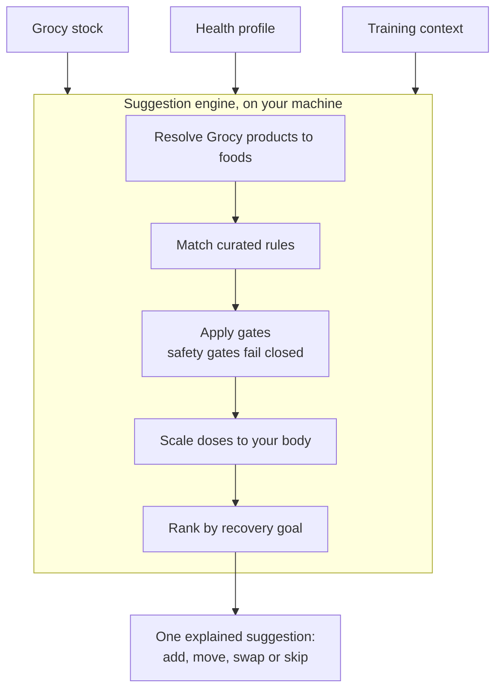

# Grocy Bioavailability and Interactions Recommendation Engine

A self-hosted tool that aims to help people who train recover better, using the food already in their own kitchen. It reads your stock from Grocy, a household inventory application, and suggests one small, evidence-graded change to a meal.

> [!NOTE]
> **Status: documentation phase.** There is no runnable code yet. The design is being written down and reviewed first. See the [roadmap](docs/product/roadmap.md) for what comes next.

<!-- Two separate callouts. -->

> [!WARNING]
> **Not medical advice.** This project does not diagnose, treat, cure or prevent any disease. Read [SAFETY.md](SAFETY.md) before acting on anything it produces.

## The idea

Recovery means being ready for the next session and still adapting to training. A knowledge graph links foods to the nutrients and compounds they contain. The graph proposes; only curated rules, each with an evidence grade, decide what you see (proposed in [ADR-0007](docs/decisions/0007-graph-proposes-rules-decide.md)). Your health information (allergies, intolerances, conditions, medicines, supplements, life stage and body measurements) shapes a suggestion but is never the thing being treated. Each suggestion is one of four kinds: **add**, **move**, **swap** or **skip**. It always comes with a dose, a grade and a source.

## How it works

Gates run before anything is ranked. If a safety gate's question has not been answered, the gate assumes the worst and withholds the suggestion. Tolerance gates, such as lactose intolerance, offer a swap or a note instead.

## An example suggestion

This comes from draft rule [R-0006](knowledge/rules/R-0006-post-training-protein-dose.yaml). It has not been reviewed, so the engine may not use it yet.

> **Add**, in the meal after training
>
> Build your post-training meal around a protein food from your kitchen, such as eggs or yoghurt, in the amount shown for your body weight.
>
> *Amount scaled to your body weight.*

| Part | Value |
|---|---|
| Dose | 0.25 to 0.4 grams of protein per kilogram of body mass, in one meal |
| Window | Within 120 minutes after training |
| Grade | B: several independent tracer trials agree, but muscle protein synthesis is a surrogate outcome |
| Gates | Reduced kidney function, inherited metabolic disorders, declared food allergies, coeliac disease or gluten sensitivity, eating disorder history, lactose intolerance |
| Sources | Kerksick 2017, PubMed identifier (PMID) [28919842](https://pubmed.ncbi.nlm.nih.gov/28919842/); Witard 2014, PMID [24257722](https://pubmed.ncbi.nlm.nih.gov/24257722/); and four more in the rule file |

## What is decided

Significant choices are recorded as architecture decision records (ADRs). The [decision index](docs/decisions/README.md) explains the process.

| ADR | Decision | Status |
|---|---|---|
| [0001](docs/decisions/0001-record-decisions.md) | Record significant decisions as ADRs | Accepted |
| [0002](docs/decisions/0002-licensing.md) | License code under Apache-2.0 and the knowledge base under Creative Commons Attribution 4.0 (CC BY 4.0) | Accepted |
| [0003](docs/decisions/0003-open-source-self-hosted.md) | Build an open-source, self-hosted, local-first tool | Accepted |
| [0004](docs/decisions/0004-knowledge-graph-first.md) | Build the knowledge graph first, with competency questions as exit criteria | Accepted |
| [0005](docs/decisions/0005-full-advice-with-safety-gates.md) | Allow full advice, including removals, behind safety gates | Accepted |
| [0006](docs/decisions/0006-arcadedb-graph-store.md) | Use ArcadeDB as the graph store, with conditions | Proposed |
| [0007](docs/decisions/0007-graph-proposes-rules-decide.md) | Only curated rules produce suggestions; the graph proposes | Proposed |
| [0008](docs/decisions/0008-python-for-pipelines.md) | Use Python for importers, pipelines and analysis | Proposed |
| [0009](docs/decisions/0009-recovery-goal-and-health-profile.md) | Optimise recovery for people who train, informed by a full health profile | Accepted |
| [0010](docs/decisions/0010-grade-evidence-at-tested-dose.md) | Grade evidence at the tested dose; supplement-dose-only is a firing condition | Proposed |

Questions still waiting for a decision are in [open questions](docs/open-questions.md).

## Where to start reading

The [documentation index](docs/README.md) lists every document.

- **New here:** [scope](docs/product/scope.md), then [product principles](docs/product/principles.md), then the [roadmap](docs/product/roadmap.md).
- **Want to contribute evidence:** [evidence policy](docs/science/evidence-policy.md), [recovery nutrition](docs/science/recovery-nutrition.md), [rule model](docs/architecture/rule-model.md) and the [knowledge base](knowledge/README.md).
- **Want to build:** [architecture overview](docs/architecture/overview.md), [knowledge graph design](docs/architecture/knowledge-graph.md), [Grocy integration](docs/architecture/grocy-integration.md) and [data sources](docs/architecture/data-sources.md).
- **Want to understand safety:** [SAFETY.md](SAFETY.md), the [safety model](docs/science/safety-model.md) and the [health profile](docs/science/health-profile.md).

## Contributing

Read [CONTRIBUTING.md](CONTRIBUTING.md) first. Never post your own or anyone else's health data. Open an issue with one of the [issue forms](https://github.com/dev-nobytes-io/Grocy-Bioavaiability-and-Interactions-Reccomendation-Engine/issues/new/choose): rule proposal, evidence challenge, safety concern, feature or design proposal, or bug report. Report security problems privately, as [SECURITY.md](SECURITY.md) explains.

## Licence

Everything outside `knowledge/` is licensed under the [Apache License 2.0](LICENSE). Everything inside `knowledge/` is licensed under the [CC BY 4.0 International licence](knowledge/LICENSE). See [NOTICE](NOTICE) for details.
