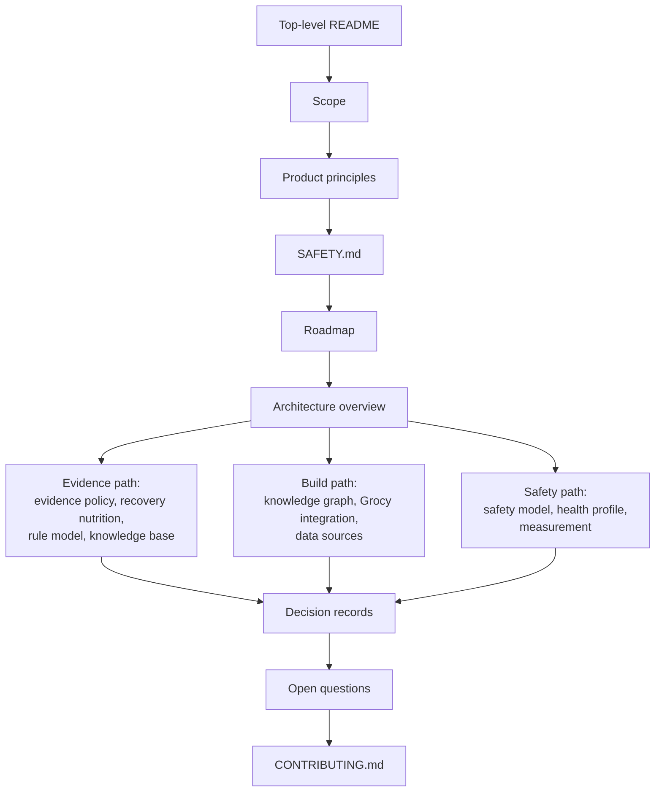

# Documentation index

This page lists every document in `docs/`, the policy files at the repository root and the knowledge base. Each entry has one line on what it covers. The project is in its documentation phase, so these pages are the whole project for now.

## Suggested reading order

This flowchart shows one path through the documents. Start at the top. After the architecture overview, follow the branch that fits why you are here.

## Start here

| Document | What it covers |
|---|---|
| [README](../README.md) | What the project is, its status, one example suggestion and where to go next. |
| [Open questions](open-questions.md) | Decisions the founder still has to make, each with a stable identifier such as Q-01. |
| [CHANGELOG](../CHANGELOG.md) | Notable changes to the project, newest first. |

## Product

| Document | What it covers |
|---|---|
| [Scope](product/scope.md) | The intended purpose, the recovery goal, and what is in and out of scope. |
| [Product principles](product/principles.md) | The principles that settle design arguments, and the order they apply in. |
| [Roadmap](product/roadmap.md) | Milestones M0 to M5, each defined by exit criteria rather than dates. |

## Architecture

| Document | What it covers |
|---|---|
| [Architecture overview](architecture/overview.md) | The three layers of knowledge, the data flow for one suggestion and the main components. |
| [Knowledge graph design](architecture/knowledge-graph.md) | What goes into the reference graph, how it is built and how milestone M1 is judged done. |
| [Rule model](architecture/rule-model.md) | The fields of a curated rule and what each one means. |
| [Data sources](architecture/data-sources.md) | The public datasets the graph imports, their licences and publication tiers. |
| [Grocy integration](architecture/grocy-integration.md) | How the engine reads stock from Grocy and resolves products to foods. |

## Science

| Document | What it covers |
|---|---|
| [Evidence policy](science/evidence-policy.md) | Evidence grades A to D, what each grade may do, and how rules are reviewed. |
| [Recovery nutrition](science/recovery-nutrition.md) | What the evidence says about eating to recover from training, mapped to rules. |
| [Health profile](science/health-profile.md) | What you can tell the engine about yourself and how it shapes suggestions. |
| [Safety model](science/safety-model.md) | The order in which gates run, and how safety gates fail closed. |
| [Measurement and validation](science/measurement.md) | Which signals can show whether a suggestion helps one person, and the self-experiment protocol. |

## Decisions

Architecture decision records (ADRs) hold the significant decisions.

| Document | What it covers |
|---|---|
| [Decision index](decisions/README.md) | How decisions are made and recorded, and the status of each ADR. |
| [ADR template](decisions/template.md) | The template for a new decision record. |
| [ADR-0001](decisions/0001-record-decisions.md) | Record significant decisions as ADRs. Accepted. |
| [ADR-0002](decisions/0002-licensing.md) | Apache-2.0 for code and documentation, Creative Commons Attribution 4.0 (CC BY 4.0) for the knowledge base. Accepted. |
| [ADR-0003](decisions/0003-open-source-self-hosted.md) | Build an open-source, self-hosted, local-first tool. Accepted. |
| [ADR-0004](decisions/0004-knowledge-graph-first.md) | Build the knowledge graph first, with competency questions as exit criteria. Accepted. |
| [ADR-0005](decisions/0005-full-advice-with-safety-gates.md) | Allow full advice, including removals, behind safety gates. Accepted. |
| [ADR-0006](decisions/0006-arcadedb-graph-store.md) | Use ArcadeDB as the graph store, with conditions. Proposed. |
| [ADR-0007](decisions/0007-graph-proposes-rules-decide.md) | Only curated rules produce suggestions; the graph proposes. Proposed. |
| [ADR-0008](decisions/0008-python-for-pipelines.md) | Use Python for importers, pipelines and analysis. Proposed. |
| [ADR-0009](decisions/0009-recovery-goal-and-health-profile.md) | Optimise recovery for people who train, informed by a full health profile. Accepted. |
| [ADR-0010](decisions/0010-grade-evidence-at-tested-dose.md) | Grade evidence at the tested dose; supplement-dose-only is a firing condition. Proposed. |

## Research

The research record and the founding vision. Where these differ from the decision records, the decision records win.

| Document | What it covers |
|---|---|
| [Original README](vision/original-readme.md) | The project README as it stood before the documentation phase, kept verbatim. |
| [Project brief](vision/project-brief.md) | The research brief that assessed the original README against the literature. |
| [Research record](research/README.md) | How the research was produced and how to read its appendices. |
| [Claim verification](research/claim-verification.md) | Appendix A: each claim in the original README checked for evidence and safety. |
| [Expert panel reports](research/expert-panel.md) | Appendix B: twelve reports, each from one professional lens, written by AI research agents. |
| [Gap memos](research/gap-memos.md) | Appendix C: research on perspectives the panel did not cover. |
| [Critic summary](research/critic-summary.md) | Appendix D: points of agreement and disagreement across the panel. |

## Governance and policy

| Document | What it covers |
|---|---|
| [SAFETY.md](../SAFETY.md) | The intended purpose, the not-medical-advice statement, and how to report a safety problem. |
| [GOVERNANCE.md](../GOVERNANCE.md) | Who decides what, how decisions are recorded and how that changes. |
| [CONTRIBUTING.md](../CONTRIBUTING.md) | Useful contributions now, how to propose a rule and the writing style. |
| [CODE_OF_CONDUCT.md](../CODE_OF_CONDUCT.md) | How to argue about evidence productively. |
| [SECURITY.md](../SECURITY.md) | How to report a vulnerability privately. |
| [LICENSE](../LICENSE) | The Apache License 2.0 text, for everything outside `knowledge/`. |
| [NOTICE](../NOTICE) | The licence split by directory and the note on third-party datasets. |

## Knowledge base

The curated rules, gates and schemas in `knowledge/`, licensed under CC BY 4.0.

| Document | What it covers |
|---|---|
| [Knowledge base README](../knowledge/README.md) | The layout of `knowledge/` and what each draft example rule shows. |
| [Knowledge base licence](../knowledge/LICENSE) | The CC BY 4.0 licence text. |
| [Rules](../knowledge/rules/) | One YAML file per curated rule. All are unreviewed drafts. |
| [Gates](../knowledge/gates/gates.yaml) | Safety and tolerance gates, and the health questions that trigger them. |
| [Licence manifest](../knowledge/sources/license-manifest.yaml) | Every external dataset, its licence and its tier. |
| [Example profile](../knowledge/examples/profile.example.yaml) | A health profile for an invented person. |
| [Schemas](../knowledge/schema/) | JSON Schemas for rules, gates, sources and profiles. |
