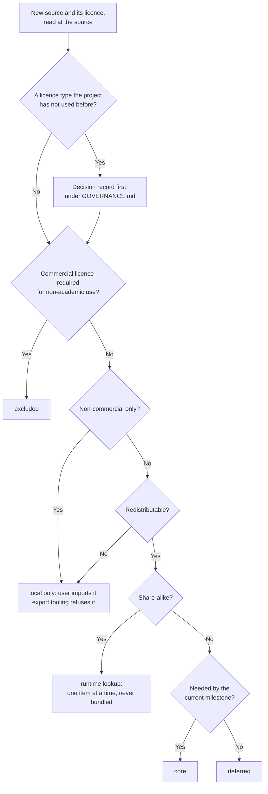

# Data sources

The knowledge graph imports public datasets. Their licences decide what the project may publish. The machine-readable list is the [licence manifest](../../knowledge/sources/license-manifest.yaml). This page explains the tiers and the reasoning.

> **Licences are as found, not verified.** The research pass read what it could in September 2026. Several findings rest on third-party listings. Before an importer loads a source, a maintainer reads the licence at the source and marks the manifest entry verified.

## Tiers

| Tier | Meaning | Published in graph builds? |
|---|---|---|
| **core** | Redistributable. The backbone of the graph. | Yes |
| **runtime lookup** | Queried one item at a time while the engine runs. Never bundled. | No |
| **local only** | Not redistributable. A user may import it on their own machine. Records are tagged and export tooling refuses them. | No |
| **deferred** | Not needed until a later milestone. | Not yet |
| **excluded** | Not used. | No |

This flowchart shows how a source's licence decides its tier.

## Sources

| Source | Provides | Licence as found | Tier |
|---|---|---|---|
| [USDA FoodData Central](https://fdc.nal.usda.gov/) | Nutrient composition; branded foods with barcodes | Public domain (CC0) | core |
| [USDA Nutrient Retention Factors, Release 6](https://agdatacommons.nal.usda.gov/articles/dataset/USDA_Table_of_Nutrient_Retention_Factors_Release_6_2007_/24660888) | Cooking losses | Public domain (CC0) | core |
| [FoodOn](https://foodon.org/) | Food identity and hierarchy | CC BY 4.0 | core |
| [ChEBI](https://www.ebi.ac.uk/chebi/) | Compounds, classes, roles | CC BY 4.0 | core |
| [Reactome](https://reactome.org/) | Pathways and reactions | CC0 or CC BY 4.0; reports disagree | core |
| [UniProt](https://www.uniprot.org/) | Proteins, transporters, enzymes | CC BY 4.0 | core |
| [Open Food Facts](https://world.openfoodfacts.org/) | Products by barcode | ODbL, share-alike | runtime lookup |
| [NIH Dietary Supplement Label Database](https://dsld.od.nih.gov/) | Supplement labels | Public domain (CC0) | deferred to M4 |
| [MeNu GUIDE](https://www.biorxiv.org/content/10.1101/2024.10.12.618040v1) | Published food, metabolite and disease graph in RDF | Reported as CC BY | deferred; see [Q-21](../open-questions.md) |
| [FoodAtlas](https://github.com/IBPA/FoodAtlas-KGv2) | Food-chemical graph with provenance per edge | Apache-2.0 code; data licence unconfirmed | deferred |
| [Rhea](https://www.rhea-db.org/) | Biochemical reactions | CC BY 4.0 | deferred |
| [MeSH](https://www.nlm.nih.gov/mesh/) | Biomedical vocabulary | Public domain with NLM terms | deferred |
| [Virtual Metabolic Human and AGORA2](https://www.vmh.life/) | Food metabolites, gut microbe reconstructions | Reported as CC BY | deferred with microbiome work |
| [FooDB](https://foodb.ca/) | Food compounds and concentrations | CC BY-NC 4.0 per re3data | local only |
| [Human Metabolome Database](https://hmdb.ca/) | Human metabolites | CC BY-NC 4.0 | local only |
| [Phenol-Explorer](http://phenol-explorer.eu/) | Polyphenol content and retention | Non-commercial; retention factors reported as CC BY but web-only | local only |
| [DrugBank](https://go.drugbank.com/) | Drugs and interactions | CC BY-NC 4.0; open subset CC0 | deferred; medication features out of scope |
| [KEGG](https://www.kegg.jp/) | Pathways | Commercial licence for non-academic use | excluded |

## Why these choices

- **KEGG is excluded.** The original README named it. KEGG requires a commercial licence for non-academic use and a paid subscription for bulk download. That conflicts with an openly licensed project. Reactome covers the pathways the project needs.
- **FooDB and HMDB are local only.** Both are listed as non-commercial. The project's CC BY 4.0 knowledge base allows commercial reuse, so it cannot contain their data.
- **Open Food Facts is a runtime lookup.** Its share-alike licence would bind any published database built from it. Looking up one barcode at a time avoids that.
- **Composition data has gaps.** None of the core sources reliably carries per-ingredient phytate, polyphenol or oxalate, which the best absorption equations need. Filling that gap is future curation work. See the [knowledge graph design](knowledge-graph.md#known-gaps-in-the-sources).

## Adding a source

1. Add an entry to the [licence manifest](../../knowledge/sources/license-manifest.yaml) with `verified: false`.
2. Read the licence at the source. Record `licence_url` and `verified_on`, and set `verified: true`.
3. Choose the tier. A new licence type needs a decision record under [GOVERNANCE.md](../../GOVERNANCE.md).
4. Only then write the importer.
