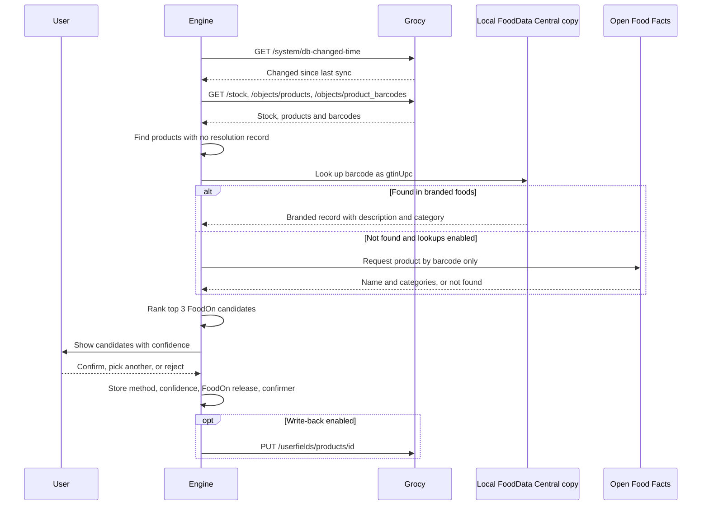
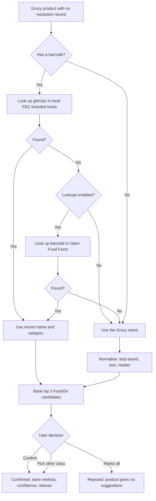
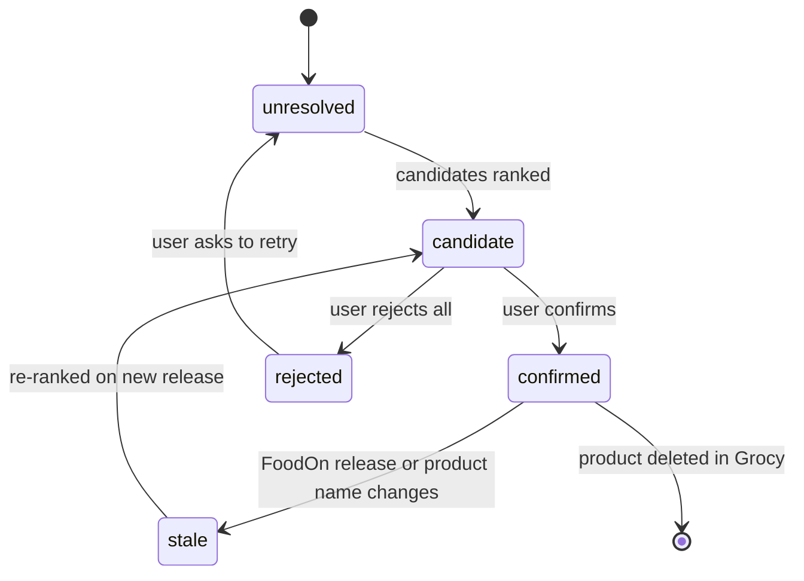
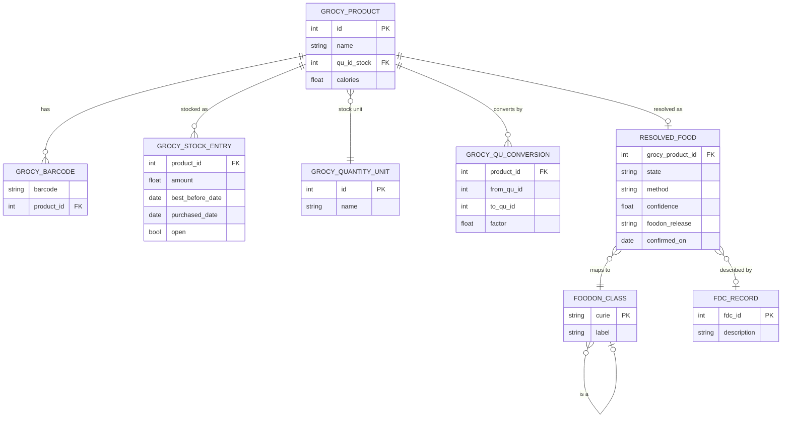
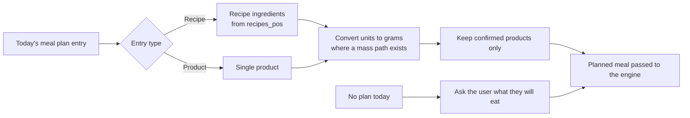

# Grocy integration

This page designs how the engine reads your kitchen from Grocy, a self-hosted household inventory application. It covers milestone M3 (Grocy integration and entity resolution) in the [roadmap](../product/roadmap.md). Status: design only. Nothing here is built yet.

Grocy tells the engine what is in your kitchen. It does not say what a product is, what it contains, or what you ate. This page explains how the engine fills those gaps without guessing silently.

## What Grocy provides

Facts below come from the Grocy OpenAPI specification on the master branch, checked on 27 September 2026, and the public demo instance running Grocy 4.7.1. The wider research is in the [gap memos](../research/gap-memos.md).

| Grocy entity | Fields the engine uses | Notes |
|---|---|---|
| `products` | name, description, location, product group, quantity units, default best-before days, picture, `calories`, userfields | Free-text name. One energy field. No nutrients, ingredients, allergens, serving size or net weight. |
| `product_barcodes` | product, barcode, quantity unit, amount | Barcodes are unique across products. Loose produce and meat usually have none. |
| `quantity_units` and `quantity_unit_conversions_resolved` | unit names, `from_qu_id`, `to_qu_id`, `factor` | The resolved table lists every conversion path Grocy knows, per product. |
| `stock` entries | amount, best-before date, purchased date, opened flag, opened date | Amount is in the product's stock unit. |
| `stock_log` | transaction type, `spoiled`, `recipe_id` | Records purchase, consume, open and correction events. |
| `recipes_pos` and `meal_plan` | recipe ingredients with amount and unit; planned day, section, recipe or product | Source of the "planned meal". |

Two points shape the whole design.

1. **Nutrition is out of scope upstream.** A request for nutrition fields ([grocy #2910](https://github.com/grocy/grocy/issues/2910)) was closed as a duplicate. A request to make amount tracking optional ([grocy #2132](https://github.com/grocy/grocy/issues/2132)) was closed as out of scope. The built-in Open Food Facts plugin fetches only a product name and image. Food identity and composition must therefore be built by this project.
2. **Presence and freshness are the realistic inputs.** Logging each use of a product is the most abandoned Grocy behaviour, according to forum and issue reports in the research. Snacks and partial use go unlogged. Self-reported instances range from 8 products to 426 in stock, with no census behind either figure. The engine must work from "is it there, and is it fresh" alone.

## Access and configuration

The engine is read-only by default.

- **Dedicated user.** You create a Grocy user for the engine and an application programming interface (API) key for that user. Grocy's permission list, read from the demo instance, has no read-only permission. Give the engine's user none of the stock, shopping list, recipe editing or master-data editing permissions. Whether a user with no permissions can still read every endpoint below is **unverified**. It will be tested in M3.
- **Secrets.** The key is read from the environment variable `GROCY_API_KEY` and sent in the `GROCY-API-KEY` header, as the specification defines. The base address comes from `GROCY_BASE_URL`. Neither value enters the repository or any log.
- **Lookups switch.** **Proposed:** external lookups are off until you set `ENGINE_LOOKUPS_ENABLED=true`. See [privacy](#privacy).

### Endpoints

Every endpoint below exists in the specification checked on 27 September 2026.

| Method and path | Purpose | Default |
|---|---|---|
| `GET /system/db-changed-time` | Cheap check for any change since the last sync | on |
| `GET /stock` | Current stock per product, with best-before and opened amounts | on |
| `GET /stock/volatile` | Products that are due soon, overdue, expired or missing | on |
| `GET /stock/products/{productId}` | Last purchased, last used, average shelf life, barcodes | on |
| `GET /objects/products` | Product master data, with userfields inlined | on |
| `GET /objects/product_barcodes` | All barcodes | on |
| `GET /objects/quantity_units` and `GET /objects/quantity_unit_conversions_resolved` | Units and resolved conversion factors | on |
| `GET /objects/meal_plan` and `GET /objects/recipes_pos` | Planned meals and their ingredients | on |
| `GET /recipes/{recipeId}/fulfillment` | Whether a planned recipe can be made from stock | on |
| `GET /stock/products/by-barcode/{barcode}` | Find the Grocy product for a scanned barcode | on |
| `GET /stock/barcodes/external-lookup/{barcode}` | Grocy's own lookup plugin, Open Food Facts by default | off |
| `PUT /userfields/products/{objectId}` | Optional write-back of resolution results | off, **Proposed** |

The engine does not rely on Grocy's external-lookup endpoint. It returns only a name and image. If the engine calls it, it passes `add=false` so no product is created.

## Sync

**Proposed:** the engine checks `/system/db-changed-time` every 5 minutes and again before it builds a suggestion. It reads the full stock only when that time has changed. Each read is stored locally as a snapshot with its timestamp. The polling interval is not yet settled; see [open questions](#open-questions) below.

This sequence diagram shows one stock sync in which a new barcoded product is found and resolved with your confirmation.

## Entity resolution

Entity resolution maps each Grocy product to a class in FoodOn, an open food ontology. Where possible it also maps to a record in the United States Department of Agriculture (USDA) FoodData Central (FDC) database. Rules and composition amounts are keyed to these identifiers ([knowledge graph](knowledge-graph.md)).

There are two paths.

- **Barcode path.** A barcode, also called a Global Trade Item Number (GTIN), is looked up in the FDC branded foods data by its `gtinUpc` field, then in Open Food Facts. FDC is public domain, so **Proposed:** the engine keeps a local copy and that step needs no network. Open Food Facts is a runtime lookup because of its share-alike licence ([data sources](data-sources.md)). Either source returns a clean product name and category, not an ontology class. Open Food Facts categories carry no FoodOn cross-references. The cleaner text then goes through candidate ranking, with a higher prior.
- **Name path.** For products without a barcode, the engine normalises the name. It lowercases it and strips brand, retailer, pack size and weight. It then ranks the top 3 FoodOn candidates. **Proposed:** candidates come from a local index of the pinned FoodOn release already loaded in milestone M1. The European Bioinformatics Institute (EBI) Ontology Lookup Service (OLS) API is an optional fallback that counts as an external lookup. In a live probe during the research, 11 of 20 retailer-style names failed a plain lexical lookup, which is why normalisation comes first.

Nothing is resolved silently. You confirm every mapping, even a strong barcode match, with one tap. Each record stores the method, a confidence score, the FoodOn release identifier, the date and who confirmed it. **Proposed:** rules match a confirmed class or its ancestors within a small number of levels, so "lemon" can satisfy a rule written for "citrus fruit". The number of levels is [Q-16](../open-questions.md).

This flowchart shows the decision path for one product.

This state diagram shows the resolution states one product can pass through.

Only `confirmed` products can match a rule. A `stale` product produces nothing until you confirm it again.

### Published linking accuracy

No study has tested linking on Grocy product names. The closest published figures, summarised in the [project brief](../vision/project-brief.md#7-the-hard-problems), are below.

| Method | Test material | Result |
|---|---|---|
| Retrieval plus a language model ([Drole et al. 2025](https://doi.org/10.1109/bigdata66926.2025.11400993)) | 119 ingredient strings from six Open Food Facts products | 90.7% top-1, 95% confidence interval about 84 to 95%. A second annotator gave 83.3%. |
| Fine-tuned model ([Gjorgjevikj et al. 2025](https://doi.org/10.1007/978-3-032-05461-6_26)) | The same 119 strings | 36.9% top-1 |
| The same fine-tuned model | Recipe text | 92.3% precision at 77.0% recall, exact identifier match |
| Retrieval plus a language model | Recipe text, 948 mentions | 58.6 to 60.2% strict. About 97% after manual review counted matches at a different level of the hierarchy. |
| General language models without training ([Gjorgjevikj et al. 2026](https://pubmed.ncbi.nlm.nih.gov/41737890/)) | FoodOn linking | 0%, because they could not produce valid FoodOn identifiers |

Caveats:

- The studies come mostly from one research group, with no independent replication.
- The best grocery-like test set is 119 strings from six products.
- Scores are tied to one FoodOn release. Gold labels decay as FoodOn changes.
- Accuracy runs from about 60 to 97% depending on whether ancestor or descendant matches count. Hierarchy tolerance is a design choice, not a detail.

### Gold set

M3 is not done until a gold set of 200 to 500 real products has measured precision and recall ([roadmap](../product/roadmap.md)). Each item holds the normalised name, a public barcode where one exists, the accepted FoodOn classes and the FoodOn release. **Proposed:** report precision and recall at top 1 and top 3, both strict and hierarchy-tolerant, plus the share of products the engine declines to guess.

**Proposed:** the gold set also includes products whose animal source matters to the exclusion filter, such as gelatin, and records that source. [R-0007](../../knowledge/rules/R-0007-gelatin-vitamin-c-pre-training.yaml) depends on it: gelatin of unknown source is treated as pork.

The published gold set holds no personal details: no quantities, dates, prices, locations, notes, in-store barcodes, medicines or household identifiers. Contributors give explicit consent.

## Data model

This entity-relationship diagram shows how Grocy tables map to the engine's own entities.

Resolution records live in the engine's local store, keyed by the Grocy product identifier. **Proposed**, pending [Q-19](../open-questions.md): optionally write the FoodOn identifier, FDC identifier and confidence back to Grocy userfields, so they show in Grocy and survive a reinstall. Userfield values come back from Grocy as strings, so the engine must parse them.

## Freshness and preparation

The engine labels each product with the most reliable tier it can use.

1. **Presence:** amount above zero, best-before date, opened flag, last purchase. Reliable for people who scan purchases.
2. **Count:** packs or pieces. Converted to grams only where `quantity_unit_conversions_resolved` gives a path to a mass unit.
3. **Grams:** rare. Mostly products with tare-weight handling.

**Proposed:** a product is "probably stale" when it is past its best-before date, or when time since purchase exceeds its average shelf life with no consume event. Stale products are shown with a question, not used silently.

Cooking changes nutrient content. The USDA Table of Nutrient Retention Factors, Release 6 ([DOI 10.15482/USDA.ADC/1409034](https://doi.org/10.15482/USDA.ADC/1409034)), is public domain. It holds 270 food and preparation codes across 26 nutrients. For example, boiled and drained greens keep 55 to 70% of their vitamin C. The table has no per-factor provenance and does not cover storage. Many FDC "cooked" entries were already calculated from raw values with these factors, so the engine must not apply a factor twice. Grocy recipes store preparation as free text. **Proposed:** each food gets a default preparation, which you can change per recipe.

## Supplements

Many people keep supplements in Grocy as ordinary products. The engine uses Grocy only to know a supplement is present. A supplement-dose rule, such as creatine, fires only when the supplement is in stock or declared ([rule model](rule-model.md)).

Doses come from the declared supplements in your [health profile](../science/health-profile.md), stored as ranges. Grocy pack counts do not supply doses. The engine asks you to link each Grocy supplement product to a declared supplement. If a supplement is in stock but not declared, the engine asks about it. Until you answer, `gate.upper_limit` treats the amount as unknown and caps related suggestions, as its `on_unknown: cap` setting requires. See the [safety model](../science/safety-model.md). The upper-limit standard is [Q-07](../open-questions.md).

## The planned meal

Suggestions attach to a meal you are about to eat. The engine takes it from today's `meal_plan` entries. Each entry names a recipe with servings, or a single product. Recipe ingredients come from `recipes_pos` with amounts and units.

This flowchart shows how the engine assembles the planned meal.

The engine never treats Grocy consume events as a record of what you ate.

## Privacy

Your health profile, stock and product names stay on your machine ([ADR-0003](../decisions/0003-open-source-self-hosted.md)). With lookups off, nothing leaves. With lookups on, the engine sends only a barcode to Open Food Facts. If you also enable the OLS fallback, it sends a normalised generic name such as "lemon". No quantities, dates, prices or health data are ever sent.

## Failure modes

| Failure | Effect | Response |
|---|---|---|
| Stale stock | Suggests food that is not there | Presence tier label, stale question, recent snapshot only |
| Unknown product | No food identity | Stays `unresolved` or `rejected`, produces nothing |
| No barcode match | Common outside the United States. Only 22.7% of Australian Open Food Facts products had completed categories in September 2026. | Fall back to the name path |
| In-store barcodes | Not publicly resolvable | Treat as no barcode |
| No mass conversion | Dose cannot be checked | Rules that need grams do not fire |
| New FoodOn release | Mappings drift | Affected records move to `stale` |
| Grocy unreachable | No current stock | Use the last snapshot only if recent, with its age shown |

## Open questions

- Write-back to Grocy userfields, and which fields: [Q-19](../open-questions.md).
- Whether lookups default to off, and whether the OLS fallback is allowed.
- Polling interval and stale threshold. Hierarchy tolerance is [Q-16](../open-questions.md).
- Whether Grocy reads work for a user with no permissions.

Q-16 and Q-19 are tracked in [open questions](../open-questions.md). The others are M3 design details and are not yet tracked there.
