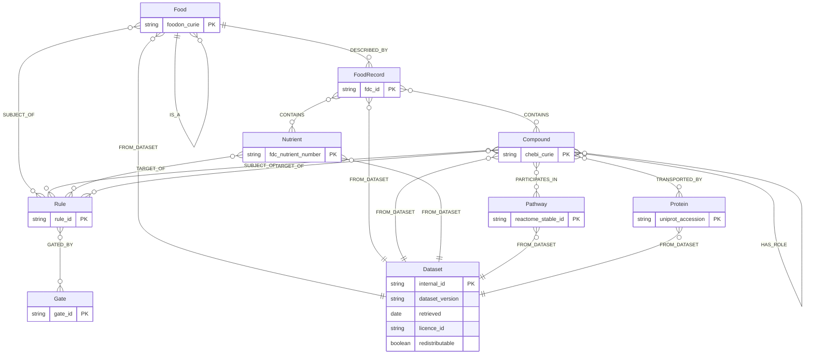
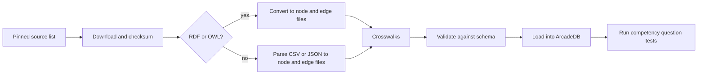

# Knowledge graph design

The reference knowledge graph is milestone 1 ([ADR-0004](../decisions/0004-knowledge-graph-first.md)). This page defines what goes in it, how it is built, and how we know it is done.

Status: design. Everything here can change by pull request until M1 starts.

## Purpose

The graph answers "what is in this food, what is it, and what does it touch?" It links foods to the compounds and nutrients they contain, and those to the pathways and proteins they take part in. It records where every fact came from.

The graph does **not** decide what to suggest. Curated rules do that. The graph explains rules, links them to foods in the kitchen, and nominates candidate rules for human review. See [ADR-0007](../decisions/0007-graph-proposes-rules-decide.md).

## Node types

| Type | Meaning | Primary identifier | Source |
|---|---|---|---|
| `Food` | A food concept, such as "spinach" or "citrus fruit" | FoodOn CURIE, such as `FOODON:03000221` (spinach, whole or pieces) | FoodOn |
| `FoodRecord` | A composition record for a food in a specific state | FoodData Central ID, such as `FDC:168462` | USDA FoodData Central |
| `Compound` | A chemical entity | ChEBI CURIE, such as `CHEBI:29073` (L-ascorbic acid) | ChEBI |
| `Nutrient` | A nutrient as reported in composition tables | FoodData Central nutrient number | USDA FoodData Central |
| `Pathway` | A biological pathway or reaction | Reactome stable ID, such as `R-HSA-917937` (iron uptake and transport) | Reactome |
| `Protein` | A protein such as a transporter or enzyme | UniProt accession | UniProt |
| `Dataset` | A specific version of an imported source | Internal ID | Importer |
| `Rule` | A curated rule from `knowledge/rules/` | Rule ID, such as `R-0001` | This repository |
| `Gate` | A safety gate from `knowledge/gates/` | Gate ID, such as `gate.iron_overload` | This repository |

Deferred node types: `Microbe` and `Reaction` from the Virtual Metabolic Human and AGORA2 resources, when microbiome work starts.

The FoodOn, ChEBI and Reactome examples were checked against their sources in September 2026. Look up every identifier at its source before using it in a rule.

## Edge types

| Edge | From | To | Key properties |
|---|---|---|---|
| `IS_A` | Food, Compound | same type | Ontology hierarchy from FoodOn or ChEBI |
| `DESCRIBED_BY` | Food | FoodRecord | Match method, confidence |
| `CONTAINS` | FoodRecord | Nutrient or Compound | Amount, unit, per 100 g basis, preparation state, source |
| `SAME_AS` | any | same type | Crosswalk method, confidence, reviewer |
| `HAS_ROLE` | Compound | Compound | ChEBI role, such as "antioxidant" |
| `PARTICIPATES_IN` | Compound | Pathway | Reactome evidence |
| `TRANSPORTED_BY` | Compound | Protein | Source, evidence |
| `SUBJECT_OF` | Compound or Food | Rule | Links a rule to what it acts through |
| `TARGET_OF` | Nutrient or Compound | Rule | Links a rule to what it changes |
| `GATED_BY` | Rule | Gate | From the rule file |
| `FROM_DATASET` | any node or edge record | Dataset | Provenance |

Every edge that carries a number also carries its unit and its basis. For example, a composition amount is per 100 g of edible portion, in a stated preparation state.

This entity relationship diagram shows each node type with its primary identifier and the edges between them; `SAME_AS` and the `FROM_DATASET` links on edge records are left out for clarity.

## Provenance

Every node and every edge records:

- `dataset`: which source it came from;
- `dataset_version` and `retrieved`: which release and when;
- `licence_id`: a key into the [licence manifest](../../knowledge/sources/license-manifest.yaml);
- `redistributable`: true or false, copied from the manifest.

No fact is merged silently. When two sources disagree, both edges are kept with their provenance.

## Licence tiers

The [data sources](data-sources.md) page lists each source and its tier.

- **Core:** redistributable. The project may publish graph builds that contain it.
- **Local only:** not redistributable, such as sources under non-commercial licences. A user may run the importer on their own machine. Every record is tagged `redistributable: false`. Export tooling refuses to write such records.
- **Excluded:** not used at all, such as KEGG, which needs a commercial licence for non-academic use.

## Build pipeline

- **Pinned sources.** A file lists each source, its version and its checksum. A build with a changed checksum fails until the file is updated in a reviewed pull request.
- **Intermediate files.** Conversion writes plain node and edge files, such as JSON Lines. The graph can be rebuilt from them in another store, which keeps the database choice reversible.
- **RDF conversion.** ArcadeDB has no RDF or SPARQL support. FoodOn and ChEBI are OWL ontologies. The converter keeps labels, synonyms, `rdfs:subClassOf` edges and cross-references, and drops the rest. Tools: `rdflib` or `owlready2` in Python, or the ROBOT command-line tool. See [ADR-0008](../decisions/0008-python-for-pipelines.md).
- **One command.** The whole build runs from a clean checkout with one command.

## Scoring over paths

Path-based scores over biomedical graphs favour highly connected nodes. A compound such as vitamin C connects to hundreds of foods and pathways, so it wins almost any unnormalised path score. The research found this proven mathematically and in audits of biomedical graphs. See the [gap memos](../research/gap-memos.md).

Rules for any path score in this project:

1. Normalise for node degree. Degree-weighted path counts, as used in drug repurposing on the Hetionet graph, are one tested method ([Himmelstein et al., GigaScience](https://doi.org/10.1093/gigascience/giad047)).
2. Compare each score against a baseline from degree-preserving random graphs.
3. Publish a degree-only baseline next to any ranking, so it is obvious when a score adds nothing.
4. Use path scores only to nominate hypotheses for human review. Never use them to produce suggestions.

## Competency questions

Competency questions define what the graph must be able to answer. M1 is done when CQ-01 to CQ-10 each have a committed query and an automated test with a known answer.

| ID | Question | Why it matters |
|---|---|---|
| CQ-01 | For a food, which nutrients and compounds does it contain, per 100 g, in which preparation state, from which dataset? | The basic lookup every rule depends on. |
| CQ-02 | For a Grocy product, which food does it resolve to, by which method, with what confidence? | Links the kitchen to the graph. Needs M3 for real data; test with fixtures in M1. |
| CQ-03 | Which foods in a given set contain more than a threshold amount of a compound per typical serving? | "Which of my foods can supply 25 mg vitamin C?" |
| CQ-04 | For the foods in a meal, which rules have both their subject and target present? | The core match step of the engine. |
| CQ-05 | For a rule, what are its sources, grade, dose and gates? | Traceability for every suggestion. |
| CQ-06 | Which compounds take part in a given pathway, and which foods contain them? | Hypothesis generation. |
| CQ-07 | Which descendants of a food class, such as "citrus fruit", are in a given set? | Hierarchy reasoning, so a rule about citrus matches a lemon. |
| CQ-08 | Which nodes and edges came from a non-redistributable source? | Licence audit before any export. |
| CQ-09 | For each dataset, which version was loaded, when, and how many nodes and edges did it contribute? | Reproducibility. |
| CQ-10 | Does a product labelled "cinnamon" resolve to *Cinnamomum cassia* or *Cinnamomum verum*, and what coumarin content applies? | Species matters for safety. Cassia carries far more coumarin. |
| CQ-11 | For a candidate path, how does its score compare with a degree-preserving random baseline? | Bias control. Stretch goal for M1. |
| CQ-12 | Which rules would change if a given dataset version were replaced? | Impact analysis for source updates. Stretch goal for M1. |

## Known gaps in the sources

These came out of the research. Each is a design constraint, not a surprise.

- **No official FooDB-to-FoodOn mapping.** A FoodOn issue asking for one has been open since 2019. Food identity must go through FoodData Central, Open Food Facts and our own crosswalk.
- **Composition tables lack key inhibitors.** Per-ingredient phytate, polyphenol and oxalate amounts are the binding constraint for the best-evidenced absorption equations. USDA and FooDB do not reliably carry them. See the [gap memos](../research/gap-memos.md).
- **MeNu GUIDE reports its own bias.** Its authors found biases toward specific foods and conditions in the integrated databases. Whether to import it is [open question Q-21](../open-questions.md).
- **AGORA2 bulk download.** The research found the bulk download no longer offered from the project repository. Relevant only when microbiome work starts.
- **Cooked values.** Many USDA cooked-food entries are raw values multiplied by an old retention factor, not measurements. Record which is which.

## ArcadeDB notes

Proposed in [ADR-0006](../decisions/0006-arcadedb-graph-store.md).

- Pin a release no older than 26.9.1. Read release notes for storage and index fixes before upgrading.
- Use Cypher or SQL for queries. Commit every competency-question query as a file with a test.
- Leave the vector index unused until a feature needs it.
- Keep large text, such as abstracts, out of vertices that queries traverse often. Store a source ID and look up the text when needed.
