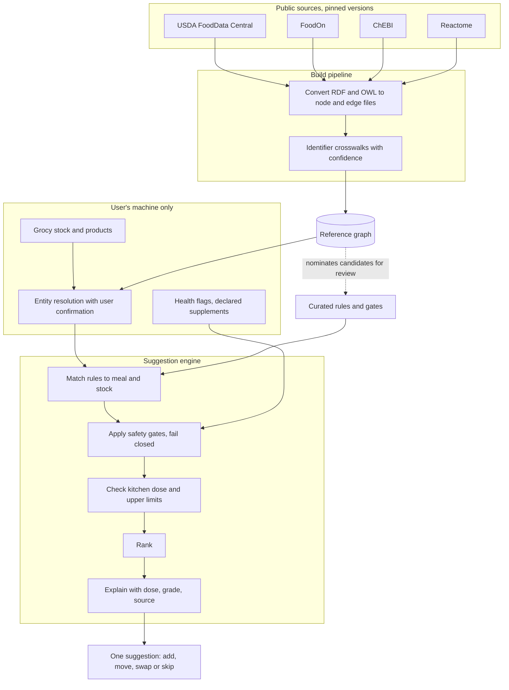
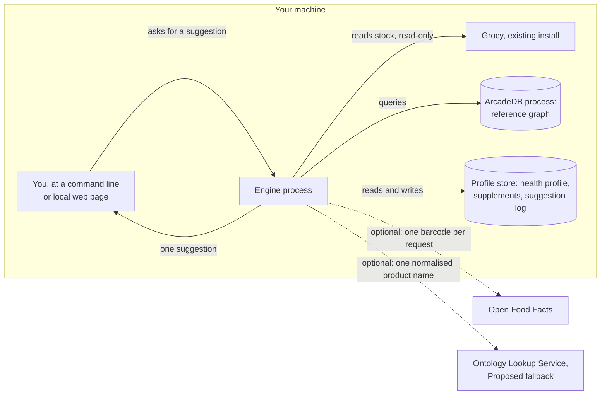

# Architecture overview

This page shows how the parts fit. Each part has its own page. Status: design only. Nothing here is built yet.

## Three layers of knowledge

The system separates knowledge by how fast it changes and how much it is trusted.

| Layer | What it holds | Changes | Trusted to | Lives in |
|---|---|---|---|---|
| **Reference graph** | Foods, compounds, nutrients, pathways, proteins, identifiers, and where each fact came from | When a source releases a new version | Explain and propose | ArcadeDB, rebuilt from pinned sources (proposed in [ADR-0006](../decisions/0006-arcadedb-graph-store.md)) |
| **Curated rules** | Reviewed interaction rules with dose, population, evidence grade, sources and safety gates | By reviewed pull request | Produce suggestions | `knowledge/` in this repository (proposed in [ADR-0007](../decisions/0007-graph-proposes-rules-decide.md)) |
| **Personal layer** | Kitchen stock, resolved products, health flags, declared supplements, suggestion log | Daily | Constrain and gate | The user's machine only ([ADR-0003](../decisions/0003-open-source-self-hosted.md)) |

## Data flow for one suggestion

## Components

| Component | Responsibility | Design page | Milestone |
|---|---|---|---|
| Source importers | Download pinned versions, verify checksums, record provenance | [Knowledge graph](knowledge-graph.md) | M1 |
| RDF converter | Turn OWL and RDF ontologies into plain node and edge files | [Knowledge graph](knowledge-graph.md) | M1 |
| Crosswalk builder | Map identifiers between sources with method and confidence | [Knowledge graph](knowledge-graph.md) | M1 |
| Rule validator | Check rules and gates against their schemas and the graph | [Rule model](rule-model.md) | M2 |
| Grocy reader | Read stock, products, barcodes and units | [Grocy integration](grocy-integration.md) | M3 |
| Entity resolver | Map Grocy products to foods, with user confirmation | [Grocy integration](grocy-integration.md) | M3 |
| Gate engine | Withhold rules for gated users; fail closed on unknowns | [Safety model](../science/safety-model.md) | M4 |
| Ranker | Order the rules that pass; form still open ([Q-01, Q-02](../open-questions.md)) | [Rule model](rule-model.md) | M4 |
| Explainer | Render the suggestion with dose, grade and source | [Evidence policy](../science/evidence-policy.md) | M4 |

## How the original README maps to this design

The [original README](../vision/original-readme.md) named several components. This table shows what each became and why.

| README concept | Now | Why |
|---|---|---|
| Graph engine over "immutable biochemical laws" | Reference graph plus curated rules with conditions | The chemistry is fixed, but the size of the effect depends on dose, food, timing and person. Rules carry those conditions. See [claim C19](../research/claim-verification.md). |
| Document store on nodes | Provenance and source metadata on every node and edge | Same idea, used for traceability. |
| Vector engine for free-text state | Deferred. A fixed list of nine goals first. | No mapping from free text to biological target states exists yet. See [scope](../product/scope.md#deferred-with-the-reason). |
| Microbiome map | Deferred | Too volatile per person, and key conversions cannot be created by feeding. See [claims C7 and C8](../research/claim-verification.md). |
| Anabolic Synergy Index solver | A bounded ranking function over rules that pass their gates | Unnormalised path scores reward highly connected nodes. See [ADR-0007](../decisions/0007-graph-proposes-rules-decide.md). |
| Additive-only output | Add, move, swap or skip, behind gates | See [ADR-0005](../decisions/0005-full-advice-with-safety-gates.md). |
| Blood-panel validation loop | Self-experiment protocol on dense signals; blood only for slow status markers | Routine markers vary too much within a person. See [measurement](../science/measurement.md). |
| Dynamic Biological Twin | A longitudinal record with explicit uncertainty | Same aim, stated in terms the data can support. |

## Deployment shape

- One process for the engine and one for ArcadeDB, next to an existing Grocy.
- Packaged as a container image first. A Home Assistant add-on is a likely second target.
- Configuration by environment variables. The Grocy API key never enters the repository.
- The reference graph ships as a build artefact that users can download or rebuild. Non-redistributable sources are loaded locally by the user, if at all.

This flowchart shows what runs on your machine and the optional outbound lookups described in [Grocy integration](grocy-integration.md); health, profile and stock data never leave.

