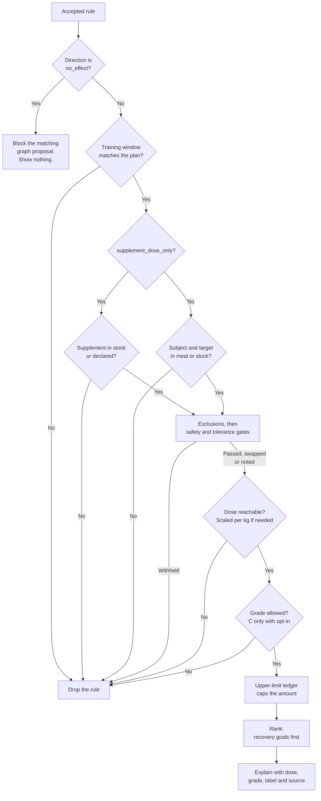
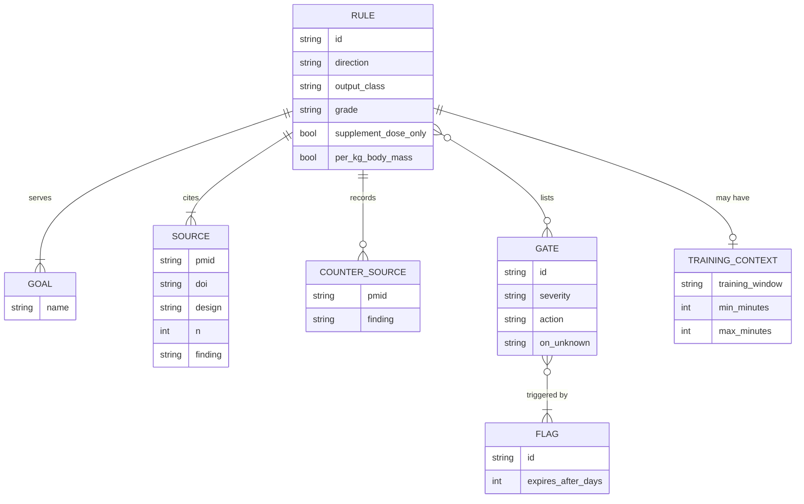

# Rule model

A rule is a curated, reviewed statement about how one food component changes the effect of another, or changes recovery from training. Rules are the only thing that can produce a suggestion (proposed in [ADR-0007](../decisions/0007-graph-proposes-rules-decide.md)). The machine-checked definition is [rule.schema.json](../../knowledge/schema/rule.schema.json). This page explains it.

## One rule, one file

Each rule lives in `knowledge/rules/R-NNNN-short-name.yaml`. IDs are never reused. A rule that turns out to be wrong is set to `deprecated`, not deleted, so the history stays visible.

## Fields

| Field | Required | Meaning |
|---|---|---|
| `id` | yes | `R-` and four digits. |
| `title` | yes | One sentence stating the rule. |
| `status` | yes | `draft`, `in_review`, `accepted` or `deprecated`. Only `accepted` rules produce suggestions. |
| `version` | yes | Increases with every substantive change. |
| `direction` | yes | `enhances`, `inhibits` or `no_effect`. |
| `output_class` | yes | `add`, `move`, `swap`, `skip`, or `none`. `no_effect` rules must use `none`. See [ADR-0005](../decisions/0005-full-advice-with-safety-gates.md). |
| `goals` | yes | One or more goals the rule serves. See [goals](#goals). |
| `subject` | yes | The component that acts, with CURIE (compact identifier) values where known. |
| `target` | yes | The component or outcome that changes. |
| `dose.effective` | yes | Minimum and optional maximum effective dose, unit, and whether per meal, day or dose. |
| `dose.effective.per_kg_body_mass` | no | True if the dose is per kilogram of body mass. See [per-kilogram doses](#per-kilogram-doses). |
| `dose.kitchen_reachable` | yes | Whether a normal meal can reach the effective dose. |
| `dose.supplement_dose_only` | yes | True if the effect is only shown at supplement doses. See [supplement rules](#supplement-rules). |
| `timing.window` | yes | `same_meal`, `separate_by_hours`, `daily`, `chronic` or `not_applicable`. |
| `context.training_window` | no | `pre_training`, `post_training`, `rest_day` or `any`. See [training context](#training-context). |
| `context.minutes_from_session` | no | The tested time range, as `min` and `max` minutes before or after a session. |
| `effect.summary` | yes | What happens, in plain words. |
| `effect.magnitude` | yes | The effect size, with the dose and baseline it was measured at. |
| `effect.outcome_type` | yes | What was measured: absorption by isotope, absorption in plasma, a status marker, a functional marker, a clinical outcome, performance, pharmacokinetics, or mechanism only. |
| `effect.whole_diet_note` | no | Whether a single-meal effect survives across a whole diet. |
| `conditions.applies_to` | yes | Who the evidence covers. |
| `conditions.weak_or_absent_in` | no | Who it does little for. |
| `gates` | yes | Safety gate IDs from [gates.yaml](../../knowledge/gates/gates.yaml). An empty list must be a deliberate choice. Gates with `scope: global` apply even when a rule does not list them. |
| `evidence.grade` | yes | A to D: how strong the evidence is at the dose the studies tested. It does not depend on whether food can reach that dose; `dose.supplement_dose_only` records that. See the [evidence policy](../science/evidence-policy.md). Accepted rules cannot be grade D. |
| `evidence.replicated` | yes | Whether an independent group has reproduced the main finding. |
| `evidence.sponsor_flag` | yes | `independent`, `manufacturer`, `mixed` or `unknown`. |
| `evidence.sources` | yes | At least one source with a PubMed ID (PMID), digital object identifier (DOI) or URL, and the finding it supports. |
| `evidence.counter_evidence` | no | Sources that point the other way. Recording them is expected. |
| `suggestion.text` | yes | What the user sees. Positive, plain, no disease claims. |
| `suggestion.label` | no | A caveat that must be shown with the suggestion. |
| `reviewers`, `last_reviewed` | for accepted | Who reviewed it and when. |
| `changelog` | yes | Dated list of changes. |

## Goals

Every rule declares the goals it serves ([ADR-0009](../decisions/0009-recovery-goal-and-health-profile.md)). The goal list is fixed in the schema.

| Goal | Meaning | Example rule |
|---|---|---|
| `muscle_repair` | Muscle protein synthesis after training. | [R-0006](../../knowledge/rules/R-0006-post-training-protein-dose.yaml) |
| `glycogen_restoration` | Refilling muscle carbohydrate before the next session. | None yet |
| `connective_tissue` | Collagen synthesis in tendons and ligaments. | [R-0007](../../knowledge/rules/R-0007-gelatin-vitamin-c-pre-training.yaml) |
| `adaptation` | Keeping the long-term gains that training produces. | [R-0008](../../knowledge/rules/R-0008-antioxidant-supplements-adaptation.yaml) |
| `sleep` | Nutrition that affects overnight recovery. | None yet |
| `micronutrient_status` | Vitamin and mineral status, such as iron. | [R-0001](../../knowledge/rules/R-0001-vitamin-c-nonheme-iron.yaml) |
| `hydration` | Fluid and electrolyte balance. | None yet |
| `gut_comfort` | Tolerance of the meal. | None yet |
| `general` | General wellness with no direct recovery link. | [R-0004](../../knowledge/rules/R-0004-piperine-curcumin.yaml) |

Recovery goals rank ahead of `micronutrient_status` and `general`. Absorption rules serve recovery indirectly, through nutrient status. How much weight each goal carries is **Proposed**. See [Q-01 and Q-02](../open-questions.md). The science behind each goal is in [recovery nutrition](../science/recovery-nutrition.md).

## Training context

A rule may carry a `context` block. It ties the rule to a point in the user's training plan.

- `pre_training` rules are considered only before a planned session.
- `post_training` rules are considered only after a completed session.
- `rest_day` rules are considered only on days with no session.
- `any`, or no `context` block, means no restriction.

`minutes_from_session` records the time range that the cited studies tested. For `pre_training` it counts minutes before the session starts. For `post_training` it counts minutes after it ends. The range must come from the sources. For example, [R-0007](../../knowledge/rules/R-0007-gelatin-vitamin-c-pre-training.yaml) uses 60 to 60 minutes because both positive studies used one hour.

The engine needs session times to use this block. They come from the training part of the [health profile](../science/health-profile.md). Without them, rules with a `pre_training` or `post_training` window do not fire.

## Per-kilogram doses

Some doses scale with body mass, such as protein at 0.25 to 0.4 g per kg in one meal. Such a rule sets `per_kg_body_mass: true`. The engine multiplies the dose by the user's declared weight. If weight is missing, the suggestion is shown without a scaled amount. This default is **Proposed**. See the [health profile](../science/health-profile.md) and [Q-09](../open-questions.md).

## Supplement rules

A rule with `supplement_dose_only: true` describes an effect shown only at supplement doses. It follows three rules.

1. **It never fires from food.** A kitchen serving cannot reach the dose, so food in stock never triggers it.
2. **It fires only when the supplement itself is present.** The supplement must be in Grocy stock or declared in the health profile. An `add` rule, such as creatine in [R-0011](../../knowledge/rules/R-0011-creatine-monohydrate.yaml), then suggests the tested dose. A `skip` rule, such as high-dose vitamin C and E in [R-0008](../../knowledge/rules/R-0008-antioxidant-supplements-adaptation.yaml), suggests leaving the supplement out for a while.
3. **It never recommends buying anything.** The engine works only from what the user has.

The grade and the supplement flag answer different questions. `evidence.grade` rates how strong the evidence is at the dose the studies tested. `supplement_dose_only` sets when the rule may fire. So [R-0008](../../knowledge/rules/R-0008-antioxidant-supplements-adaptation.yaml) and [R-0011](../../knowledge/rules/R-0011-creatine-monohydrate.yaml) are grade B, because controlled trials agree at the supplement dose. [R-0004](../../knowledge/rules/R-0004-piperine-curcumin.yaml) is grade C for its evidence: one small, manufacturer-linked study, contradicted by an independent crossover. A grade C supplement rule follows the same opt-in and label rule as any other grade C rule. This reading is **Proposed** in [ADR-0010](../decisions/0010-grade-evidence-at-tested-dose.md) until the founder decides it and answers [Q-11](../open-questions.md).

Every supplement-dose-only rule lists `gate.pregnancy`. Its suggested amount also enters the upper-limit ledger. See the [safety model](../science/safety-model.md).

## Rules the schema enforces

- A `no_effect` rule must have `output_class: none`, and the reverse.
- An `accepted` rule must list at least one reviewer, a review date, and a grade of A, B or C.
- Every rule lists at least one goal from the fixed list.
- Every source must carry a PMID, DOI or URL.
- Gate IDs must look like `gate.name`.

## Rules the reviewer enforces

The schema cannot check these. Reviewers do.

- Every number in `effect.magnitude` appears in a cited source.
- The dose is what the study used, not an extrapolation. A finding at 12 drinks is not applied to one.
- `kitchen_reachable` is honest. Check the amount in a realistic serving.
- `minutes_from_session` matches the tested timing.
- Every relevant gate is listed. Skip rules list `gate.eating_disorder`.
- `counter_evidence` includes any known null or contrary result.
- `goals` names what the evidence measured, not what the rule might help in theory.
- `suggestion.text` fits the intended purpose in [SAFETY.md](../../SAFETY.md).

## How the engine uses a rule

This flowchart shows the checks one rule passes through before it can become a suggestion. It follows the evaluation order in the [safety model](../science/safety-model.md).

1. **Refuted pairs.** A `no_effect` rule is never shown. It stops the graph from nominating an interaction that has already been tested and refuted.
2. **Context.** If the rule has a training window, the plan must match it.
3. **Match.** For a food rule, the subject and target are both in the planned meal, or the subject can be added from stock. Food classes match through the ontology, so a rule about citrus matches a lemon. For a supplement rule, the supplement itself must be in stock or declared.
4. **Gate.** Excluded foods are removed first. If any listed safety gate applies, or its answer is unknown, the rule is dropped. Gates with global scope, such as `gate.inborn_error`, apply to every rule whether it lists them or not. Tolerance gates may swap or add a note instead. See the [safety model](../science/safety-model.md).
5. **Dose.** If stock cannot reach the effective dose, the rule is dropped. This is **Proposed**; see [Q-25](../open-questions.md). Per-kilogram doses are scaled to the user.
6. **Grade.** Grades A and B pass. Grade C passes only if the user has opted in, with an "early evidence" label. This is **Proposed**. See [Q-11](../open-questions.md).
7. **Rank.** Remaining rules are ordered, recovery goals first. The ranking function is not yet decided. See [Q-01 and Q-02](../open-questions.md).
8. **Explain.** The top rule is shown with its `suggestion.text`, `label`, dose, grade and first source.

## How the parts relate

This entity-relationship diagram shows how a rule connects to its goals, gates, sources and training context.

A gate can protect many rules, and a rule can list many gates. A flag, such as `flag.kidney_disease`, comes from the [health profile](../science/health-profile.md). Recent-event flags carry an expiry.
