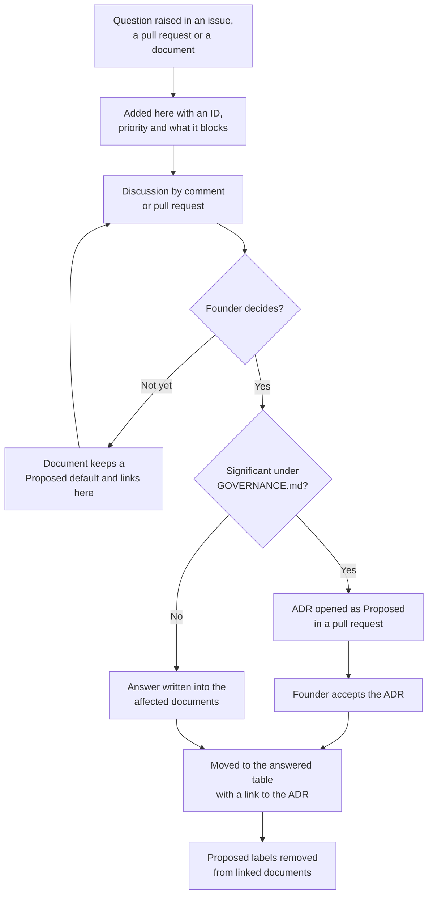
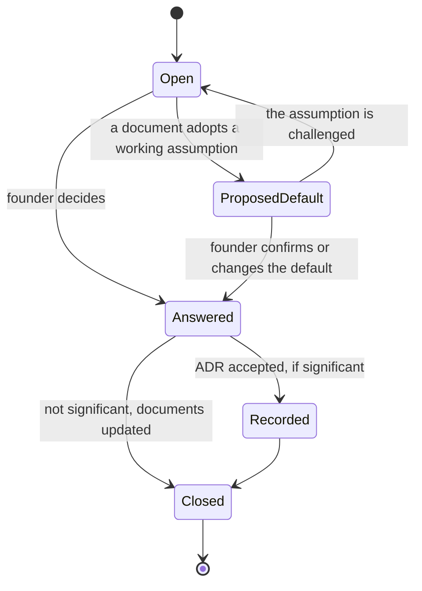
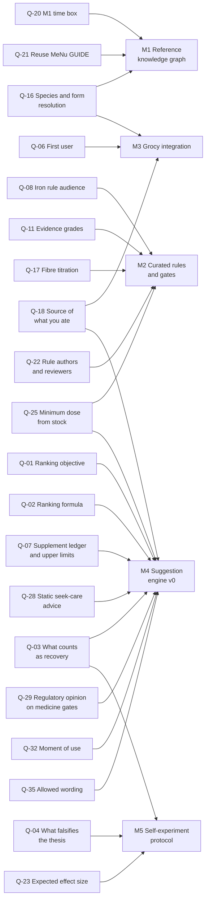

# Open questions

This page tracks the decisions the founder still has to make. Each question has an identifier (ID) such as Q-01. Other documents link to these IDs. An ID never changes meaning and is never reused.

Last reviewed: 2026-09-27.

## How a question gets answered

1. Anyone may comment on a question in an issue, or propose an answer in a pull request.
2. The founder decides. The process is set out in [GOVERNANCE.md](../GOVERNANCE.md).
3. If the answer is significant under [GOVERNANCE.md](../GOVERNANCE.md), it is recorded in an architecture decision record (ADR) in [docs/decisions](decisions/README.md).
4. The question moves to the answered table below, with a link to its record. Its ID is retired.
5. Until then, a document may state a **Proposed** default and link here. A Proposed default is a working assumption, not a decision.

This flowchart shows how a question moves from open to answered to recorded.

This state diagram shows the statuses a single question can pass through.

## Answered questions

These questions were open in the [project brief](vision/project-brief.md) and are now decided.

| Question | Answer in brief | Record |
|---|---|---|
| Who is it for, and will it be hosted, sold or exchanged for data? | Open source, self-hosted and local-first. No telemetry. Non-commercial. | [ADR-0003](decisions/0003-open-source-self-hosted.md) |
| Which licence applies? | Apache License 2.0 for code and documentation. Creative Commons Attribution 4.0 (CC BY 4.0) for the knowledge base. | [ADR-0002](decisions/0002-licensing.md) |
| What is built first? | The reference knowledge graph, with competency questions as exit criteria. | [ADR-0004](decisions/0004-knowledge-graph-first.md) |
| Is advice additive only? | No. Suggestions may add, move, swap or skip. Safety gates run first. The tone stays positive. | [ADR-0005](decisions/0005-full-advice-with-safety-gates.md) |
| What is the primary goal, and what role does health information play? | Recovery for people who train. Health information shapes suggestions and is never treated. | [ADR-0009](decisions/0009-recovery-goal-and-health-profile.md) |

Three decision records are still **Proposed** and wait for the founder: [ADR-0006](decisions/0006-arcadedb-graph-store.md) (ArcadeDB), [ADR-0007](decisions/0007-graph-proposes-rules-decide.md) (only curated rules produce suggestions) and [ADR-0008](decisions/0008-python-for-pipelines.md) (Python). They are tracked in the [decision index](decisions/README.md), not here.

## Open questions

**Priority.** High means the answer blocks a milestone exit or a safety design. Medium means it shapes a design, but a workable default exists. Low means it can wait.

**Blocks.** The milestone or document that cannot be finished without an answer. Milestones (M) are defined in the [roadmap](product/roadmap.md): M0 documentation and governance, M1 reference knowledge graph, M2 curated rules and gates, M3 Grocy integration, M4 suggestion engine v0, M5 self-experiment protocol.

### Goal and scope

| ID | Question | Why it matters | Priority | Blocks |
|---|---|---|---|---|
| Q-01 | What does the ranking function maximise, and over what horizon? Options: expected benefit for the next session, evidence-weighted nutrient status gained per meal, or progress toward a goal the user chose. Horizons: one meal, one day or one training block. | The ranker, its tests and the evaluation of M4 all follow from this choice. | high | M4; [rule model](architecture/rule-model.md) |
| Q-02 | What is the ranking formula? Sum or product over matched rules, which input units, how dose and body mass enter, and whether inhibitory rules act as a filter before ranking or a penalty inside it. | A penalty can be outweighed by other scores. A filter cannot. | high | M4; [rule model](architecture/rule-model.md) |
| Q-03 | What counts as recovery when ranking: readiness for the next session, less soreness, or adaptation over weeks? Which training outcome would show the engine works: session quality, strength, lean mass or days available to train? | The three meanings can favour different suggestions on the same day. | high | M4, M5; [recovery nutrition](science/recovery-nutrition.md) |
| Q-04 | What result would falsify the thesis? If M5 finds effects smaller than your noise floor, does the project pivot, narrow its claims or stop? | The M5 exit criterion needs a reading of the result agreed before the data arrive. | high | M5; [measurement](science/measurement.md) |
| Q-05 | Should the engine say anything about overall energy intake? Options: nothing; a fixed, general note that no pairing makes up for too little food; or a goal the user can choose. It never calculates energy availability and never suggests eating less. | [Recovery nutrition](science/recovery-nutrition.md) states that no food pairing fixes an energy shortfall. Any wording must also respect `gate.eating_disorder`. | medium | M2; [recovery nutrition](science/recovery-nutrition.md) |

### Users

| ID | Question | Why it matters | Priority | Blocks |
|---|---|---|---|---|
| Q-06 | Who is the first user: a Grocy power user who already scans barcodes, or a lifter who would install Grocy for this? Has one such person been onboarded end to end? What did they learn that their current nutrient tracker did not tell them? | The two groups need different first screens. The research found the assumed "micronutrient blindness" of gym-goers is overstated ([claim C9](research/claim-verification.md)). | high | M3, M4; [scope](product/scope.md) |
| Q-08 | Who are iron-absorption rules for? Options: rank them up only when diet pattern or life stage points to low iron stores; rank them equally for everyone who passes `gate.iron_overload`; or add a direct question about low iron. The gate already withholds when iron status is unknown. | The best-evidenced rule helps mainly people with low iron stores and does little for iron-replete men ([claim C1](research/claim-verification.md), [scope](product/scope.md)). | high | M2, M4; [health profile](science/health-profile.md) |

### Health profile

| ID | Question | Why it matters | Priority | Blocks |
|---|---|---|---|---|
| Q-09 | Every profile field is optional under [ADR-0009](decisions/0009-recovery-goal-and-health-profile.md). Which body measurements should onboarding ask for first? Which suggestions stay hidden without them? Should a body fat figure from `tape` or `estimate` be ignored for lean-mass scaling? What reference body mass applies when weight is missing? Current **Proposed** default: 50 kg. | Per-kilogram doses and limits depend on body mass. A body fat figure is only as useful as the method behind it. | medium | M4; [health profile](science/health-profile.md), [safety model](science/safety-model.md) |
| Q-10 | How long should each recent event shape advice? The current values are design choices: 14 days for gastrointestinal (GI) illness and for fever or infection, 30 for antibiotics, 56 for injury or surgery. Can you end an event early, and is that different from deleting it? | Too short leaves a sensitive gut exposed. Too long hides useful suggestions. | medium | M2; [safety model](science/safety-model.md), [health profile](science/health-profile.md) |
| Q-13 | When a tolerance question is unanswered, such as lactose intolerance or recent GI illness, should its gate fail closed like a safety gate, or show the suggestion with a note? The current definition for lactose is a note. | Failing closed costs useful suggestions. A note may be missed. Weakening a gate needs an ADR under [GOVERNANCE.md](../GOVERNANCE.md). | medium | M2; [safety model](science/safety-model.md) |
| Q-14 | Which list of major allergens does `gate.allergy` use when allergy status is unknown? Options: the European Union list, the United States list, the Australia and New Zealand list, or all three combined. | The choice decides which additions are withheld from users who have not answered. | medium | M2; [health profile](science/health-profile.md) |
| Q-15 | Should the engine import training load (sessions, volume, effort, phase) and wearable readiness data (heart-rate variability, sleep, resting heart rate)? Options: typed by you only; import from a file; read from a local service. | Without training context, every recovery rule fires after every hard session ([expert panel](research/expert-panel.md)). | medium | M4; [health profile](science/health-profile.md) |

### Data and knowledge graph

| ID | Question | Why it matters | Priority | Blocks |
|---|---|---|---|---|
| Q-16 | How does a Grocy product named "cinnamon" or "orange juice" resolve to a species and form when the label does not say? Options: ask once when the product is created, assume the higher-risk species, or refuse to match. How much hierarchy tolerance applies: may a rule about a specific food match a vaguer product name? | Safety limits depend on species. Cassia cinnamon carries far more coumarin than Ceylon cinnamon ([knowledge graph](architecture/knowledge-graph.md), competency question CQ-10). | high | M1, M3; [Grocy integration](architecture/grocy-integration.md) |
| Q-18 | Where does "what you ate" come from? Options: planned meals and recipes in Grocy, consume events, what is in stock, or a quick confirmation after the meal. | Consume logging is the Grocy behaviour users most often abandon ([project brief](vision/project-brief.md), section 7). The upper-limit ledger needs some record of intake. | high | M3, M4; [Grocy integration](architecture/grocy-integration.md) |
| Q-19 | Should resolved identifiers, such as the FoodOn class and match confidence, be written back to Grocy userfields? The alternative is to keep them only in the engine's own store. M3 is read-only today. | Write-back makes matches visible and editable in Grocy, but it changes your Grocy data. | medium | M3; [Grocy integration](architecture/grocy-integration.md) |
| Q-20 | What is the time box for M1? If the graph misses its exit criteria in that time, does work narrow to the rule table or continue? | [ADR-0004](decisions/0004-knowledge-graph-first.md) puts the graph first but sets no limit. The M0 exit criteria require an answer. | high | M0 exit, M1; [roadmap](product/roadmap.md) |
| Q-21 | Should the project reuse the MeNu GUIDE graph, reported as CC BY, or rebuild those joins from the source datasets? | It decides whether early months go on data engineering someone else has done. Its authors report biases in the integrated databases ([knowledge graph](architecture/knowledge-graph.md)). | high | M0 exit, M1; [data sources](architecture/data-sources.md) |
| Q-22 | Who writes and reviews the first rules? Options: the founder writes and recruits one reviewer; contributors write and the founder reviews; or a named reviewer panel. | M2 needs at least 20 accepted rules, each reviewed by someone other than its author ([roadmap](product/roadmap.md)). | high | M2 |

### Science and evidence

| ID | Question | Why it matters | Priority | Blocks |
|---|---|---|---|---|
| Q-11 | Which evidence grades may produce suggestions? Current **Proposed** default: A and B yes; C only with a visible "early evidence" label when you opt in; D never. Does the grade C limit for supplement-dose evidence apply when a rule's subject is the supplement itself at its tested dose? | Grades decide how many rules can reach you and how much trust each one deserves. | high | M2; [evidence policy](science/evidence-policy.md), [rule model](architecture/rule-model.md) |
| Q-12 | Is learning per-user only, or pooled across users by opt-in? If per-user, where does the starting estimate come from? If pooled, what consent and sharing design fits local-first operation? | Pooling needs data to leave your machine, which [ADR-0003](decisions/0003-open-source-self-hosted.md) rules out by default. | low | Work after M5; [measurement](science/measurement.md) |
| Q-17 | How is fermentable fibre introduced to someone with irritable bowel syndrome (IBS) or sensitivity to fermentable carbohydrates (FODMAPs)? A titration model needs grams, fibre type, ramp rate and a follow-up question. Until then `gate.fermentable_fibre` withholds. | The brief names this the likeliest real-world harm from an engine that adds food ([project brief](vision/project-brief.md), section 10). | high | M2; [safety model](science/safety-model.md) |
| Q-23 | For one concrete rule, what outcome changes, by how much, over what period, and how would you know if it did not? Options for the outcome level: absorption from one meal, a status marker over weeks, or training performance. | No effect size was stated in the original design. M5 cannot be planned without one. | high | M5; [measurement](science/measurement.md) |
| Q-24 | Should control periods be part of normal use: weeks without the addition, alternating blocks with and without it, or blinded additions? Or is every day an intervention day? | This decides whether the tool is a self-experiment platform or a diary. | medium | M4, M5; [measurement](science/measurement.md) |
| Q-25 | When stock cannot reach a rule's minimum effective dose, should the engine stay silent, suggest the partial dose with a note, or suggest adding the food to the shopping list? | A true but underdosed suggestion wastes trust. Silence hides a useful purchase. | high | M2, M4; [rule model](architecture/rule-model.md) |
| Q-26 | What are the default settings for self-experiments? Current **Proposed** defaults: at least five replicates per condition, one analysed outcome, and a posterior above 80 percent at the pre-registered effect. | The M5 protocol must be committed before data collection starts. | medium | M5; [measurement](science/measurement.md) |
| Q-27 | During a routine re-review, does an accepted rule keep producing suggestions until a reviewer finds a problem? Current **Proposed** default: yes. A challenge or safety report moves it to `in_review` at once. | Pausing each rule at every routine re-review would remove sound rules for no reason. | low | M2; [evidence policy](science/evidence-policy.md) |

### Safety and legal

| ID | Question | Why it matters | Priority | Blocks |
|---|---|---|---|---|
| Q-07 | Should the supplement ledger store amounts as ranges, and which upper-limit standard applies: the European Food Safety Authority (EFSA) or the United States Institute of Medicine? Current **Proposed** default: compare the top of each range with the limit. | Supplement labels are unreliable ([safety model](science/safety-model.md)). The standard chosen sets every limit the ledger checks against. | high | M4; [safety model](science/safety-model.md) |
| Q-28 | Should the engine show fixed, static advice to seek medical care when you report a symptom on a set list? It would never interpret the symptom or any lab value. Options: no symptom input at all; a fixed list with one static message; or a static message on every recent-event entry. The expert panel's example presentations are in the [project brief](vision/project-brief.md), section 10, question 15. | An engine that only suggests food has no other path to "see a doctor". Any interpretation would cross the intended purpose in [SAFETY.md](../SAFETY.md). | high | M4; [safety model](science/safety-model.md) |
| Q-29 | Is a regulatory opinion needed on the medication-based gates before any distribution beyond personal use, such as a public release or a packaged add-on? The safety model already requires one before commercial supply, a hosted version or lab-value features. | Medication gates use patient-specific data and sit close to a medical-device function ([safety model](science/safety-model.md)). | high | First public release after M4; [SAFETY.md](../SAFETY.md) |
| Q-30 | What counts as a "substantial" protein increase under `gate.kidney_function`? Options: any protein-focused addition, a fixed grams-per-meal threshold, or a per-kilogram threshold. | The gate cannot be tested until the threshold is defined ([safety model](science/safety-model.md)). | medium | M2; [safety model](science/safety-model.md) |
| Q-31 | Should the engine store lab results at all? Current **Proposed** default: a personal journal, kept on your machine and shown back unchanged, never used for suggestions. The alternative is to store nothing. | Interpreting lab values is out of scope under [SAFETY.md](../SAFETY.md). A journal must not drift into interpretation. | medium | M4; [measurement](science/measurement.md) |
| Q-35 | What may suggestion text say? Should there be a fixed whitelist of phrasings, with example outputs agreed before M4, and a list of banned wording? | Disease or threshold wording would move the tool outside its intended purpose in [SAFETY.md](../SAFETY.md). | high | M4; [principles](product/principles.md) |

### Product

| ID | Question | Why it matters | Priority | Blocks |
|---|---|---|---|---|
| Q-32 | When does a suggestion appear: when a Grocy meal-plan entry is due, when you open the app, on a morning schedule, or after a training session? Which form comes first: command line, local web page, Home Assistant add-on or Grocy plugin? | A self-hosted tool with no notification path has no moment of use ([project brief](vision/project-brief.md), section 10). | high | M4; [overview](architecture/overview.md) |
| Q-33 | What result after M4 decides whether to continue? Options: the share of suggestions users act on (the "do-rate"), a concierge test with a few volunteers, or completed self-experiments. The brief proposed a do-rate floor of 20 percent at week 4 ([project brief](vision/project-brief.md), section 8). | Without a stated signal, the project cannot tell a weak product from a slow start. | medium | Work after M4; [roadmap](product/roadmap.md) |
| Q-34 | Should the repository be renamed to fix the spelling of "Bioavailability" and "Recommendation"? Should the project take a short name? Should the ranking function drop the name "Anabolic Synergy Index"? | Renaming later breaks more links. The expert panel found no basis for "anabolic synergy" in the training literature ([expert panel](research/expert-panel.md)). | medium | First public release; [README](../README.md) |

## What blocks which milestone

This flowchart shows which high-priority questions block which milestones from M1 to M5.

## Where the brief's questions went

The [project brief](vision/project-brief.md), section 10, listed 19 questions. This table shows where each one is now.

| Brief question | Now |
|---|---|
| 1. What the index maximises and which training outcome should move | Q-01, Q-03 |
| 2. The index formula | Q-02 |
| 3. What would falsify the thesis | Q-04 |
| 4. Grocy power users or lifters new to Grocy | Q-06 |
| 5. Who the iron advice is for | Q-08 |
| 6. Barcodes and species resolution | Q-16 |
| 7. Source of intake data, supplement ledger and upper limits | Q-18, Q-07 |
| 8. Training load and wearable readiness | Q-15 |
| 9. Reuse MeNu GUIDE or rebuild | Q-21 |
| 10. Effect size for one recommendation | Q-23 |
| 11. Control periods in the product | Q-24 |
| 12. Per-user or pooled learning | Q-12 |
| 13. Minimum kitchen-achievable dose | Q-25, and ranking in Q-02 |
| 14. Telling a urolithin non-producer | Dropped. Microbiome suggestions are deferred in [scope](product/scope.md). |
| 15. Escalation for alarming presentations | Q-28, reframed: the engine never interprets values or symptoms. |
| 16. Learning that an addition was useless or harmful | Answered in part by [ADR-0005](decisions/0005-full-advice-with-safety-gates.md) and the adverse-event channel in the [safety model](science/safety-model.md). |
| 17. Fermentable fibre and titration | Q-17 |
| 18. Hosting, sale, labs and data leaving the host | Answered by [ADR-0003](decisions/0003-open-source-self-hosted.md). The lab journal is Q-31. |
| 19. Moment of use | Q-32 |

## Related

- [Roadmap](product/roadmap.md)
- [Decision records](decisions/README.md)
- [GOVERNANCE.md](../GOVERNANCE.md)
- [CONTRIBUTING.md](../CONTRIBUTING.md)
