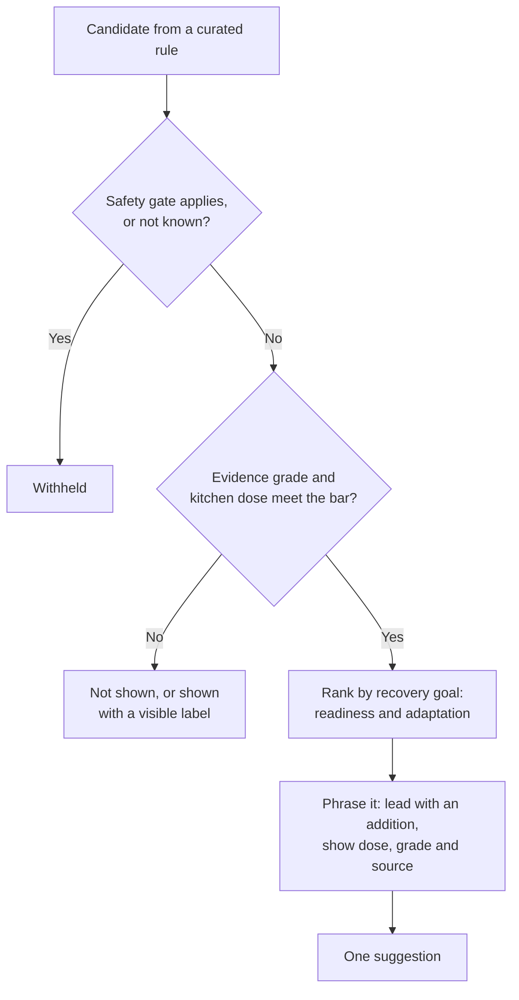

# Product principles

These principles settle arguments. When a design choice is unclear, pick the option that fits them best. Changing one needs a decision record.

This flowchart shows the order in which the principles apply to one candidate suggestion.

## 1. Positive health first

The goal is better recovery and performance for people who train: ready for the next session and still adapting. Health information such as conditions, intolerances and recent illness shapes what is suggested. It is never the thing being treated. See [ADR-0009](../decisions/0009-recovery-goal-and-health-profile.md).

## 2. Recovery that supports adaptation

Feeling less sore is not the same as recovering well. Some measures that reduce soreness, such as high-dose antioxidant supplements, can blunt the training adaptations people train for. Rules are judged on readiness and adaptation, not comfort alone. See [recovery nutrition](../science/recovery-nutrition.md).

## 3. The graph proposes; curated rules decide

The knowledge graph finds candidates and explains connections. Only a reviewed rule, with a dose, a population, an evidence grade and sources, can produce a suggestion. See [ADR-0007](../decisions/0007-graph-proposes-rules-decide.md).

## 4. Show the evidence

Every suggestion shows its dose, its evidence grade and a link to its source. If a key study was funded by a company that sells the product, the suggestion says so.

## 5. Safety gates run first and fail closed

Gates remove suggestions for people they could harm before anything is ranked. If the engine does not know whether a gate applies, the suggestion is withheld. See the [safety model](../science/safety-model.md).

## 6. Full advice, positive tone

The engine can suggest adding, moving, swapping or skipping. It leads with an addition when one exists, explains every suggestion, and never moralises. See [ADR-0005](../decisions/0005-full-advice-with-safety-gates.md).

## 7. Kitchen doses, or say otherwise

A rule only fires when a normal meal from the user's stock can reach the dose that produced the effect. Effects seen only at supplement doses carry a visible label and never masquerade as food advice.

## 8. Honest about uncertainty

Amounts are ranges, not points. "No evidence yet" is a valid answer and is never shown as "does nothing". The engine does not claim a suggestion worked for a person without a designed comparison. See [measurement and validation](../science/measurement.md).

## 9. Your data stays home

Health, profile and inventory data never leave the user's machine. No telemetry. See [ADR-0003](../decisions/0003-open-source-self-hosted.md).

## 10. Open by default, licence-clean by construction

Code and knowledge are published for reuse. Data that cannot be redistributed is only ever loaded locally by the user and is tagged so it never leaks into anything the project publishes. See [ADR-0002](../decisions/0002-licensing.md).

## 11. Small and correct beats large and plausible

Twenty well-evidenced rules are worth more than two thousand inferred ones. Growth comes from review, not from import volume.
