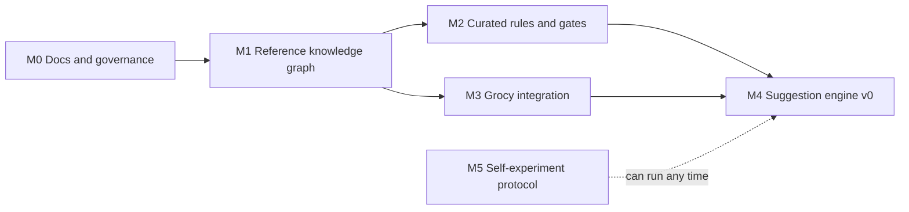

# Roadmap

Milestones are defined by exit criteria, not dates. A milestone is done when its criteria pass, not when time runs out. Order follows [ADR-0004](../decisions/0004-knowledge-graph-first.md): knowledge graph first.

## M0: Documentation and governance

Write the design down before building it.

**Exit criteria**

- [ ] Founder has reviewed and merged the documentation pull request.
- [ ] Proposed decisions [ADR-0006](../decisions/0006-arcadedb-graph-store.md), [ADR-0007](../decisions/0007-graph-proposes-rules-decide.md) and [ADR-0008](../decisions/0008-python-for-pipelines.md) are accepted, changed or rejected.
- [ ] High-priority [open questions](../open-questions.md) that block M1 have answers: Q-20 (time box) and Q-21 (reuse MeNu GUIDE or rebuild).
- [ ] Private vulnerability reporting is switched on in the repository settings. [SECURITY.md](../../SECURITY.md) depends on it.

## M1: Reference knowledge graph

Import licence-clean open data into a graph with provenance on everything. Design: [knowledge graph](../architecture/knowledge-graph.md).

**Deliverables**

- Licence manifest entries verified at the source for every imported dataset.
- A spike comparing ArcadeDB load and query on a ChEBI subset and FoodOn, per [ADR-0006](../decisions/0006-arcadedb-graph-store.md).
- Reproducible importers for the core sources: USDA FoodData Central, FoodOn, ChEBI and Reactome, plus the USDA retention factors.
- An RDF-to-property-graph conversion step that writes versioned node and edge files.
- Identifier crosswalks with a method and confidence on every mapping.
- Optional local importers for non-redistributable sources, tagged so their data is never exported.

**Exit criteria**

- [ ] Competency questions CQ-01 to CQ-10 are answered by committed queries with automated tests.
- [ ] A clean checkout rebuilds the graph from pinned source versions with one command.
- [ ] Every node and edge carries its dataset, version and licence.
- [ ] A licence audit query (CQ-08) returns no non-redistributable data in any exported artefact.

## M2: Curated rules and safety gates

Turn the evidence into reviewed rules. Design: [rule model](../architecture/rule-model.md), [evidence policy](../science/evidence-policy.md), [safety model](../science/safety-model.md).

**Exit criteria**

- [ ] At least 20 rules have status `accepted`, each reviewed by someone other than its author.
- [ ] Every rule links to knowledge graph entities for its subject and target.
- [ ] Every gate in the catalogue has at least one rule that uses it, or is removed.
- [ ] Continuous integration rejects any rule that fails schema validation or cites no source.

## M3: Grocy integration and entity resolution

Read the kitchen. Design: [Grocy integration](../architecture/grocy-integration.md).

**Exit criteria**

- [ ] Read-only import of stock, products, barcodes and quantity units from a Grocy instance.
- [ ] Barcoded products resolve through Open Food Facts or USDA branded foods to a FoodOn class.
- [ ] Products without a barcode get top-3 FoodOn candidates for the user to confirm.
- [ ] A gold set of 200 to 500 real products has measured precision and recall, published in the repository without personal details.

## M4: Suggestion engine v0

Put it together.

**Exit criteria**

- [ ] Given a planned meal and current stock, the engine returns at most one suggestion with dose, grade, source and reason.
- [ ] Gates are applied before ranking, and a test suite covers every gate.
- [ ] Upper-limit tracking covers declared supplements.
- [ ] Nothing leaves the host except explicit, documented lookups.
- [ ] The ranking function is written down and tested. See Q-01 and Q-02.

## M5: Self-experiment protocol

Find out whether any suggestion's effect is detectable in one person. Design: [measurement and validation](../science/measurement.md).

This needs no product code. It can start at any time, in parallel with M1.

**Exit criteria**

- [ ] A pre-registered protocol with a random schedule is committed before data collection starts.
- [ ] At least one completed run reports the measured noise floor and the smallest detectable effect.
- [ ] A written decision on what the result means for the product. For example, if only effects above about 25 percent are detectable, per-person validation is not practical at consumer scale.

## Later

Each needs a decision record before work starts: free-text state input and the vector layer, microbiome metabotypes, medication interaction features, lab-value input beyond gating, and pooled learning. See [scope](scope.md#deferred-with-the-reason).
