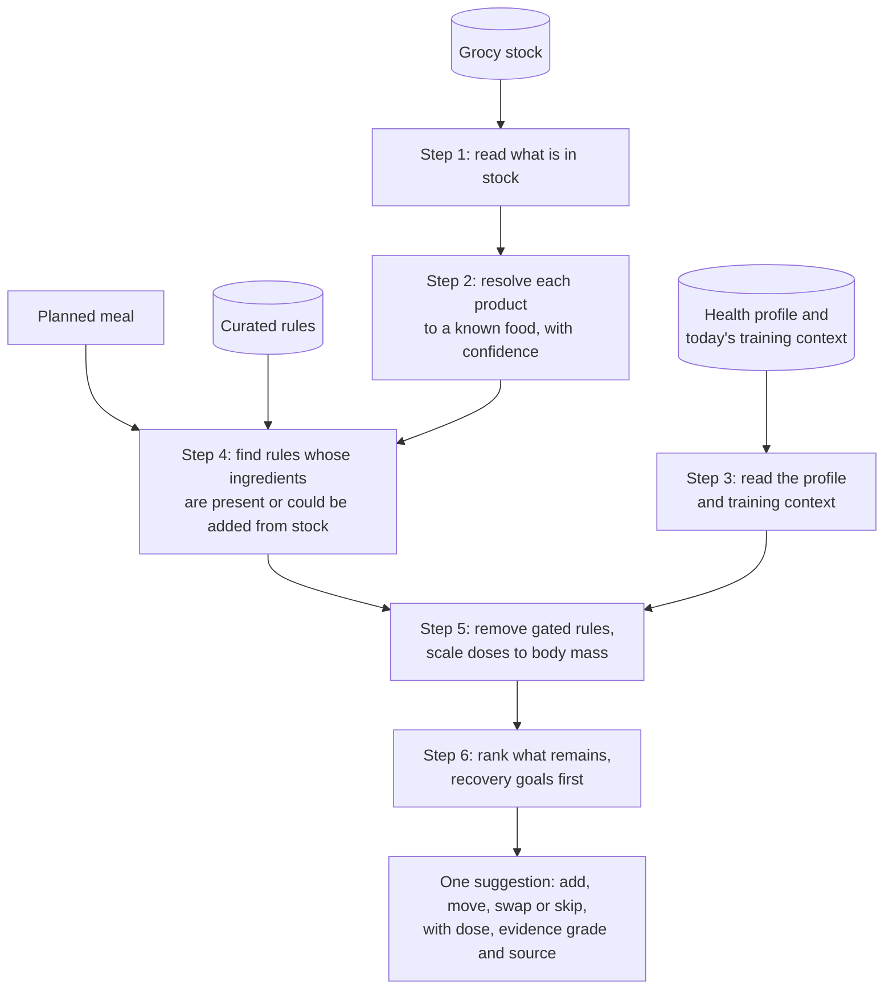

# Scope

## Intended purpose

A personal, self-hosted tool that suggests what to add to, re-time, swap or skip in your meals to support recovery from training and general wellness. It works from the food you have at home and the health information you choose to give it, which it uses to keep suggestions safe, tolerable and suited to you. It does not diagnose, treat, cure or prevent any disease. It does not interpret medical test results.

This wording lives in [SAFETY.md](../../SAFETY.md). Everything below must fit inside it.

## The goal

Better recovery for people who train, through the best nutrition available from their own kitchen. Recovery means ready for the next session and still adapting to training. See [ADR-0009](../decisions/0009-recovery-goal-and-health-profile.md) and [recovery nutrition](../science/recovery-nutrition.md).

## Who it is for

**Primary user: the self-hosting home cook who trains.** They run Grocy or are willing to. They cook most meals at home, and they already track what they eat, often down to the gram of protein. They know little about how foods change each other's absorption. This is the "gym rat" of the original README, defined by behaviour rather than by a deficiency.

**Where the first real benefit is likely: people with low iron stores.** The best-evidenced rule, vitamin C with plant iron, makes a meaningful difference mainly for people with low ferritin. That group includes many menstruating, plant-based and endurance athletes. For iron-replete men the same rule does almost nothing. See [claim C1](../research/claim-verification.md). The research also found that the widely assumed "micronutrient blindness" of gym-goers is not well documented. Documented shortfalls are in vitamin D, iron in women, fibre, and supplement doses that add up past safe limits. See [claim C9](../research/claim-verification.md).

**Contributors:** people with nutrition, pharmacology or data skills who want to build an open, evidence-graded knowledge base.

## What it does

1. Reads what is in stock from Grocy.
2. Resolves each product to a known food, with a confidence level.
3. Reads the user's [health profile](../science/health-profile.md) and today's training context.
4. For a planned meal, finds curated rules whose ingredients are present or could be added from stock.
5. Removes rules gated for this user, and scales doses to their body mass.
6. Ranks what remains, recovery goals first, and shows one suggestion with dose, evidence grade and source.

This flowchart shows the six steps above, from your stock and health profile to one suggestion.

Suggestions come in four classes: **add**, **move**, **swap** and **skip**. See [ADR-0005](../decisions/0005-full-advice-with-safety-gates.md).

## In scope for v0.x

- A reference knowledge graph of foods, compounds, nutrients and pathways from licence-clean sources.
- A curated, reviewed rule table with safety gates.
- Read-only Grocy integration and entity resolution.
- A suggestion engine with a command-line or simple local web interface.
- A user-controlled health profile: body measurements, training, diet pattern, allergies, intolerances, conditions, recent events, medicines, supplements and life stage.
- A tracker for suggested intake against upper intake levels, based on declared supplements.

## Deferred, with the reason

| Feature | Why deferred | Revisit when |
|---|---|---|
| Free-text state input ("slept badly, legs sore") and the vector layer | No mapping from text to target states exists yet. Four goal choices cover the need first. | The rule table covers more than one goal. |
| Microbiome-based suggestions | Taxa change day to day. Key conversions such as urolithin A depend on microbes some people lack, and feeding cannot create them. | A one-off urolithin test shows value. |
| Lab-value input used for anything beyond gating | Interpreting results is a medical-device function in the US, EU and Australia. | A decision record and a regulatory review exist. |
| Medication interaction checking beyond gating | Same as above. | Same as above. |
| Learning personal response from blood panels | Routine markers vary too much within a person to show kitchen-scale effects. | The self-experiment protocol shows a detectable signal. |
| Pooled learning across users | Conflicts with local-first data. | An opt-in design exists. See Q-12. |

## Out of scope

- A hosted service, accounts or sale of access. See [ADR-0003](../decisions/0003-open-source-self-hosted.md).
- Diagnosing, treating or claiming to prevent disease.
- Advice about starting, stopping or changing prescribed medicine.
- Weight-loss programmes or calorie prescriptions.
