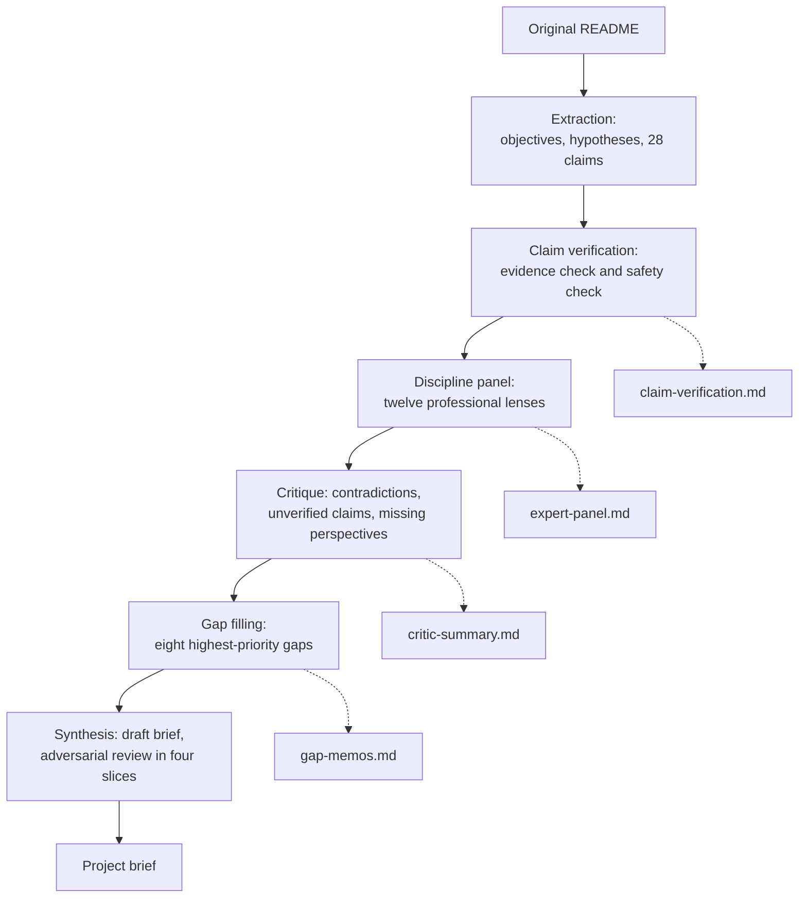

# Research record

This folder holds the research that turned the [original README](../vision/original-readme.md) into the [project brief](../vision/project-brief.md). It exists so that every claim in the design documents can be traced back to a source.

## How it was produced

The research ran on 26 and 27 September 2026 as an automated, multi-agent literature review. AI research agents did the work. No human clinician, dietitian or lawyer reviewed it.

| Stage | What happened | Output |
|---|---|---|
| Extraction | One agent read the README and listed its objectives, hypotheses, methods and every concrete scientific claim | 19 objectives, 14 explicit and 18 implicit hypotheses, 28 claims |
| Claim verification | Each claim was checked twice: once for strength of human evidence, once for safety | [claim-verification.md](claim-verification.md) |
| Discipline panel | Twelve agents each took one professional lens and researched the project from it | [expert-panel.md](expert-panel.md) |
| Critique | One agent looked for contradictions, unverified claims and missing perspectives | [critic-summary.md](critic-summary.md) |
| Gap filling | The eight highest-priority gaps were researched further | [gap-memos.md](gap-memos.md) |
| Synthesis | A draft brief was written, reviewed adversarially in four slices, and revised | [project-brief.md](../vision/project-brief.md) |

The twelve lenses were: sports and internal medicine physician, clinical pharmacologist, registered dietitian, metabolomics researcher, gut microbiome scientist, exercise physiologist, knowledge-graph engineer, machine-learning engineer, health-tech regulatory analyst, product strategist, clinical epidemiologist, and research librarian.

This flowchart shows the research stages in order, with the output of each.

## How to use it

- **Start with the brief.** It is the reviewed summary. The appendices are raw material.
- **Treat numbers as leads, not facts.** Agents were told to cite real sources and never invent one. Some URLs may still be wrong, and some summaries may misstate a paper. Check the primary source before a number goes into a rule.
- **Use the claim IDs.** Claims are numbered C1 to C28 in [claim-verification.md](claim-verification.md). Design documents cite them by ID.
- **Expect disagreement.** The panel disagreed on several points. The critic summary lists where and suggests a resolution. Those resolutions are proposals, not decisions.

## What it found, in five lines

1. The pantry constraint through Grocy is the part no existing product covers.
2. The README's interaction examples are real chemistry, but their size depends on dose, food matrix, timing and the person. Several examples only work at supplement doses.
3. Every example pairing has a group of people it can harm, so the engine needs safety gates.
4. Routine blood markers vary too much within one person to show the effect of a kitchen-scale change.
5. Much of the knowledge-graph layer already exists in open datasets, but several named sources are not licensed for redistribution.

## Limits

- The literature search was broad but not systematic. It did not follow a registered protocol.
- Access to some full texts was blocked, so some findings rest on abstracts.
- Eleven lower-priority gaps identified by the critic were not researched. They are listed in [critic-summary.md](critic-summary.md).
- Licence findings reflect what the agents could read in September 2026. Confirm each licence at the source before importing data. See [data sources](../architecture/data-sources.md).
