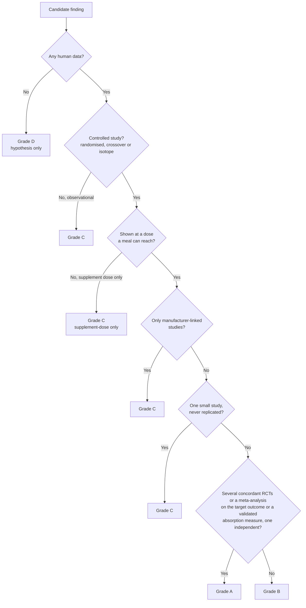
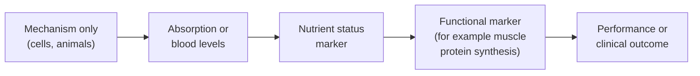
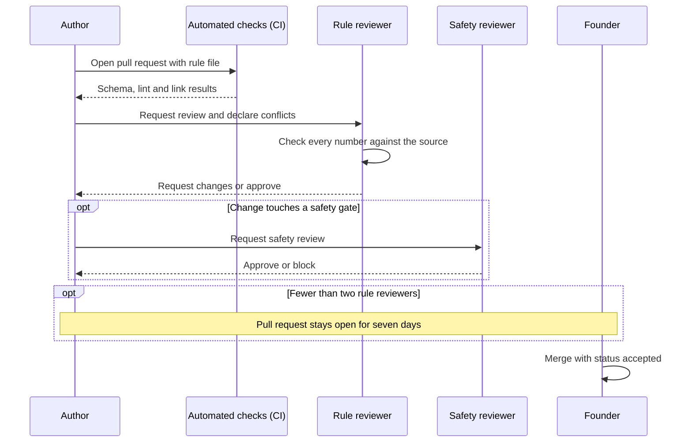
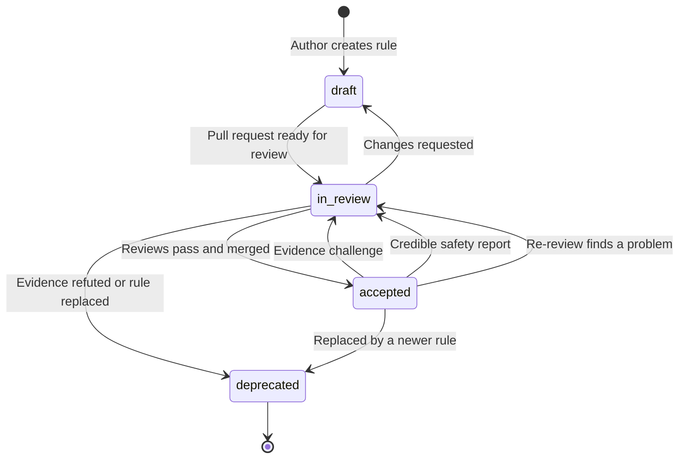

# Evidence policy

This policy decides what can become a rule and what a rule may do. Rules are the only thing that can produce a suggestion, under architecture decision record [ADR-0007](../decisions/0007-graph-proposes-rules-decide.md). So this page sets the bar for everything the user sees.

The grades are fixed. Which grades may produce suggestions is **Proposed**. See [Q-11](../open-questions.md). Changing this policy needs a decision record under [GOVERNANCE.md](../../GOVERNANCE.md).

## Evidence grades

Every rule carries one grade in `evidence.grade`. The fields are defined in the [rule model](../architecture/rule-model.md).

| Grade | Definition |
|---|---|
| **A** | Multiple concordant human randomised controlled trials (RCTs), or a meta-analysis, at the recommended dose. The outcome is the target outcome or a validated absorption measure. At least one study is independent of manufacturers. |
| **B** | At least one well-conducted human controlled study (randomised, crossover or isotope) at the recommended dose. Replication is preferred. |
| **C** | A single small or unreplicated human study, a supplement-dose-only finding, manufacturer-only evidence, or human observational data. |
| **D** | Animal, in-vitro or mechanism only. A hypothesis. It never becomes a rule that produces suggestions. |

The flowchart below shows how a reviewer reaches a grade from the study characteristics.

### Worked examples

Each source below is linked by its PubMed identifier (PMID).

**Vitamin C with plant iron is grade B.** Cook and Monsen gave 63 men radio-labelled meals. Absorption rose in proportion to the dose of ascorbic acid, from 1.65 times at 25 mg ([PMID 835510](https://pubmed.ncbi.nlm.nih.gov/835510/)). Hallberg and colleagues showed that ascorbic acid counteracts phytate inhibition ([PMID 2911999](https://pubmed.ncbi.nlm.nih.gov/2911999/)). These are controlled isotope studies at food doses from independent groups. It is not grade A because the effect shrinks across a whole diet. In 12 people, daily vitamin C from 51 to 247 mg made no significant difference to absorption ([PMID 11124756](https://pubmed.ncbi.nlm.nih.gov/11124756/)). See [R-0001](../../knowledge/rules/R-0001-vitamin-c-nonheme-iron.yaml).

**Piperine with curcumin is grade C and supplement-dose only.** The one positive human study gave 2 g of curcumin with 20 mg of piperine. It reported a 2000 percent rise in bioavailability, from a baseline that was undetectable or very low ([PMID 9619120](https://pubmed.ncbi.nlm.nih.gov/9619120/)). A later independent crossover in nine men found that piperine provided no benefit ([PMID 40487425](https://pubmed.ncbi.nlm.nih.gov/40487425/)). See [R-0004](../../knowledge/rules/R-0004-piperine-curcumin.yaml).

**Cinnamon, magnesium and vinegar "activating GLUT4" is not admissible.** The original README claimed this trio activates glucose transporter type 4 (GLUT4) in muscle. The GLUT4 evidence for cinnamon is in mouse fat cells grown in a dish ([PMID 17316549](https://pubmed.ncbi.nlm.nih.gov/17316549/)). That is grade D. A Cochrane review of 10 RCTs with 577 people found no significant effect of cinnamon on serum insulin ([PMID 22972104](https://pubmed.ncbi.nlm.nih.gov/22972104/)). The research record found no trial of the three together. The claim also aims to treat a disease marker, which is outside the [intended purpose](../../SAFETY.md). See [claim verification](../research/claim-verification.md).

## What each grade may do

This is the **Proposed** default. See [Q-11](../open-questions.md).

| Grade | May produce a suggestion? | How it is shown |
|---|---|---|
| A | Yes | Grade and first source shown. |
| B | Yes | Grade and first source shown. |
| C | Only if the user opts in | Always with a visible "early evidence" label. |
| D | Never | Stored as a hypothesis in the graph, not as a rule. |

The schema already refuses an `accepted` rule with grade D.

## Required fields and why

Each field answers a question that has misled nutrition advice before.

| Field | Why it is required |
|---|---|
| `dose.effective` | The dose at which the effect was shown. An effect at 2 g says nothing about a pinch. |
| `dose.kitchen_reachable` | Whether a normal meal from the user's stock can reach that dose. |
| `conditions.applies_to` | The population studied. A finding in people with low iron may not apply to someone with full stores. |
| `effect.magnitude` | The effect size with its uncertainty, dose and baseline. A large ratio from a tiny baseline can mean a small absolute gain. |
| `effect.outcome_type` | What was measured, from mechanism through absorption and status to performance. See the ladder below. |
| `evidence.replicated` | Whether an independent group has reproduced the main finding. |
| `evidence.sponsor_flag` | Who funded or ran the studies. See the sponsor section. |
| `evidence.counter_evidence` | Null or contrary results. A rule without them is assumed incomplete, not uncontested. |

The diagram below orders outcome types from furthest to closest to what you care about.

## Supplement-dose-only rule

If an effect has only been shown at supplement doses, `dose.supplement_dose_only` is true. Such a rule never fires from food. It is at most grade C.

**Proposed:** it may appear only when the user has declared that supplement and opted in to grade C, always with a label. See [Q-11](../open-questions.md). The piperine rule is the model case. A teaspoon of turmeric supplies far less curcumin than the 2 g in the positive study.

## Negative results are first-class

A tested and refuted interaction is recorded as a rule with direction `no_effect` and output class `none`. These rules never produce a suggestion. They matter for two reasons:

1. **They stop false warnings.** Raising dietary calcium from 700 to 1,800 mg a day did not change zinc absorption ([PMID 19176739](https://pubmed.ncbi.nlm.nih.gov/19176739/)). [R-0005](../../knowledge/rules/R-0005-calcium-zinc-no-effect.yaml) stops the engine from warning about that pair.
2. **They stop the graph from re-proposing it.** The graph finds candidate interactions from mechanism text. A `no_effect` rule tells it this one has been tested.

A `no_effect` rule is graded like any other. It needs the same review.

## Surrogate and outcome endpoints

A surrogate endpoint is a measurement that stands in for the outcome you care about. Many recovery claims rest on surrogates. The rule must name the surrogate and must not claim the outcome.

- **Muscle protein synthesis is a surrogate for muscle growth.** In 23 young men, the rise in muscle protein synthesis after a first session did not correlate with quadriceps growth after 16 weeks of training (r = 0.10 over 1 to 6 hours) ([PMID 24586775](https://pubmed.ncbi.nlm.nih.gov/24586775/)).
- **Soreness is not recovery.** In 110 men, delayed-onset muscle soreness correlated weakly or not at all with other markers of muscle damage (r below 0.32) ([PMID 12453160](https://pubmed.ncbi.nlm.nih.gov/12453160/)). A Cochrane review of 50 trials found antioxidant supplements cut soreness by less than the minimal important difference. None of those trials measured recovery ([PMID 29238948](https://pubmed.ncbi.nlm.nih.gov/29238948/)).
- **Creatine kinase (CK) and high-sensitivity C-reactive protein (hs-CRP) are poor recovery markers.** In 203 healthy volunteers, one bout of eccentric exercise raised CK by 6,420 percent at day 4, with no kidney harm ([PMID 16679975](https://pubmed.ncbi.nlm.nih.gov/16679975/)). In 100 stable adults, 46 percent changed C-reactive protein risk category at least once in a year ([PMID 23579782](https://pubmed.ncbi.nlm.nih.gov/23579782/)).

Recovery means being ready for the next session and still adapting to training ([ADR-0009](../decisions/0009-recovery-goal-and-health-profile.md)). A rule graded on a surrogate keeps that surrogate in `effect.outcome_type`. How recovery is measured is covered in [measurement](measurement.md) and [recovery nutrition](recovery-nutrition.md).

## Sponsors and conflicts of interest

Industry-funded research is not banned. It is flagged.

- `evidence.sponsor_flag` is `independent`, `manufacturer`, `mixed` or `unknown`.
- A finding supported only by manufacturer-linked studies is at most grade C.
- Grade A needs at least one study independent of manufacturers.
- The piperine study is flagged `manufacturer`. One co-author founded a company that sells piperine and curcumin ingredients.

Authors and reviewers state any financial tie to a supplement, food, testing or nutrition company. The pull request template asks. A tie does not disqualify anyone. Hiding one does ([GOVERNANCE.md](../../GOVERNANCE.md)).

## Review process

A rule enters `knowledge/rules/` through a pull request. The steps follow [GOVERNANCE.md](../../GOVERNANCE.md).

1. **The author** writes the rule with a PMID or digital object identifier (DOI) for every source. They state any conflict of interest.
2. **Continuous integration (CI)** checks the file against the schema.
3. **A rule reviewer** other than the author checks every number against its source. They also check the dose, the reachability claim, the gates and the counter-evidence.
4. **A safety reviewer** must approve if the change adds, removes or alters a gate, in the rule or in [gates.yaml](../../knowledge/gates/gates.yaml).
5. **An open window.** While the project has fewer than two rule reviewers, the pull request stays open for seven days before merge.
6. **Merge.** The merged file carries status `accepted`, the reviewers and the review date.

A change that only makes a rule safer, such as adding a gate, may merge at once.

The sequence below shows one rule pull request from opening to merge.

## Rule lifecycle

Every rule moves through four states. Only `accepted` rules produce suggestions. A wrong rule is set to `deprecated`, never deleted.

The state diagram below shows each status and what moves a rule between them.

## Re-review triggers

An accepted rule is re-reviewed when any of these happens:

- a new meta-analysis on the same interaction is published;
- someone opens an [evidence challenge](../../.github/ISSUE_TEMPLATE/evidence_challenge.yml) issue;
- a safety report names the rule ([SAFETY.md](../../SAFETY.md));
- 24 months have passed since `last_reviewed`.

**Proposed:** during a routine re-review, the rule stays `accepted` unless a reviewer finds a problem. A challenge or a safety report moves it to `in_review` at once. See [open questions](../open-questions.md).

## Handling disagreement

If reviewers disagree about an accepted rule, it moves to `in_review`. It stops producing suggestions until the disagreement is resolved. This fails closed: silence is safer than a disputed suggestion. If maintainers cannot agree, the founder decides and the pull request records why.

## Related

- [Rule model](../architecture/rule-model.md)
- [Safety model](safety-model.md)
- [Health profile](health-profile.md)
- [Recovery nutrition](recovery-nutrition.md)
- [Measurement](measurement.md)
- [Open questions](../open-questions.md)
- [Glossary](../glossary.md)
