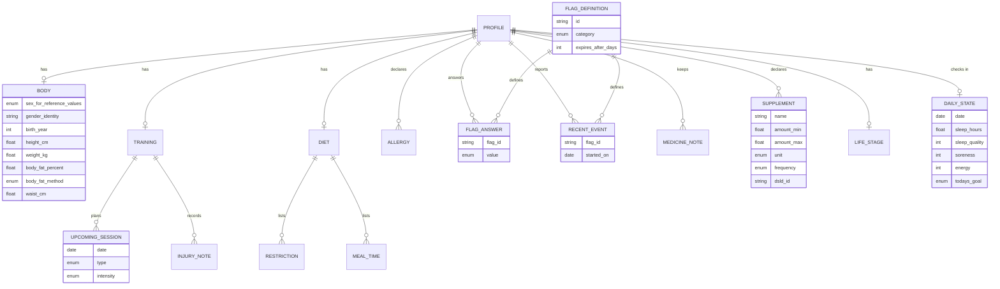
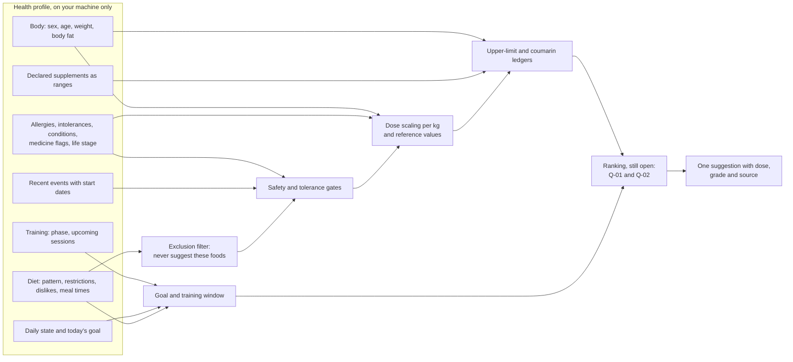
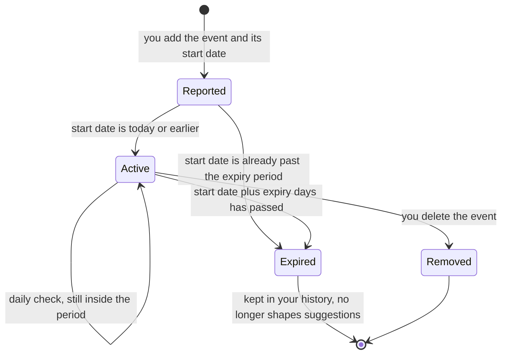
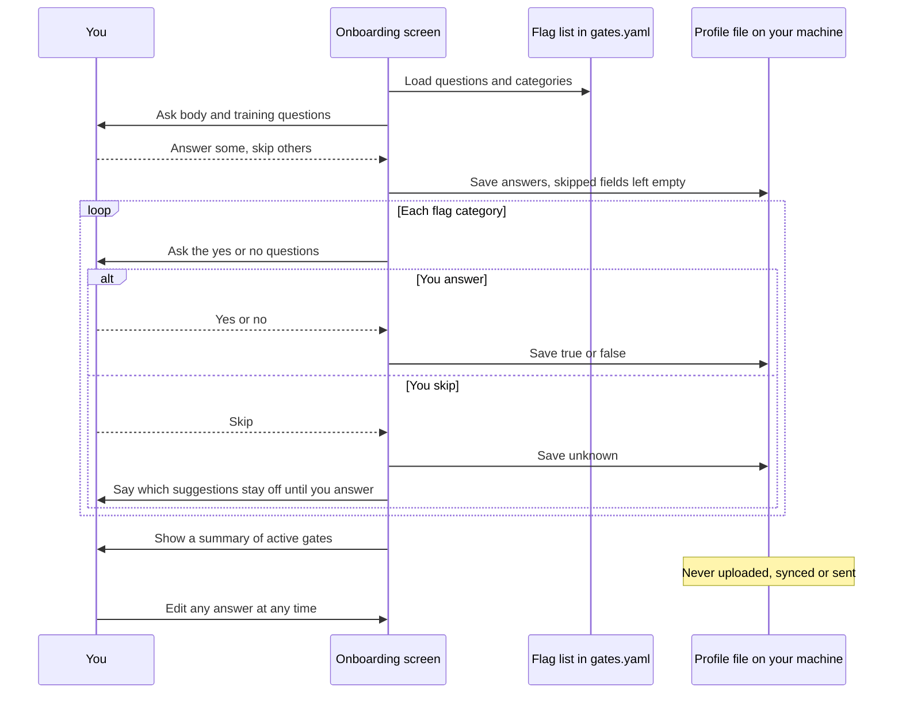

# Health profile

The health profile is what you tell the engine about yourself. It shapes suggestions: it can withhold, adjust, swap or re-time them, and it scales amounts to your body. It is never the thing being treated. The engine never says "eat X to treat condition Y". See [architecture decision record (ADR) 0009](../decisions/0009-recovery-goal-and-health-profile.md) and [SAFETY.md](../../SAFETY.md).

Status: design only. The machine-checked shape is [profile.schema.json](../../knowledge/schema/profile.schema.json). A worked example for an invented person is [profile.example.yaml](../../knowledge/examples/profile.example.yaml).

## Five promises

1. **You control it.** You fill it in, change it and delete it. Nothing is required.
2. **It stays on your machine.** The profile is a local file. It is never uploaded, synced or sent. There is no telemetry. See [ADR-0003](../decisions/0003-open-source-self-hosted.md).
3. **Missing answers make the engine more cautious, not less.** A skipped question closes every safety gate that depends on it.
4. **The engine never infers a condition.** It uses only what you declare. It does not read lab results, and it never shows a value as "normal" or "abnormal".
5. **It never labels your body.** The engine does not compute body mass index, does not call a weight "high" or "low", and does not offer weight-loss plans. Weight-loss programmes are [out of scope](../product/scope.md).

## How the parts fit

This entity-relationship diagram shows the sections of the profile and how flag answers link to the flag definitions in [gates.yaml](../../knowledge/gates/gates.yaml).

This flowchart shows which parts of the engine read each section of the profile.

## Field by field

Each table says why a field is collected and what uses it. Gate and flag identifiers are defined in [gates.yaml](../../knowledge/gates/gates.yaml). The [safety model](safety-model.md) explains how gates run.

### Body

| Field | Why it is collected | Used by |
|---|---|---|
| `sex_for_reference_values` | Reference intakes and upper limits differ by sex ([National Institutes of Health tables](https://ods.od.nih.gov/HealthInformation/nutrientrecommendations.aspx)). | Dose scaling, `gate.upper_limit`. If not stated, the more cautious value is used. |
| `gender_identity` | So the interface can address you as you wish. | Display only. Never used in a calculation. |
| `birth_year` or `age_years` | Reference intakes and upper limits differ by age. | Dose scaling, `gate.upper_limit`. If missing, the most cautious adult value is used. |
| `height_cm` | You asked to record it, and some reference equations use it. | No current rule or gate. |
| `weight_kg` | Many amounts and limits are set per kilogram of body mass. | Per-kilogram doses such as protein per meal ([recovery nutrition](recovery-nutrition.md)). The coumarin limit in `gate.coumarin`, 0.1 mg per kg a day. |
| `body_fat_percent`, `body_fat_method` | Lean mass may suit per-kilogram protein better than total mass in some people. The method says how the number was obtained: dual-energy X-ray absorptiometry (`dexa`), `bioimpedance`, `skinfold`, `tape` or `estimate`. | **Proposed** only: using lean mass for protein scaling. See [Q-02](../open-questions.md). |
| `waist_cm` | For your own tracking. | No current rule or gate. |

Per-kilogram scaling is where body mass matters most. For the fictional person in the example, at 64.5 kg, the coumarin limit is 6.45 mg a day. If weight is missing, per-kilogram limits use a low reference body mass. **Proposed:** 50 kg. Per-kilogram targets, such as protein, are then shown without a scaled amount. Both defaults are open; see [open questions](../open-questions.md).

### Training

| Field | Why it is collected | Used by |
|---|---|---|
| `types`, `sessions_per_week`, `experience_years` | To describe the training that recovery must support. | Context for goal choice. **Proposed** weighting; see [Q-01](../open-questions.md). |
| `current_phase` | A hypertrophy block, strength block, deload, competition prep or endurance base changes which recovery goal matters most. | Goal choice. **Proposed**; see [Q-01](../open-questions.md). |
| `upcoming_sessions` | The next session's date, time and type set the training window. | A rule's optional `context.training_window`: `pre_training`, `post_training`, `rest_day` or `any`. |
| `current_injuries` | For your own record and for training context. | Nothing reads the text. The engine reads `flag.recent_injury_or_surgery` instead. |

### Diet

| Field | Why it is collected | Used by |
|---|---|---|
| `pattern` | Omnivore, vegetarian, vegan or pescatarian. It removes foods you do not eat. It also changes how relevant iron rules are: low iron stores are most common in menstruating, plant-based and endurance athletes ([claim C1](../research/claim-verification.md), [scope](../product/scope.md)). | Exclusion filter. Ranking of iron-absorption rules. |
| `restrictions` | Religious, ethical or other exclusions, such as gelatin or pork. | Exclusion filter. These foods are never suggested. |
| `dislikes` | Food you will not eat is a wasted suggestion. | Exclusion filter. Not a health statement. |
| `meal_times` | Timing rules need to know when meals happen. | `move` suggestions, such as separating tea from an iron-rich meal. Training window. |

### Allergies

`allergies.status` is `none`, `listed` or `unknown`. It maps to `flag.allergens`. Each listed allergen is resolved to a food class with your confirmation, so "cashew" also matches cashew butter. Severity (`mild`, `moderate`, `severe`, `anaphylaxis`, `not_sure`) is shown to you. It never loosens `gate.allergy`: a mild allergy withholds as firmly as a severe one. If the status is unknown, `gate.allergy` withholds suggestions that add a common major allergen. **Proposed**: which allergen list applies; see [open questions](../open-questions.md).

### Intolerances

| Field | Why it is collected | Used by |
|---|---|---|
| `flags.flag.lactose_intolerance` | Lactose causes discomfort for some people. | `gate.lactose_intolerance`, a tolerance gate. |
| `other_foods` | Anything else that upsets you. | Exclusion filter, like dislikes. |

An intolerance produces a **swap**, not silence. Most adults with lactose intolerance tolerate 12 to 15 g of lactose, about one cup of milk ([Shaukat 2010, PubMed 20404262](https://pubmed.ncbi.nlm.nih.gov/20404262/)). So a suggestion to add milk after training becomes "add lactose-free milk" when that is in your stock. The protein and calcium stay. If no lactose-free option is in stock, the suggestion is shown with a note about lactose.

### Conditions

These flags are yes, no or unknown. Each drives one or more safety gates. The engine uses them only to withhold or cap. It never suggests a food for a condition.

| Flag | Gate |
|---|---|
| `flag.haemochromatosis`, `flag.told_iron_high` | `gate.iron_overload` |
| `flag.kidney_disease` | `gate.kidney_function`: magnesium, supplement-dose vitamin C, large protein increases and creatine are withheld |
| `flag.gastroparesis` | `gate.gastroparesis` |
| `flag.ibs_or_fodmap_sensitive` | `gate.fermentable_fibre` for irritable bowel syndrome or sensitivity to fermentable carbohydrates (FODMAPs); titration is [Q-17](../open-questions.md) |
| `flag.g6pd_deficiency` | `gate.g6pd` for glucose-6-phosphate dehydrogenase (G6PD) deficiency |
| `flag.inborn_error_of_metabolism` | `gate.inborn_error` |
| `flag.eating_disorder_history` | `gate.eating_disorder`; weight trends and wording about amounts are also hidden (**Proposed**) |
| `flag.coeliac_or_gluten_sensitivity` | `gate.coeliac_gluten` |

### Recent events

A recent event is a flag plus the date it started. The flag definition sets how long it lasts, so you never have to remember to switch it off.

| Flag | Lasts | Effect |
|---|---|---|
| `flag.recent_gi_illness` | 14 days | `gate.recent_gi_illness` pauses fermentable fibre, vinegar and high-fat additions. |
| `flag.recent_fever_or_infection` | 14 days | Context only. No gate. |
| `flag.recent_antibiotics` | 30 days | Context only. No gate. |
| `flag.recent_injury_or_surgery` | 56 days | Context only. No gate. |

"Context only" means the event is shown with suggestions and recorded for your own [self-experiments](measurement.md). It does not change what is suggested. The day counts are design choices, not findings.

This state diagram shows the life of one recent event.

### Medicines

| Field | Why it is collected | Used by |
|---|---|---|
| `notes` | A free-text list for your own reference. | Nothing. It is never parsed, matched or checked. |
| `flags` | Yes, no or unknown answers to fixed questions. | `gate.vitamin_k_consistency`, `gate.cyp3a4_pgp_medicine`, `gate.glucose_lowering_medicine`. |

The engine does not check your medicines against each other or against food. It asks a few fixed questions, and a "yes" or a skipped answer withholds the suggestions listed in each gate. The [safety model](safety-model.md) explains why this matters for regulation.

### Declared supplements

Each supplement has a name, an amount as a range with a unit (g, mg, micrograms (mcg), international units (IU) or millilitres (mL)), a frequency, and an optional identifier from the National Institutes of Health Dietary Supplement Label Database (DSLD). Amounts are ranges because labels are unreliable. In one analysis, calcium in multivitamins measured 7.1 to 29.3 percent above the label ([Andrews 2017, PubMed 27974309](https://pubmed.ncbi.nlm.nih.gov/27974309/)). Caffeine in pre-workout products ranged from 59 to 176 percent of the label claim ([Desbrow 2019, PubMed 30196576](https://pubmed.ncbi.nlm.nih.gov/30196576/)). The ranges feed `gate.upper_limit`. Which upper-limit standard applies is [Q-07](../open-questions.md).

### Life stage

| Field | Why it is collected | Used by |
|---|---|---|
| `flags.flag.pregnant_or_breastfeeding` | Reference intakes and upper limits change, and supplement-dose data are thin. | `gate.pregnancy`, dose scaling, `gate.upper_limit`. |
| `menstrual_status` | Menstruation changes how relevant iron rules are ([claim C1](../research/claim-verification.md)). | Ranking of iron-absorption rules. Never used to infer a condition. |

### Daily state

| Field | Why it is collected | Used by |
|---|---|---|
| `sleep_hours`, `sleep_quality` (1 to 5) | Sleep is part of recovery. | Context, and the `sleep` goal. [Self-experiment](measurement.md) records. |
| `soreness` (0 to 10), `energy` (1 to 5) | How you feel today. | Context, and a default goal when you do not choose one (**Proposed**, [Q-01](../open-questions.md)). Never interpreted as a symptom. |
| `todays_goal` | What you want from today's meals. | Ranking. Values: `muscle_repair`, `glycogen_restoration`, `connective_tissue`, `adaptation`, `sleep`, `micronutrient_status`, `hydration`, `gut_comfort`, `general`. |

A daily state with an old date is ignored.

## Onboarding

This sequence diagram shows onboarding: questions come from the flag list, you may skip any of them, and answers are stored only on your machine.

Skipping has a cost, and the engine says so plainly. For example: "You skipped the kidney question, so protein top-ups and creatine will not be suggested. You can answer it any time in your profile."

## What the engine never does with the profile

- Infer a condition from other answers, from purchases or from lab values.
- Interpret a lab value, or show any value as normal or abnormal.
- Suggest a food as a treatment for a condition.
- Advise on starting, stopping or changing a medicine.
- Send any part of the profile off the machine.

## Related

- [Safety model](safety-model.md): gate order, the full gate catalogue and the regulatory posture.
- [Recovery nutrition](recovery-nutrition.md): the goals and the per-kilogram doses.
- [Evidence policy](evidence-policy.md): grades A to D.
- [Open questions](../open-questions.md).
