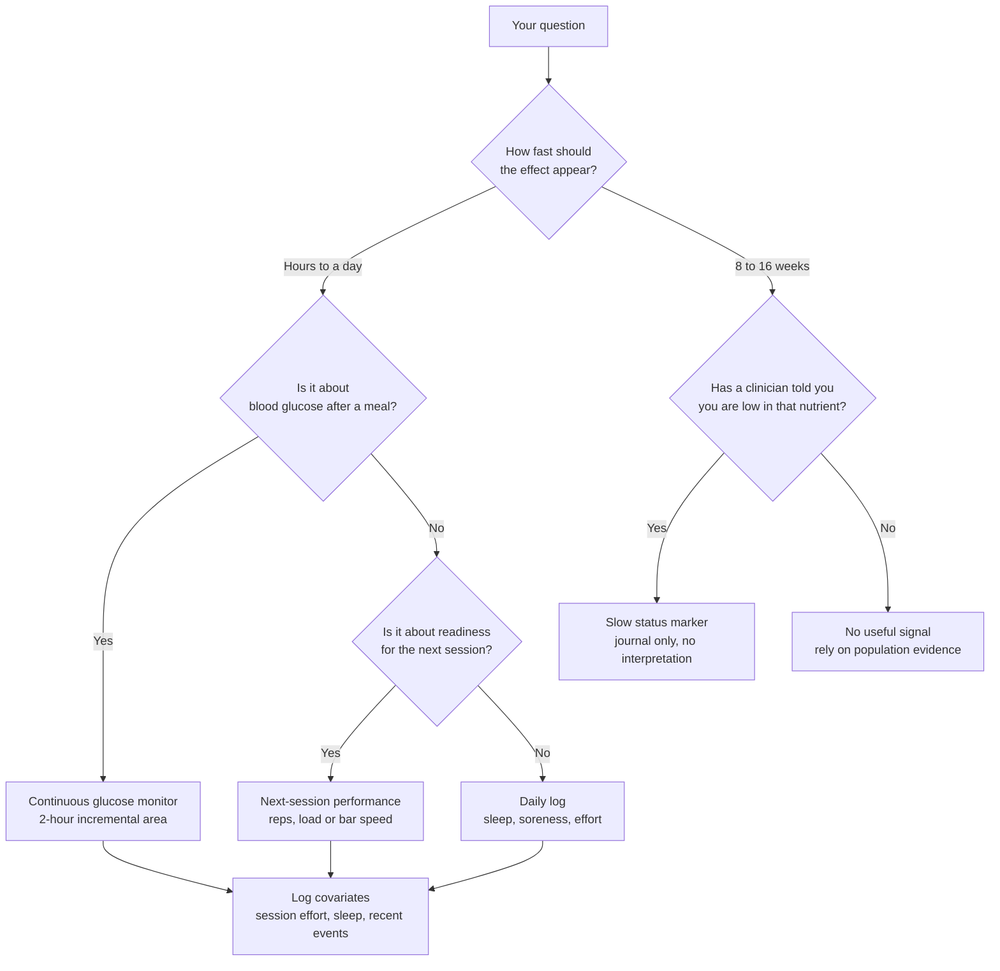
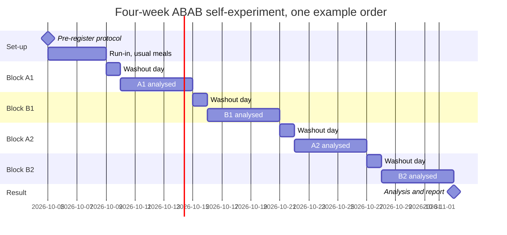
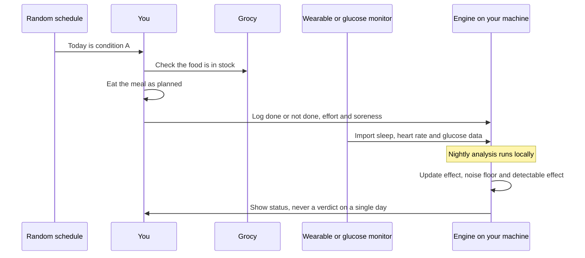
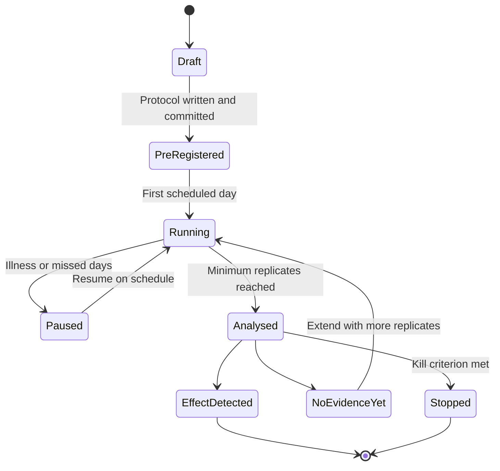
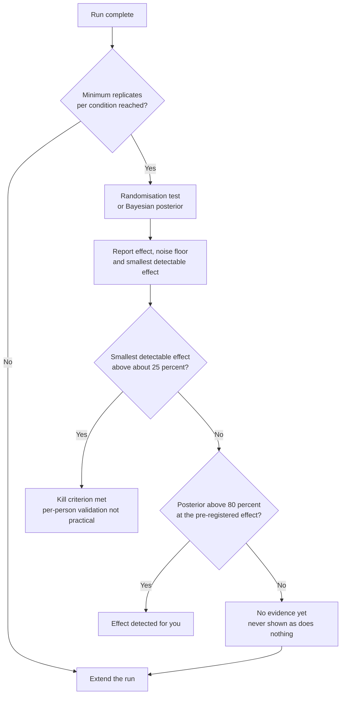

# Measurement and validation

This page explains how the project will find out whether a suggestion does anything for one person. It covers why that is hard, what blood tests can and cannot show, which signals suit recovery, and the self-experiment protocol for milestone M5 in the [roadmap](../product/roadmap.md#m5-self-experiment-protocol).

Recovery means being ready for the next session and still adapting to training (architecture decision record [ADR-0009](../decisions/0009-recovery-goal-and-health-profile.md)). Everything here measures that goal. Nothing here diagnoses or treats a condition ([SAFETY.md](../../SAFETY.md)).

## In short

- One person's blood results move a lot from week to week. A kitchen-scale change is usually smaller than that movement.
- Blood can track a few slow status markers over months. It cannot tell you whether last night's dinner helped you recover.
- Daily signals are better for recovery: next-session performance, effort, soreness, sleep, resting heart rate and heart rate variability.
- The self-experiment protocol compares "with" and "without" on a random schedule. It reports the effect, your noise floor and the smallest effect you could have seen.
- A result of "no evidence yet" never means "does nothing".

## Why one person's result is hard to read

Every measurement varies within the same healthy person, even when nothing changes. Laboratory scientists call this within-subject biological variation. Add the analyser's own error, and you get the reference change value (RCV). The RCV is the smallest change between two results that is unlikely to be noise. The standard formula is RCV = 2.77 × √(analytical variation² + within-subject variation²), from Fraser and Harris, as used by [Macy 1997, PubMed 8990222](https://pubmed.ncbi.nlm.nih.gov/8990222/). The European Federation of Clinical Chemistry and Laboratory Medicine (EFLM) keeps a [biological variation database](https://biologicalvariation.eu/) with these figures for many tests.

The markers in the original README have large RCVs.

| Marker | Change needed between two results | Source |
|---|---|---|
| High-sensitivity C-reactive protein (hs-CRP) | About 118 percent. Within-subject variation was 42.2 percent in 143 healthy people. | [Macy 1997, PubMed 8990222](https://pubmed.ncbi.nlm.nih.gov/8990222/) |
| Fasting insulin | 68.5 percent with normal glucose tolerance. It rises to 93.4 percent as tolerance worsens. | [Borai 2013, PubMed 23548151](https://pubmed.ncbi.nlm.nih.gov/23548151/) |
| Creatine kinase (CK) | About +140 percent or -60 percent, from 17 healthy people sampled every two weeks. | [Wu 2009, PubMed 18848535](https://pubmed.ncbi.nlm.nih.gov/18848535/) |

Training moves these markers far more than food does. One bout of unaccustomed eccentric exercise raised CK by 6,420 percent at day 4 in 203 volunteers ([Clarkson 2006, PubMed 16679975](https://pubmed.ncbi.nlm.nih.gov/16679975/)).

The [project brief](../vision/project-brief.md) worked through what this means. Its figures are a rough calculation, not a published power analysis. Detecting a 20 percent true effect would need about 25 results per condition. That is about 50 blood draws, or more than 12 years at one draw a quarter.

## What blood can and cannot do

**What it can do.** A few status markers respond to a nutrient you supply, over 8 to 16 weeks, in people whose status is low. These markers are ferritin (iron stores), 25-hydroxy vitamin D, glycated haemoglobin (HbA1c) and the omega-3 index. The omega-3 index is the share of omega-3 fats in red cell membranes ([Harris 2009, PubMed 19852881](https://pubmed.ncbi.nlm.nih.gov/19852881/)). The research panel reached this view ([expert panel](../research/expert-panel.md)). The engine never judges from a number whether your status is low. Only a clinician can tell you that.

**What it cannot do.** CK and hs-CRP are poor recovery markers. CK reflects the workout, not the meal. In 286 young men, strength loss was the best indirect marker of muscle damage, not CK ([Damas 2016, PubMed 27116346](https://pubmed.ncbi.nlm.nih.gov/27116346/)). hs-CRP rises after hard training, infection and poor sleep.

**What the engine does with lab results.** Nothing clinical. Under [SAFETY.md](../../SAFETY.md) the engine does not interpret lab values. It never calls a result normal or abnormal. Gates use flags you declare, such as `flag.told_iron_high`, not numbers ([safety model](safety-model.md), [health profile](health-profile.md)). **Proposed:** you may keep lab results in a personal journal. The engine stores them on your machine and shows them back unchanged. They never change a suggestion. Anything more needs a new decision record ([Q-31](../open-questions.md)).

## Choosing a signal

This flowchart shows how to pick a signal for a question about recovery.

## Signals for recovery

Dense, cheap signals give hundreds of data points a year. Each has honest limits.

| Signal | What it tells you | Noise and limits |
|---|---|---|
| Next-session performance: reps at a fixed load, load for fixed reps, or bar velocity if you own a device | Closest to "ready for the next session". | Varies with warm-up, time of day and motivation. Use the same lift at the same time. Strength loss tracks muscle damage best ([Damas 2016](https://pubmed.ncbi.nlm.nih.gov/27116346/)). |
| Session rating of perceived exertion (RPE), 0 to 10, times minutes | How hard the session was. A valid training-load measure ([Foster 2001, PubMed 11708692](https://pubmed.ncbi.nlm.nih.gov/11708692/)). | A covariate, not an outcome. It lets the analysis adjust for harder days. |
| Wellness and soreness, 0 to 10 | How you feel. Subjective measures tracked training load better than objective ones across 56 studies ([Saw 2016, PubMed 26423706](https://pubmed.ncbi.nlm.nih.gov/26423706/)). Wellness correlated with jump velocity (r 0.5 to 0.89) in rugby players ([Hills 2018, PubMed 29489732](https://pubmed.ncbi.nlm.nih.gov/29489732/)). | Soreness correlated weakly with muscle damage, r below 0.32 in 110 men ([Nosaka 2002, PubMed 12453160](https://pubmed.ncbi.nlm.nih.gov/12453160/)). Less soreness is not better recovery. Use it as a secondary outcome. |
| Sleep duration from a wearable | Whether you slept. | Seven consumer devices detected sleep well (sensitivity 0.93 or more) but wake poorly (specificity 0.18 to 0.54). Sleep stages were inconsistent ([Chinoy 2021, PubMed 33378539](https://pubmed.ncbi.nlm.nih.gov/33378539/)). Use duration, not stages. |
| Resting heart rate and heart rate variability (HRV) | A slow readiness trend. | In elite footballers, HRV tracked daily load only weakly (r -0.24) ([Thorpe 2015, PubMed 25710257](https://pubmed.ncbi.nlm.nih.gov/25710257/)). Use rolling averages, not single mornings ([Plews 2013, PubMed 23852425](https://pubmed.ncbi.nlm.nih.gov/23852425/)). |

Log the things that muddy results: session effort, sleep, alcohol and recent events. The recent-event flags in the [health profile](health-profile.md), such as `flag.recent_fever_or_infection`, mark days the analysis should treat with care.

## The self-experiment protocol (milestone M5)

This adapts Phase 0 of the [project brief](../vision/project-brief.md). It needs no product code and can start at any time. It follows the n-of-1 approach set out for nutrition by [Potter 2021, PubMed 33460438](https://pubmed.ncbi.nlm.nih.gov/33460438/). An n-of-1 trial is a randomised crossover trial in one person.

1. **Pre-register.** Before any data, write down the question, the change (A versus B), one primary outcome, the smallest effect worth acting on, the length and the analysis. Commit it to your own records.
2. **Randomise.** Use a pre-generated random schedule. Either run blocks in the order A, B, A, B (ABAB) or alternate at random by day or by session. You never choose on the day.
3. **Wash out.** Leave time for the effect to fade. For meal-level effects, drop the first day of each block from the analysis.
4. **Replicate.** At least five days or sessions per condition. More is better.
5. **Analyse.** Use a randomisation test, as TummyTrials did ([Karkar 2017, PubMed 28516175](https://pubmed.ncbi.nlm.nih.gov/28516175/)), or a simple Bayesian posterior, as WE-MACNUTR did ([Ma 2021, PubMed 34255080](https://pubmed.ncbi.nlm.nih.gov/34255080/)).
6. **Report.** Give the effect with its uncertainty, your noise floor and the smallest detectable effect.

The noise floor is how much your outcome varies within one condition. The smallest detectable effect follows from it. A standard approximation for two conditions, at 80 percent power and a 5 percent false-positive rate, is 2.8 × √2 × noise ÷ √(days per condition). This is our calculation, and it assumes days are independent.

**Proposed** defaults, pending [Q-26](../open-questions.md): five replicates minimum, one analysed outcome, and a posterior above 80 percent at the pre-registered effect to count as "effect detected". WE-MACNUTR used the same 80 percent threshold.

This Gantt chart shows a four-week ABAB run starting on 5 October 2026. The order of A and B is drawn at random at pre-registration.

This sequence diagram shows one day in the protocol.

The protocol moves through a fixed set of states. This state diagram shows them.

### "No evidence yet" is not "does nothing"

Most runs will end without a clear answer. In TummyTrials, one of 15 people got a strong result and three got possible evidence ([project brief](../vision/project-brief.md)). A 2023 review found only 7 nutrition n-of-1 studies, with 83 people in total ([Allman-Farinelli 2023, PubMed 37049595](https://pubmed.ncbi.nlm.nih.gov/37049595/)). So the report says "no evidence yet" and shows the smallest effect the run could have seen. It never says the suggestion failed. A rule's grade rests on population evidence ([evidence policy](evidence-policy.md)). One person's run does not change it.

### Variant 1: glucose response with a glucose monitor

This is the brief's Phase 0. It is the cleanest test of the method, because a continuous glucose monitor (CGM) gives a reading every few minutes.

- Eat one Grocy recipe for breakfast on 10 to 12 days.
- Randomly alternate with and without one change, such as 15 to 20 mL vinegar in the dressing or a fibre pre-load.
- Compute the 2-hour incremental area under the glucose curve each day.

Single meals are unreliable. In an inpatient study published in January 2025, 30 adults ate duplicate meals about a week apart. The intraclass correlation (ICC) was only 0.17 to 0.28 ([Hengist 2025, PubMed 39755436](https://pubmed.ncbi.nlm.nih.gov/39755436/)). Average responses are steadier. Glucose repeatability was 0.74 in the PREDICT study, which a nutrition company funded ([Berry 2020, PubMed 32528151](https://pubmed.ncbi.nlm.nih.gov/32528151/)). Personal glycaemic sensitivity held an ICC of 0.73 over two years in 176 people ([Zhang 2025, PubMed 40754388](https://pubmed.ncbi.nlm.nih.gov/40754388/)). So aggregate at least three replicates.

The brief uses about 12 percent CGM variation as a working figure. With five days per condition, the formula above gives a smallest detectable effect of about 21 percent. The brief says effects under about 15 percent will not resolve.

Gates still apply. Vinegar is withheld under `gate.gastroparesis` and `gate.glucose_lowering_medicine`, and a fibre pre-load under `gate.fermentable_fibre`. The engine compares conditions. It never labels a glucose value.

Glucose data can come from a self-hosted Nightscout server or a file export. Nightscout shows that people will run their own health data pipes. Its only outcome study was a self-report survey of 1,157 people ([Lee 2017, digital object identifier (DOI) 10.1089/dia.2016.0312](https://doi.org/10.1089/dia.2016.0312)). It is a data pipe, not an experiment engine.

### Variant 2: recovery after training

This tests [R-0006](../../knowledge/rules/R-0006-post-training-protein-dose.yaml), a draft rule on the protein dose in the post-training meal.

- **A:** the post-training meal holds the per-kilogram protein dose within two hours.
- **B:** the same daily protein, with the main protein meal later.
- **Schedule:** randomise per training session, not per day.
- **Primary outcome:** reps at a fixed load on the first working set of one named lift, at the next session of the same type.
- **Secondary outcomes:** next-morning soreness, sleep duration and session RPE.

Expect "no evidence yet". A meta-analysis of randomised trials found no significant effect of protein timing on strength or muscle size once total protein was matched ([Schoenfeld 2013, PubMed 24299050](https://pubmed.ncbi.nlm.nih.gov/24299050/)). Next-session performance is also noisy. That outcome would not weaken R-0006, which rests on dose, not timing. See [recovery nutrition](recovery-nutrition.md).

### Analysis and decision

This flowchart shows how a finished run becomes a decision.

### Kill criterion

If only effects above about 25 percent are detectable, per-person validation is not practical at consumer scale ([roadmap](../product/roadmap.md#m5-self-experiment-protocol)). The project would then say so. Rules would rest on population evidence alone. The engine would never claim that a suggestion worked for you. M5 would stay an optional tool.

Completion is the other limit. The brief expects 20 to 30 percent of unsupervised users to finish a run ([project brief](../vision/project-brief.md)).

## Pooled versus per-user learning

One person's run is noisy. Combining many people's runs gives sharper estimates. WE-MACNUTR pooled 28 people in a Bayesian model and found 9 who responded to high carbohydrate and 6 to high fat ([Ma 2021](https://pubmed.ncbi.nlm.nih.gov/34255080/)). Potter and colleagues describe the same approach.

Pooling needs data to leave your machine. That conflicts with local-first, no-telemetry operation under [ADR-0003](../decisions/0003-open-source-self-hosted.md). **Proposed:** results stay per-user by default. Any pooling would be opt-in, share summaries only, and need a decision record. See [Q-12](../open-questions.md).

Either way, nothing learned from a run changes a rule automatically. Rules change only by curation (proposed in [ADR-0007](../decisions/0007-graph-proposes-rules-decide.md)).

## Related

- [Roadmap: M5](../product/roadmap.md#m5-self-experiment-protocol)
- [Recovery nutrition](recovery-nutrition.md)
- [Health profile](health-profile.md)
- [Safety model](safety-model.md)
- [Evidence policy](evidence-policy.md)
- [Open questions](../open-questions.md)
- [Glossary](../glossary.md)
