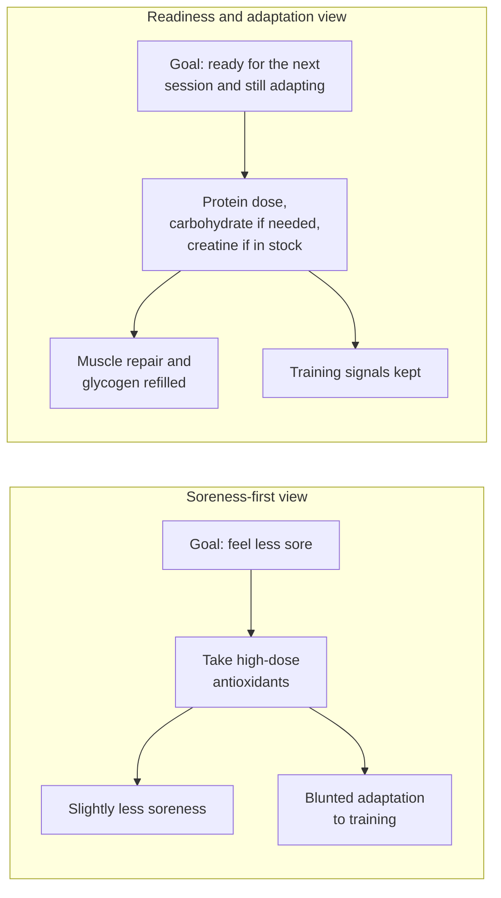
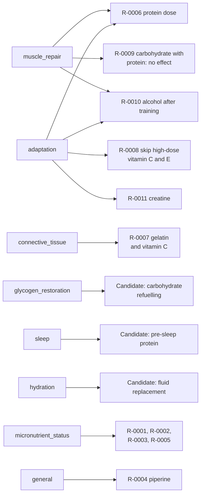
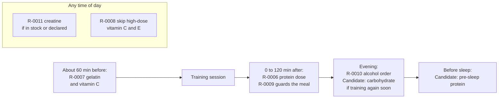

# Recovery nutrition

This page sets out what the evidence says about eating to recover from training. It explains the goals that rules declare, and it maps each topic to a rule or a candidate rule. The decision behind it is [ADR-0009](../decisions/0009-recovery-goal-and-health-profile.md).

> **Status: draft.** Every rule linked here is an unreviewed draft. None may produce a suggestion until it is accepted under the [evidence policy](evidence-policy.md).

Grades follow the evidence policy. In short: A means concordant randomised controlled trials (RCTs) or a meta-analysis at the recommended dose. B means at least one well-conducted controlled human study. C means a single small study, manufacturer-only or observational data. Whether a dose is reachable from food is a separate flag, not a grade (**Proposed**, [ADR-0010](../decisions/0010-grade-evidence-at-tested-dose.md)). D means animal, cell or mechanism only, and never produces a suggestion. Which grades may produce suggestions is **Proposed**. See [Q-11](../open-questions.md). Sources are cited by PubMed identifier (PMID).

## What recovery means

Recovery has two parts:

1. **Readiness.** You can train well at your next session.
2. **Adaptation.** Your body keeps making the changes that training is meant to cause, such as more muscle, stronger tendons and more mitochondria.

Recovery is not the same as feeling less sore. Some things that reduce soreness also reduce adaptation. A Cochrane review of 50 trials found that antioxidant supplements lowered soreness only slightly ([Ranchordas 2017, PMID 29238948](https://pubmed.ncbi.nlm.nih.gov/29238948/)). At 24 hours the standardised mean difference was -0.13 across 41 studies. None of the 50 trials measured whether people felt recovered. Meanwhile, daily 1000 mg vitamin C with vitamin E blunted cellular adaptation to training in two trials ([Paulsen 2014, PMID 24492839](https://pubmed.ncbi.nlm.nih.gov/24492839/); [Paulsen 2014, PMID 25384788](https://pubmed.ncbi.nlm.nih.gov/25384788/)).

This flowchart contrasts a soreness-first view of recovery with the readiness-and-adaptation view that this project uses.

The engine therefore judges rules on readiness and adaptation, not comfort alone. See [principles](../product/principles.md).

## Protein

### Dose per meal

About 20 to 40 g of high-quality protein in a meal, or roughly 0.25 to 0.4 g per kg of body mass, stimulates muscle protein synthesis well after resistance exercise. The International Society of Sports Nutrition (ISSN) nutrient-timing position stand gives this range ([Kerksick 2017, PMID 28919842](https://pubmed.ncbi.nlm.nih.gov/28919842/)).

The studies behind it disagree about the ceiling:

- In 6 young men, muscle protein synthesis reached a plateau at 20 g of egg protein ([Moore 2009, PMID 19056590](https://pubmed.ncbi.nlm.nih.gov/19056590/)).
- In 48 trained men, 20 g and 40 g of whey raised myofibrillar synthesis by 49 and 56 percent over none ([Witard 2014, PMID 24257722](https://pubmed.ncbi.nlm.nih.gov/24257722/)).
- After whole-body exercise in 30 trained men, 40 g beat 20 g ([Macnaughton 2016, PMID 27511985](https://pubmed.ncbi.nlm.nih.gov/27511985/)).
- In 36 people, 100 g gave a larger response lasting more than 12 hours than 25 g ([Trommelen 2023, PMID 38118410](https://pubmed.ncbi.nlm.nih.gov/38118410/)).

Rule [R-0006](../../knowledge/rules/R-0006-post-training-protein-dose.yaml) uses 0.25 to 0.4 g per kg in the post-training meal. It is grade B. Muscle protein synthesis is a functional marker, not muscle growth itself. The amount is scaled to your declared body mass. See the [health profile](health-profile.md).

### Daily total and spacing

The ISSN protein position stand gives 1.4 to 2.0 g per kg a day for most people who train ([Jäger 2017, PMID 28642676](https://pubmed.ncbi.nlm.nih.gov/28642676/)). A meta-analysis of 49 trials found that protein supplements added about 0.30 kg of fat-free mass during training ([Morton 2018, PMID 28698222](https://pubmed.ncbi.nlm.nih.gov/28698222/)). Gains stopped rising at about 1.6 g per kg a day.

The position stands suggest spreading protein doses every 3 to 4 hours. This is a **candidate** rule. It is not yet written or graded.

### Carbohydrate does not "waste" protein

The original README claimed that clashing foods cause "anabolic waste". The research found no such concept in the literature. See [claim verification](../research/claim-verification.md). Two independent tracer trials tested the most common version of the idea: carbohydrate eaten with protein. With enough protein, extra carbohydrate raised insulin but did not change muscle protein synthesis ([Koopman 2007, PMID 17609259](https://pubmed.ncbi.nlm.nih.gov/17609259/); [Staples 2011, PMID 21131864](https://pubmed.ncbi.nlm.nih.gov/21131864/)).

Rule [R-0009](../../knowledge/rules/R-0009-carbohydrate-protein-no-effect.yaml) records this as `no_effect`. It never produces a suggestion. It stops the engine from telling you to eat protein and carbohydrate apart.

## Carbohydrate and glycogen

Muscle glycogen is the carbohydrate store that fuels hard training. Refilling it matters most when your next hard session is soon, for example within about 24 hours. Carbohydrate availability rises when you eat carbohydrate before a session, during it and while recovering between sessions ([Burke 2011, PMID 21660838](https://pubmed.ncbi.nlm.nih.gov/21660838/)).

The ISSN nutrient-timing stand gives numbers for fast turnarounds ([Kerksick 2017, PMID 28919842](https://pubmed.ncbi.nlm.nih.gov/28919842/)):

- If glycogen must be restored in under 4 hours, eat about 1.2 g carbohydrate per kg per hour.
- Or combine about 0.8 g carbohydrate per kg per hour with 0.2 to 0.4 g protein per kg per hour.
- A diet of 8 to 12 g carbohydrate per kg a day maximises glycogen stores.

The joint position statement of the American College of Sports Medicine (ACSM), the Academy of Nutrition and Dietetics and Dietitians of Canada also covers carbohydrate for training ([Thomas 2016, PMID 26891166](https://pubmed.ncbi.nlm.nih.gov/26891166/)). Its detailed targets were not checked against the full text for this page.

A `glycogen_restoration` rule is a **candidate**. It needs your session plan to know how soon the next session is. It must also respect `gate.glucose_lowering_medicine` and `gate.eating_disorder`. It is not yet graded.

## Creatine

Creatine monohydrate is one of the best-studied sports supplements. A meta-analysis of 100 placebo-controlled studies found small benefits for lean mass and for short, repeated high-intensity efforts ([Branch 2003, PMID 12945830](https://pubmed.ncbi.nlm.nih.gov/12945830/)). It found no clear effect on running or swimming. The ISSN creatine stand says 3 to 5 g a day maintains muscle stores ([Kreider 2017, PMID 28615996](https://pubmed.ncbi.nlm.nih.gov/28615996/)). It also reports that doses up to 30 g a day for 5 years were well tolerated in healthy people.

Rule [R-0011](../../knowledge/rules/R-0011-creatine-monohydrate.yaml) is grade B and, separately, supplement-dose only. The grade rates the trials at the tested dose. It fires only when creatine is already in your stock or declared. It never suggests buying it. As a precaution, it is withheld if you report reduced kidney function or leave that question unanswered. It is also withheld during pregnancy or breastfeeding. See the [safety model](safety-model.md).

## Connective tissue

Tendons and ligaments are mostly collagen. One small trial gave 8 men 15 g of vitamin C-enriched gelatin one hour before 6 minutes of rope-skipping. A blood marker of collagen synthesis doubled ([Shaw 2017, PMID 27852613](https://pubmed.ncbi.nlm.nih.gov/27852613/)). The vitamin C content of that drink was not verified from the full text.

The evidence since then is mixed:

- In 10 men, the same marker rose about 20 percent, which was not significant ([Lis 2019, PMID 30859848](https://pubmed.ncbi.nlm.nih.gov/30859848/)).
- In 45 athletes, 30 g of collagen after exercise did not raise muscle connective protein synthesis ([Aussieker 2023, PMID 37202878](https://pubmed.ncbi.nlm.nih.gov/37202878/)).
- In 24 men, 20 g a day of collagen peptides did not change the collagen marker, though jump height recovered faster ([Clifford 2019, PMID 30783776](https://pubmed.ncbi.nlm.nih.gov/30783776/)).
- In 50 athletes, 20 g collagen with 50 mg vitamin C before training helped rate of force development recover ([Lis 2022, PMID 34808597](https://pubmed.ncbi.nlm.nih.gov/34808597/)).

Bone broth is not a reliable substitute. Its collagen amino acids were lower and more variable than a 20 g supplement dose ([Alcock 2019, PMID 29893587](https://pubmed.ncbi.nlm.nih.gov/29893587/)).

Rule [R-0007](../../knowledge/rules/R-0007-gelatin-vitamin-c-pre-training.yaml) is grade C. Under the proposed policy it appears only if you opt in to early evidence, with a label.

## Antioxidant supplements and adaptation

Fruit and vegetables are not the concern here. The concern is high-dose supplements taken daily through a training block:

- In 54 people, 1000 mg vitamin C and 235 mg vitamin E daily for 11 weeks stopped a mitochondrial marker from rising. Maximal oxygen uptake improved equally in both groups ([Paulsen 2014, PMID 24492839](https://pubmed.ncbi.nlm.nih.gov/24492839/)).
- In 32 strength-trained people, the same supplements blunted growth signalling and hampered some strength gains. Muscle growth did not differ ([Paulsen 2014, PMID 25384788](https://pubmed.ncbi.nlm.nih.gov/25384788/)).
- In 39 young men, 1000 mg vitamin C and 400 international units (IU) of vitamin E removed the gain in insulin sensitivity from 4 weeks of exercise ([Ristow 2009, PMID 19433800](https://pubmed.ncbi.nlm.nih.gov/19433800/)).

Rule [R-0008](../../knowledge/rules/R-0008-antioxidant-supplements-adaptation.yaml) is grade B. It is a **skip** rule. It fires only for a declared or stocked supplement at 1000 mg vitamin C or more. It never flags food.

## Alcohol

In 8 active men, about 12 standard drinks after a hard session lowered muscle protein synthesis by 24 percent even with 25 g of protein ([Parr 2014, PMID 24533082](https://pubmed.ncbi.nlm.nih.gov/24533082/)). Smaller amounts were not tested.

Rule [R-0010](../../knowledge/rules/R-0010-alcohol-after-training.yaml) is grade C. Its suggestion is about the order of the evening, not abstinence. It must never be applied to a single drink.

## Energy availability

Low energy availability means eating too little for the training you do. The 2023 consensus of the International Olympic Committee (IOC) on Relative Energy Deficiency in Sport (REDs) links it to harm to health and performance in women and men ([Mountjoy 2023, PMID 37752011](https://pubmed.ncbi.nlm.nih.gov/37752011/)).

No food pairing fixes an energy shortfall. The engine does not calculate energy availability, and it never suggests eating less. Skip and swap rules are withheld for anyone who reports an eating disorder history or leaves that question unanswered (`gate.eating_disorder`). How the engine should handle low energy intake is [Q-05](../open-questions.md).

## Hydration

The ACSM fluid replacement stand aims to prevent a water loss of more than 2 percent of body weight during exercise ([Sawka 2007, PMID 17277604](https://pubmed.ncbi.nlm.nih.gov/17277604/)). Sweat rates vary widely between people. You can estimate yours by weighing before and after a session. After exercise, the goal is to replace the fluid and electrolyte deficit. A `hydration` rule is a **candidate**. It is not yet graded.

## Sleep-relevant nutrition

Only one topic has enough evidence to list. In 16 young men, 40 g of casein before sleep after evening exercise improved overnight protein balance. Muscle protein synthesis was about 22 percent higher, at borderline significance ([Res 2012, PMID 22330017](https://pubmed.ncbi.nlm.nih.gov/22330017/)). A later tracer study found that pre-sleep protein was built into muscle overnight ([Trommelen 2018, PMID 28536184](https://pubmed.ncbi.nlm.nih.gov/28536184/)).

A `sleep` rule for pre-sleep protein is a **candidate**. It would probably be grade C.

## Poor recovery markers

Creatine kinase (CK) and high-sensitivity C-reactive protein (hs-CRP) are poor measures of recovery for people who train.

- **CK.** After one bout of eccentric arm exercise, 111 of 203 healthy people had CK above 2,000 units per litre (U/L) at day 4, and 51 were above 10,000 U/L ([Clarkson 2006, PMID 16679975](https://pubmed.ncbi.nlm.nih.gov/16679975/)). None needed treatment for kidney problems.
- **hs-CRP.** In healthy people, it varied 42 percent from one test to the next in the same person. Two results had to differ by 118 percent before the change was meaningful ([Macy 1997, PMID 8990222](https://pubmed.ncbi.nlm.nih.gov/8990222/)).

A review of muscle damage recommends judging it by the loss and recovery of muscle force ([Paulsen 2012, PMID 22876722](https://pubmed.ncbi.nlm.nih.gov/22876722/)). Several trials above used jump height or rate of force development. Measures like these, taken the same way each time, track readiness more directly. See [measurement](measurement.md). The engine never interprets lab values. See [SAFETY.md](../../SAFETY.md).

## Goals and rules

This flowchart shows which rules and candidates serve each recovery goal.

The `gut_comfort` goal has no rule yet. Recovery goals rank ahead of `micronutrient_status` and `general`. The weights are **Proposed**. See [Q-01](../open-questions.md).

## A training day

This flowchart shows where each recovery rule applies across a day with one afternoon session.

The engine needs your session times to place these. They come from the training part of the [health profile](health-profile.md). Without them, rules tied to a window before or after training do not fire.

## Evidence map

| Topic | What to do | Dose | Grade | Rule |
|---|---|---|---|---|
| Protein after training | Build the post-training meal around protein | 0.25 to 0.4 g per kg, or 20 to 40 g | B | [R-0006](../../knowledge/rules/R-0006-post-training-protein-dose.yaml) |
| Protein daily total | Spread protein doses through the day | 1.4 to 2.0 g per kg a day, every 3 to 4 hours | Not graded | Candidate |
| Carbohydrate with protein | Nothing: they do not clash | Tested with 50 g carbohydrate and 25 g whey | B | [R-0009](../../knowledge/rules/R-0009-carbohydrate-protein-no-effect.yaml) |
| Glycogen before a soon next session | Refuel with carbohydrate | 1.2 g per kg per hour if under 4 hours | Not graded | Candidate |
| Creatine | Take the creatine you have | 3 to 5 g a day | B | [R-0011](../../knowledge/rules/R-0011-creatine-monohydrate.yaml) |
| Tendon loading | Gelatin with vitamin C beforehand | 15 g gelatin, about 60 minutes before | C | [R-0007](../../knowledge/rules/R-0007-gelatin-vitamin-c-pre-training.yaml) |
| High-dose antioxidants | Skip them during a training block | 1000 mg vitamin C a day or more | B | [R-0008](../../knowledge/rules/R-0008-antioxidant-supplements-adaptation.yaml) |
| Alcohol after training | Recovery meal first, alcohol-free drinks for a few hours | Tested at 1.5 g ethanol per kg | C | [R-0010](../../knowledge/rules/R-0010-alcohol-after-training.yaml) |
| Pre-sleep protein | Protein before bed after evening training | 40 g casein tested | Not graded | Candidate |
| Hydration | Replace the fluid lost in training | Keep loss under 2 percent of body weight | Not graded | Candidate |
| Energy availability | Never suggest eating less | Not applicable | Not applicable | Context only |

Candidates become rules only through the review process in the [evidence policy](evidence-policy.md).

## Related

- [Rule model](../architecture/rule-model.md): the `goals` and `context` fields.
- [Health profile](health-profile.md): body mass and session times.
- [Safety model](safety-model.md): the gates these rules list.
- [Measurement](measurement.md): what to measure instead of CK and hs-CRP.
- [Glossary](../glossary.md)
