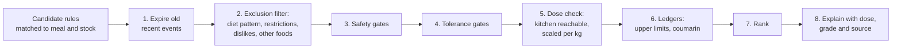
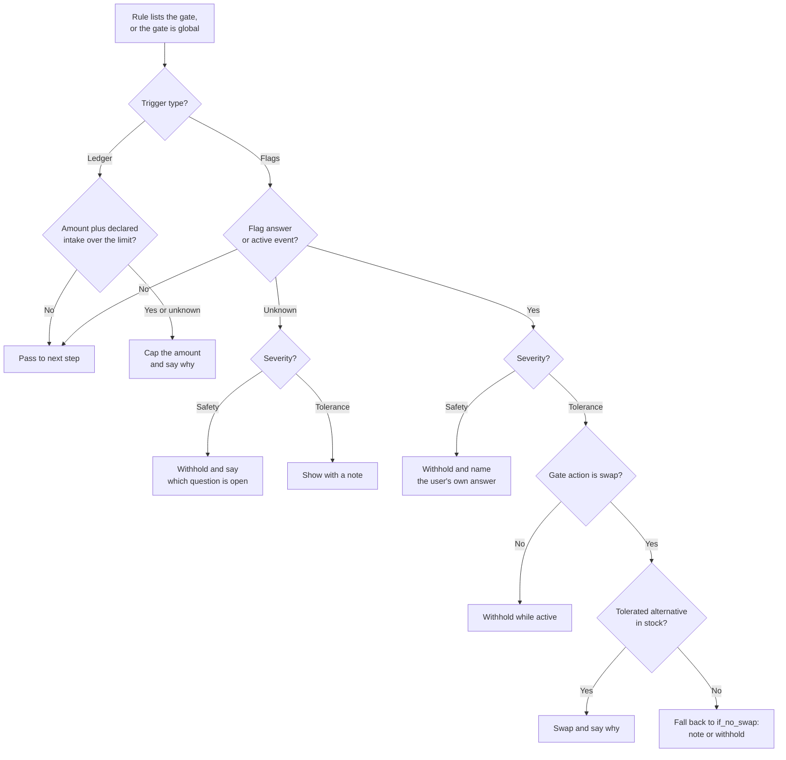
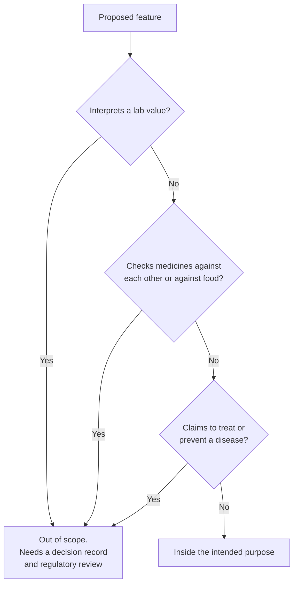
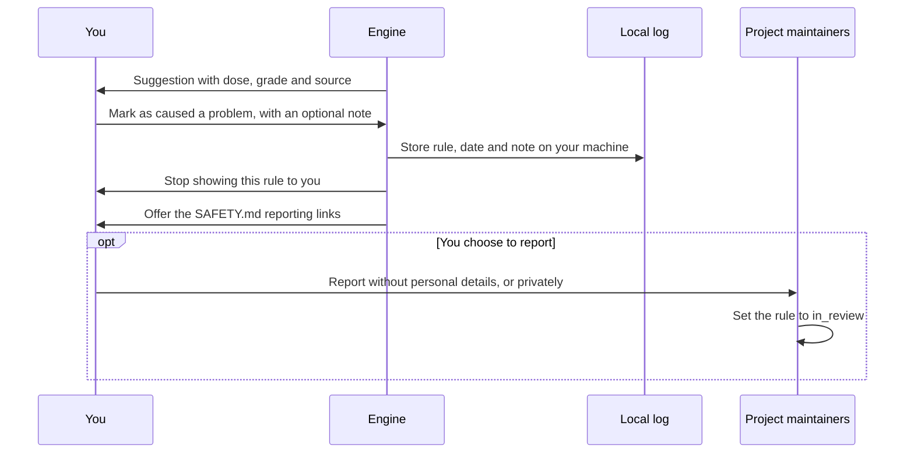

# Safety model

This page specifies how the engine keeps suggestions safe and tolerable for the person using it. It turns the commitments in [SAFETY.md](../../SAFETY.md) into an order of operations. The flags and gates themselves live in [gates.yaml](../../knowledge/gates/gates.yaml), checked by [gates.schema.json](../../knowledge/schema/gates.schema.json). The answers come from your [health profile](health-profile.md).

Status: design only. The gate file is a draft and needs a safety reviewer before any engine uses it.

## Principles

1. **Gates run before ranking.** The engine removes or changes gated suggestions before it scores anything. A high score can never bring a gated suggestion back.
2. **Safety gates fail closed.** A safety gate protects against harm. If you have not answered its question, the engine treats the answer as "yes" and withholds.
3. **Tolerance gates prefer a swap.** A tolerance gate protects comfort. It replaces the food with a tolerated version where the rule allows, such as lactose-free milk. It only withholds when no swap exists or the rule says so. An unanswered tolerance question shows a note; whether it should withhold is [Q-13](../open-questions.md).
4. **A swap is never used for safety.** The schema only allows `swap` on tolerance gates. A wrong swap after a misread product name could harm someone with coeliac disease or an allergy, so safety gates withhold.
5. **Withholding is explained, without scolding.** The user sees what was held back and why, in plain words. The wording states the user's own answer. It never implies they did something wrong.
6. **Gates never claim to check interactions.** A gate says a suggestion was withheld "as a precaution for people who take" a class of medicine. It never says a food "interacts with your medicine".

Examples of explanation wording:

| Situation | What the user sees |
|---|---|
| Safety gate, answered yes | "Not suggested because you told us you take warfarin or another vitamin K blood thinner." |
| Safety gate, not answered | "Not suggested because the medicines question is unanswered. You can answer it in your profile." |
| Tolerance gate, swap found | "Swapped to lactose-free milk because you told us lactose upsets you." |
| Tolerance gate, no swap in stock | "Contains lactose. A lactose-free version would work the same way." |
| Recent event | "Paused until 4 October because you reported a stomach upset on 20 September." |

## Evaluation order

This flowchart shows the order in which the engine applies the profile to a candidate suggestion.

1. **Expire.** Recent events past their expiry stop applying. See [recent-event expiry](#recent-event-expiry).
2. **Exclude.** Foods the user does not eat are removed. This is not a gate. It needs no reason and shows no message.
3. **Safety gates.** Every accepted rule lists its gates. Gates with global scope apply to every rule, whether it lists them or not. If any applicable safety gate applies, or its answer is unknown, the suggestion is withheld.
4. **Tolerance gates.** A matching tolerance gate swaps, withholds or adds a note.
5. **Dose.** Supplement-dose-only rules never fire from food. Amounts are scaled to body mass.
6. **Ledgers.** Suggested amounts are added to declared supplements and capped at the limit.
7. **Rank.** The ranking function is still open. See [Q-01 and Q-02](../open-questions.md).
8. **Explain.** The top suggestion shows its dose, evidence grade and first source, plus any gate note. See the [evidence policy](evidence-policy.md).

This flowchart shows how one gate is evaluated, including the fail-closed and swap branches.

## Gate catalogue

This table is generated from [gates.yaml](../../knowledge/gates/gates.yaml) version 2. The file is the source of truth. Each gate's `affects`, rationale and sources are in the file.

| Gate | Severity | Trigger | Action | If unknown | Basis |
|---|---|---|---|---|---|
| `gate.iron_overload` | safety | `flag.haemochromatosis`, `flag.told_iron_high` | withhold | withhold | evidence |
| `gate.vitamin_k_consistency` | safety | `flag.vitamin_k_antagonist` | withhold | withhold | guideline |
| `gate.cyp3a4_pgp_medicine` | safety | `flag.narrow_index_cyp3a4_pgp_medicine`, `flag.any_prescription_medicine` | withhold | withhold | evidence |
| `gate.kidney_function` | safety | `flag.kidney_disease` | withhold | withhold | guideline |
| `gate.pregnancy` | safety | `flag.pregnant_or_breastfeeding` | withhold | withhold | precautionary |
| `gate.glucose_lowering_medicine` | safety | `flag.glucose_lowering_medicine` | withhold | withhold | precautionary |
| `gate.gastroparesis` | safety | `flag.gastroparesis` | withhold | withhold | evidence |
| `gate.fermentable_fibre` | safety | `flag.ibs_or_fodmap_sensitive` | withhold | withhold | precautionary |
| `gate.g6pd` | safety | `flag.g6pd_deficiency` | withhold | withhold | guideline |
| `gate.inborn_error` | safety | `flag.inborn_error_of_metabolism` | withhold | withhold | guideline |
| `gate.eating_disorder` | safety | `flag.eating_disorder_history` | withhold | withhold | precautionary |
| `gate.allergy` | safety | `flag.allergens` | withhold | withhold | precautionary |
| `gate.coumarin` | safety | Ledger: daily coumarin against 0.1 mg per kg body weight | cap | cap | evidence |
| `gate.upper_limit` | safety | Ledger: suggested plus declared amounts against each tolerable upper intake level | cap | cap | guideline |
| `gate.lactose_intolerance` | tolerance | `flag.lactose_intolerance` | swap | note | evidence |
| `gate.coeliac_gluten` | safety | `flag.coeliac_or_gluten_sensitivity` | withhold | withhold | guideline |
| `gate.recent_gi_illness` | tolerance | `flag.recent_gi_illness` | withhold | note | precautionary |

Four points need comment.

- **Kidney function now covers protein and creatine.** The Kidney Disease Outcomes Quality Initiative (KDOQI) 2020 guideline recommends 0.55 to 0.60 g of protein per kg a day for metabolically stable adults with chronic kidney disease stages 3 to 5 who are not on dialysis ([Ikizler 2020, PubMed 32829751](https://pubmed.ncbi.nlm.nih.gov/32829751/); [claim C11](../research/claim-verification.md)). In a meta-analysis of 49 trials, training gains in fat-free mass stopped rising at about 1.6 g per kg a day ([Morton 2018, PubMed 28698222](https://pubmed.ncbi.nlm.nih.gov/28698222/)). Training targets and kidney guidance point in opposite directions, so protein top-ups are withheld. Creatine is withheld as a precaution. That is not a finding that creatine harms kidneys. What counts as a "substantial" protein increase is not yet defined; see [Q-30](../open-questions.md).
- **Coeliac disease is a safety gate.** It is a permanent immune response to gluten in wheat, barley and rye, managed by strict lifelong avoidance ([Rubio-Tapia 2023, PubMed 36602836](https://pubmed.ncbi.nlm.nih.gov/36602836/)). Products with unknown gluten status are also withheld.
- **Four gates have global scope.** `gate.inborn_error`, `gate.upper_limit`, `gate.allergy` and `gate.coeliac_gluten` set `scope: global` in [gates.yaml](../../knowledge/gates/gates.yaml). They apply to every rule, so a rule that forgets to list them cannot bypass them. People with an inherited metabolic disorder follow clinician-managed diets, so every suggestion is withheld for them. The allergy and coeliac gates depend on what the suggested food contains, not on the rule, so they check every suggestion.
- **Skipping a safety question has a real cost.** An unanswered medicines question closes `gate.cyp3a4_pgp_medicine`. An unanswered coeliac question withholds every gluten-containing addition. An unanswered allergy question withholds any addition of a common major allergen, and a declared allergy also withholds products whose allergen content is unknown. This is deliberate. The onboarding screen says so; see the [health profile](health-profile.md#onboarding).

## Per-kilogram scaling and the upper-limit ledger

Some limits are set per kilogram of body mass. The coumarin tolerable daily intake is 0.1 mg per kg ([Abraham 2010, PubMed 20024932](https://pubmed.ncbi.nlm.nih.gov/20024932/)). The engine multiplies it by the user's declared weight. If weight is missing, it uses a low reference body mass, which gives a lower cap. **Proposed:** 50 kg. See [Q-09](../open-questions.md).

The upper-limit ledger adds three things for each nutrient: the suggested amount, the amounts in declared supplements, and any earlier suggestions accepted that day. It compares the total with the tolerable upper intake level for the user's sex, age and life stage. If any of those are missing, the lowest adult value applies.

Supplement amounts are ranges because labels are unreliable. Calcium in multivitamins measured 7.1 to 29.3 percent above the label ([Andrews 2017, PubMed 27974309](https://pubmed.ncbi.nlm.nih.gov/27974309/)). Caffeine in 15 pre-workout products ranged from 59 to 176 percent of the label claim, and only 6 of the 15 labels stated caffeine at all ([Desbrow 2019, PubMed 30196576](https://pubmed.ncbi.nlm.nih.gov/30196576/)). **Proposed:** the ledger compares the top of each range with the limit. Which standard to use, from the European Food Safety Authority (EFSA) or the United States Institute of Medicine, is [Q-07](../open-questions.md).

## Recent-event expiry

A recent event is a flag with a start date. Its definition in [gates.yaml](../../knowledge/gates/gates.yaml) sets `expires_after_days`. The event is active from the start date until that many days have passed. Then it stops shaping suggestions and stays in the user's history. The schema requires an expiry for every recent-event flag.

| Flag | Days | Gate |
|---|---|---|
| `flag.recent_gi_illness` | 14 | `gate.recent_gi_illness` |
| `flag.recent_fever_or_infection` | 14 | none, context only |
| `flag.recent_antibiotics` | 30 | none, context only |
| `flag.recent_injury_or_surgery` | 56 | none, context only |

The day counts are design choices, not findings; see [Q-10](../open-questions.md). The [health profile](health-profile.md#recent-events) shows the life of an event as a state diagram.

## Regulatory posture

This section is not legal advice.

### Intended purpose

The intended purpose in [SAFETY.md](../../SAFETY.md) reads:

> A personal, self-hosted tool that suggests what to add to, re-time, swap or skip in your meals to support recovery from training and general wellness. It works from the food you have at home and the health information you choose to give it, which it uses to keep suggestions safe, tolerable and suited to you. It does not diagnose, treat, cure or prevent any disease. It does not interpret medical test results.

### What would make it a medical device

Under the European Union (EU) Medical Device Regulation (MDR), software is a medical device when its maker intends it for purposes such as "diagnosis, prevention, monitoring, prediction, prognosis, treatment or alleviation of disease" ([Regulation (EU) 2017/745, Article 2(1)](https://eur-lex.europa.eu/legal-content/EN/TXT/HTML/?uri=CELEX:32017R0745)). Three functions would cross that line.

1. **Interpreting lab values,** such as calling a ferritin result high. The research found this is a device function in the United States, the EU and Australia ([critic summary](../research/critic-summary.md)).
2. **Drug-interaction checking on patient-specific data.** The Court of Justice of the European Union (CJEU) held in case C-329/16, Snitem and Philips France, that software with a function using patient-specific data to detect "contraindications, drug interactions and excessive doses" is a medical device for that function, even though it does not act on the body ([judgment of 7 December 2017](https://eur-lex.europa.eu/legal-content/EN/TXT/?uri=celex%3A62016CJ0329)). The case interpreted Directive 93/42, which the MDR replaced. Under MDR Annex VIII Rule 11, software that provides information used for diagnostic or therapeutic decisions is class IIa or higher.
3. **Disease claims,** such as "this meal lowers inflammation in arthritis".

This flowchart shows which functions stay inside the intended purpose.

### The tension, and the chosen stance

Medication gates do use patient-specific data. A "yes" to the vitamin K antagonist question changes what the engine shows. That sits close to the function the court described. Removing these gates would avoid the question, but it would let the engine suggest intermittent kale to a warfarin user.

The chosen stance:

1. **Keep the gates.** Safety comes first. The gates only withhold food suggestions. They never advise on a medicine.
2. **Keep the project non-commercial.** It is open-source software supplied outside any commercial activity. See [architecture decision record (ADR) 0003](../decisions/0003-open-source-self-hosted.md) and [claim C28](../research/claim-verification.md).
3. **Make no claim of interaction checking.** No document, interface text or suggestion says the engine checks medicines or interactions.
4. **Get a regulatory opinion before any commercial supply,** hosted version, or feature that reads lab values. Whether a public release also needs one is [Q-29](../open-questions.md).

## Adverse-event channel

A suggestion can cause a problem the gates did not foresee. The engine needs a way to learn that. This sequence diagram shows the channel.

The flag is stored only on the user's machine. **Proposed:** the rule is muted for that user until they unmute it. Nothing is sent automatically. Project-level reports go through [SAFETY.md](../../SAFETY.md). A rule under a credible report moves to `in_review` and stops producing suggestions for everyone.

## Red-flag symptoms

The engine does not interpret symptoms. Soreness, energy and sleep scores are context, never signs of illness. Whether to show fixed, static advice to seek care for some self-reported events is [Q-28](../open-questions.md).

## Related

- [Health profile](health-profile.md)
- [Evidence policy](evidence-policy.md)
- [Rule model](../architecture/rule-model.md)
- [SAFETY.md](../../SAFETY.md)
