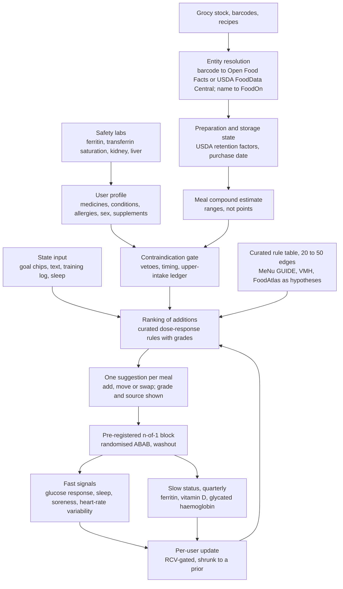

> **Research brief, September 2026.** This brief was written before the founder's decisions of 27 September 2026. Where it differs from those decisions, the [decision records](../decisions/README.md) win. In particular, the brief recommends measurement before any database and an additive-only interface. The founder chose to build the knowledge graph first ([ADR-0004](../decisions/0004-knowledge-graph-first.md)) and to allow full advice including removals ([ADR-0005](../decisions/0005-full-advice-with-safety-gates.md)).
>
> The "expert panel" referred to below is a set of AI research agents, each assigned one professional lens and given web search. It is not a panel of human clinicians. See [how the research was produced](../research/README.md).

# Pantry-Aware Food Pairing: Project Brief for the Grocy Bioavailability and Interactions Engine

## 1. What this is

You want a self-hosted assistant that reads what is in your kitchen through Grocy and knows which nutrients help or block each other. It hears how you feel, then names one thing to add to the meal you were already going to cook. The unoccupied wedge there is the pantry. No incumbent (Cronometer, MacroFactor, ZOE, InsideTracker, Levels) knows what is in your fridge tonight, and Grocy supplies that feed. Around it, the defensible product is a food-pairing assistant on 20 to 50 hand-curated rules, each with a dose, an evidence grade and a list of people who must not receive it. You judge it on signals you can measure daily: a continuous glucose monitor (CGM), sleep, soreness, training load. Blood does two narrow jobs: screening for danger, and tracking slow status markers quarterly. One developer can ship a falsifiable slice of that in one to two quarters.

The README describes a different project: a 25-million-triple any-to-any graph, a positive-only synergy score, quarterly blood panels as proof that a squeeze of lemon worked, and a learned "Dynamic Biological Twin". After a 28-claim literature check, a 12-discipline panel and eight memos, that loop does not close. High-sensitivity C-reactive protein (hs-CRP), fasting insulin and creatine kinase (CK) all move more from ordinary week-to-week biology than a kitchen-scale addition can move them.

## 2. Objectives

**As the README states them.** The extraction lists 19. Condensed, in its order: ingest Grocy stock as a sub-graph of what you own; encode bioavailability knowledge as fixed edges. Then: close the "Specificity Gap" for macronutrient-tracking gym-goers; stay additive; surface companion pairs from what is on hand. Then: feed surviving microbes for urolithin A and short-chain fatty acids (SCFA); join databases on universal identifiers; embed free-text state; rank additions with an Anabolic Synergy Index (ASI). Finally: validate through sequential blood panels, map anomalies to solutions, recalibrate into a Dynamic Biological Twin, extend later to medicines and allergies, and run it all on ArcadeDB.

**The panel's recommended reordering.** Items 1, 2 and 6 promote README objectives; items 3, 4, 5, 7 and 8 replace them.

1. Turn Grocy stock into an executable constraint: recommend only from what you own, at meal time, with one-tap feedback.
2. Encode the few nutrient interactions with human dose-response evidence at kitchen doses. Each edge carries dose, matrix, population, grade, contraindications and a citation.
3. Never harm an identifiable user: medication, condition, allergy and iron-status gates run before ranking. Replaces "liability: there is none".
4. Answer "did this work for me" with designed n-of-1 blocks on dense signals. Replaces the sequential-panel loop.
5. Use blood for safety gating (ferritin, transferrin saturation, kidney and liver function) and quarterly status (vitamin D, glycated haemoglobin, omega-3 index). Replaces mapping solutions to anomalies.
6. Serve the cohort's documented deficits: vitamin D, iron in menstruating and plant-based athletes, low fibre, stacked supplement doses.
7. Deferred (see section 8): medication and allergy awareness, behind a subtractive safety layer and a device decision; microbiome metabotypes and a knowledge-graph backend, behind an ablation.

## 3. Hypotheses

E marks an explicit README hypothesis, I an implicit one. Row and item numbers point to sections 5 and 7.

| # | Hypothesis | Evidence verdict |
|---|---|---|
| H1 (E) | Specificity closes the gap generic advice leaves | Partly. Personalised advice beat generic on diet quality in Food4Me (n=1,269); its blood and genotype layers added nothing |
| H2 (E) | Biology is chaotic and non-replicable moment to moment | Overstated. Noise is bounded and catalogued: per-person glycaemic sensitivity held an intraclass correlation (ICC) of 0.73 over two years, n=176. Compute your own reference change value (RCV) from six to ten baseline draws |
| H3, H4 (E) | Immutable laws can be fixed edges, and kitchen pairings materially change absorption | Chemistry is invariant, effect size is not. True per meal for a few pairs: 30 to 50 mg vitamin C on non-heme iron, 12 to 24 g fat on carotenoids; a lemon squeeze, 2 to 4 mg, is sub-threshold (section 5, row 1). Encode the Hallberg-Hulthen algorithm, so lemon on spinach for an iron-replete man scores near zero |
| H5 (E) | Additive-only advice is safer and better adopted | Adoption plausible; safety false, since every README pair has a harmed population |
| H6 (E) | Feeding survivors yields urolithin A or SCFA | Split: bulk fermentation is redundant, urolithin A is not (row 6) |
| H7, H10 (E) | Panels validate a recommendation, and sequential panels let a model learn a personal response function | Both rejected at consumer cadence (section 7, item 1) |
| H8 (E) | High insulin maps to cinnamon, magnesium, vinegar via GLUT4 | Weak to null, and the mechanism is wrong (section 5, row 3) |
| H9 (E) | High CK and hs-CRP mean damage needing vitamin C, copper, proline | Wrong; both rise after ordinary hard training (rows 4 and 5). Route CK above five times normal plus symptoms to a clinician |
| H11, H12 (E) | Eight databases dissolve the silos, and liability: there is none | Partly, then false. The compound, protein and pathway spine joins, food identity and behaviour do not, licences block several sources, and biomarker-to-intervention is a device function in three jurisdictions (item 5) |
| H13, H14 (I) | Grocy stock resolves to food entities, and a positive-only score can rank additions | Presence and freshness yes for scanner users, grams and consumption no, linking probabilistic (item 3). Positive-only ranking is formally wrong (item 5). Build a 200 to 500 item gold set from your own inventory |

Five further implicit hypotheses are load-bearing and none is supported. Free-text embeddings map onto target states like "Structural Repair": no mapping, training data or goal taxonomy exists. Vector trends and rigid laws fuse in one scoring pass: asserted by the database choice, not designed. Users self-report honestly and often: your most fragile input, so log entry completion before it gates anything. Blood markers proxy tissue outcomes: rejected for CK and hs-CRP. One poor night should change today's advice: rejected, since insulin sensitivity moves for a day and gut composition does not.

## 4. Method and architecture, restated

The README pipes free-text state, environment and Grocy stock into an ArcadeDB core, adds "rigid biology" edges, scores positive paths with the ASI, and recalibrates weights from sequential panels. The corrected pipeline keeps the inputs and the additive surface, and changes four things. Entity resolution and preparation state become explicit stages carrying uncertainty. A contraindication gate runs before ranking. The scorer becomes a bounded modifier model over a curated rule table, with imported graphs used only for hypotheses. The loop becomes a designed n-of-1 study on dense signals.

Storage is not the risk. ArcadeDB is a defensible Apache-2.0 choice, but its vector index is months old, with atomicity and durability bugs fixed between releases 26.7.3 and 26.10.1. It also has no RDF or SPARQL support, while FoodOn, ChEBI and MeNu GUIDE are RDF. Ship v1 on a versioned rule table plus SQLite, and pin 26.10.1 or later if you adopt it.

## 5. Evidence review of the README's scientific claims

| Claim | Verdict | What is true instead | Key source |
|---|---|---|---|
| Citrus on greens reduces ferric iron and overrides phytate | Dose- and status-conditional | Single meal: 25 mg ascorbate about 1.65x, 50 mg 2 to 3x off a 1 to 4 percent baseline, and 30 mg reverses phytate inhibition. A squeeze is 2 to 4 mg, a lemon 16 to 24 mg. Greens are a polyphenol and calcium problem, not mainly phytate. Whole diet: 51 to 247 mg/day, no measurable difference, and a 440-patient trial added no haemoglobin benefit to oral iron | https://pubmed.ncbi.nlm.nih.gov/2911999/; https://doi.org/10.1001/jamanetworkopen.2020.23644; https://doi.org/10.1093/ajcn/71.5.1147 |
| Pepper and fat raise curcumin bioavailability 2,000 percent | Dose-wrong | One 1998 crossover, 10 healthy men, 2 g purified curcumin plus 20 mg piperine, near-undetectable baseline, unreplicated. A teaspoon of turmeric holds 60 to 150 mg curcuminoids, 13 to 30 times less | https://pubmed.ncbi.nlm.nih.gov/9619120/ |
| Cinnamon, magnesium and acetic acid activate GLUT4 | Model-wrong | Cell data are mouse myotubes and 3T3-L1 adipocytes. Cinnamon: Cochrane null on insulin, cassia in nearly all trials. Magnesium: the insulin-resistance index improves mainly after 3 to 4 months and mainly in deficient or diabetic people, not fasting insulin. Vinegar: postprandial only, with pooled fasting insulin up about 2 uIU/mL in a 2025 type 2 diabetes meta-analysis. Never tested together | https://pubmed.ncbi.nlm.nih.gov/22972104/; https://pubmed.ncbi.nlm.nih.gov/27329332/; https://pubmed.ncbi.nlm.nih.gov/28292654/ |
| High CK plus hs-CRP flags severe tissue damage | Inference-wrong | One bout raises CK about 64-fold by day 4, and 51 of 203 volunteers passed 10,000 U/L with no renal harm. Athlete limits run 82 to 1,083 U/L in men and 47 to 513 in women, and half of Black adults exceed manufacturer limits after three days' rest, so one threshold misfires by sex and ancestry. hs-CRP rises after hard training too | https://pubmed.ncbi.nlm.nih.gov/16679975/; https://pubmed.ncbi.nlm.nih.gov/17526622/ |
| Vitamin C, copper, proline are the precise collagen cofactors | Right idea, wrong list | Iron, 2-oxoglutarate and glycine are missing, and proline is a substrate. For: 15 g gelatin plus vitamin C before loading, n=8, procollagen doubled. Against: an n=10 replication null, 30 g collagen no rise (n=45), vitamin C null on CK and C-reactive protein across 18 trials, no human copper or proline trial | https://pubmed.ncbi.nlm.nih.gov/27852613/; https://pubmed.ncbi.nlm.nih.gov/30859848/ |
| Redundant pathways let you feed survivors | Split | Redundancy holds for bulk fermentation, not urolithin or equol conversion. Non-producers: about 10 percent in Spanish cohorts, 14 percent Chinese, up to 60 percent in some United States reports, and none converted by feeding. A 2026 series found 8 urolithin A stone patients, up to 1,356 mg, from daily walnut and berry smoothies, no supplements | https://doi.org/10.1021/acs.jafc.2c08889; https://europepmc.org/articles/PMC13123385 |
| Urolithin A and SCFAs are critical recovery compounds | Partly supported | The 2026 meta-analysis pooled 5 trials, n=236, on one endpoint: six-minute walk +17.0 m, interval -5.3 to +39.4, GRADE low, every pooled trial manufacturer-sponsored. In 42 runners on 1,000 mg/day, CK area under the curve fell (p<0.0001) but the time trial did not. Supplement dose | https://doi.org/10.3389/fnut.2026.1834344; https://doi.org/10.1007/s40279-025-02292-5 |
| Gym-goers are micronutrient-blind and mega-dose competing supplements | Population-wrong | Shortfall data are small old surveys, plus vitamin D below the average requirement in most of 553 Dutch athletes. A 2023 study found women bodybuilders met all reference intakes; a 1994 contest-prep cohort was far below. Cronometer already reports 80 to 95 nutrients. Supplement use runs 30 to 85 percent, breaching upper limits on niacin, vitamin B6, vitamin A, zinc and caffeine. Competition vanishes at food doses, zinc above 40 to 50 mg depletes copper, and the real problem is summation | https://doi.org/10.3390/sports11080158; https://www.ncbi.nlm.nih.gov/pmc/articles/PMC5331573/; https://pubmed.ncbi.nlm.nih.gov/30678328/ |
| Clashing food matrices cause anabolic waste | Unsupported | No PubMed hits for the phrase, and the 2 Europe PMC hits are unrelated to nutrition or muscle (searched September 2026). Carbohydrate or fat with protein does not lower muscle protein synthesis, and whole egg beats egg white | https://doi.org/10.3945/ajcn.117.159855 |
| Protein and sweeteners cause dysbiosis, and one poor night rewrites metabolism and microbiome | Overstated twice | Diversity is preserved or higher in athletes, and "dysbiosis" has no operational definition. One 4 h night lowers next-day insulin sensitivity roughly 15 to 25 percent, though the single-night study gives direction, not an estimate. Two nights of restriction (n=9) shifted a few taxa, leaving beta-diversity and faecal SCFA unchanged, and no one-night microbiome data exist | https://pubmed.ncbi.nlm.nih.gov/21389180/; https://pubmed.ncbi.nlm.nih.gov/20371664/; https://pubmed.ncbi.nlm.nih.gov/28179566/ |
| Blood panels prove a recommendation worked, and deliver metabolomics and nutrigenomics | Outcome-wrong, then category error | Only status markers for a supplied nutrient can be steered, over months, in deficient people. hs-CRP, insulin and CK are routine chemistry, and genotype is measured once. The Clinical Pharmacogenetics Implementation Consortium (CPIC) lists 635 gene-drug pairs and two with a nutrient, G6PD with vitamin C and with vitamin K, both level C; all 29 guidelines are gene-drug, and medical-genetics guidance says do not test MTHFR | https://doi.org/10.1515/cclm-2020-1490; https://api.cpicpgx.org/v1/pair; https://pubmed.ncbi.nlm.nih.gov/23288205/ |
| Biomarker-driven personalisation beats good advice | Contradicted at scale | Food4Me (n=1,269): no increment from phenotype or genotype. ZOE METHOD (n=347): triglycerides -0.13 mmol/L, insulin and cholesterol null. Ben-Yacov: glycated haemoglobin 0.08 points. DIETFITS (n=609): no diet-by-genotype interaction | https://pubmed.ncbi.nlm.nih.gov/27524815/; https://pubmed.ncbi.nlm.nih.gov/38714898/; https://pubmed.ncbi.nlm.nih.gov/29466592/ |

**Magnitudes.** Single-meal multipliers of 2 to 10x collapse to no measurable whole-diet difference, and iron status dominates the rest. The pooled equation from 58 individuals is log(non-heme absorption percent) = -0.73 x log(ferritin) + 0.11 x modifier + 1.82. It predicts 2.1 percent absorption at ferritin 80 ug/L and 23.0 percent at 6 ug/L. Single inhibitors did not reduce whole-diet absorption.

**Safety.** Additive framing is a user-experience choice, not a safety property, and the first two items can injure your target user.

*Gates to ship.* High-dose vitamin C, 1 g/day with vitamin E, blunted mitochondrial biogenesis, insulin-sensitivity gains and hypertrophic signalling in three trials: an addition can subtract the adaptation the user trains for. Piperine at 15 to 20 mg (0.2 to 0.5 g pepper; a quarter teaspoon delivers 25 to 45 mg) raises phenytoin, carbamazepine (+48 percent exposure), nevirapine (+167 to 170 percent) and theophylline. Vitamin C with iron is the wrong direction for people homozygous for the haemochromatosis variant HFE C282Y. They are about 1 in 150 to 230 of people with Northern European ancestry, mostly undiagnosed in midlife; 84 percent show raised ferritin by their mid-50s, and 28 percent develop iron-overload disease. Supplemental magnesium caps at 350 mg a day and is dangerous with reduced kidney function. Retail cinnamon is usually cassia, and the coumarin tolerable daily intake of 0.1 mg/kg is reached at about 2 g a day for a 60 kg adult. A 2025 survey of 104 European samples found over 66 percent failed on quality, compliance, authenticity or coumarin limits.

*Gates to document.* A warfarin user needs a consistent vitamin K intake, so intermittently suggesting kale destabilises anticoagulation. Vinegar's main human effect is delayed gastric emptying, a hazard in diabetic gastroparesis and on glucose-lowering drugs. G6PD deficiency with vitamin C is one of the two CPIC nutrient pairs, and the right gate is an enzyme assay, not a genotype. In a 10-case turmeric liver-injury series (5 hospitalised, 1 death), piperine was in 3 of the 7 products tested and HLA-B*35:01 in 7 of 10 patients. None of these harms is visible to hs-CRP, insulin or CK.

## 6. Where the panel agrees and disagrees

Role labels are the twelve panel disciplines. Each resolution is the critic's synthesis, not a position an expert stated.

**Unanimous, twelve experts and both verification lenses.** The blood-panel loop cannot detect kitchen-level additions in one person.

**Converged, argued by subsets.** Credit assignment at n=1 without randomisation or washout learns noise. The graph needs negative, timing and upper-limit edges. The microbiome sits in the wrong tier, since taxa are volatile day to day while gene content is stable. Much of the knowledge-graph half already exists (MeNu GUIDE, AGORA2, MICOM, gutMGene, FoodKG, FoodAtlas, PrimeKG), and ArcadeDB is a question of when, not whether. The product strategist and regulatory analyst add that every edge needs a grade, a sponsor flag and a replication count, since several key positive findings are manufacturer-linked (Amazentis, Sabinsa, Gelita, ZOE, DayTwo).

**Role of blood.** Physician, machine-learning engineer and epidemiologist demote panels to quarterly checks. Metabolomics and dietitian keep ferritin, vitamin D, glycated haemoglobin and omega-3 index as validatable over 8 to 16 weeks, and the pharmacologist wants safety gates only. Resolution: a safety gate at onboarding and on medication change, quarterly status where the expected effect exceeds the RCV, and covariates that are never outcomes.

**Microbiome module.** The microbiome scientist keeps it after inverting the tiers and computing a redundancy index from AGORA2. That index assumes AGORA2 holds the conversions, which the same expert flagged as unchecked and probably absent for ellagitannin to urolithin. Resolution: ship microbiome-free fibre advice now, add metabotype as one binary covariate from a urinary challenge, defer shotgun metagenomics.

**Additive-only.** Pharmacologist, physician and regulatory analyst say it must bend. The best-replicated iron levers are timing and inhibitor removal (tea or coffee an hour after the meal, fermented bread), and the medicine roadmap is subtractive. Resolution: additive at the interface, bidirectional underneath, plus a third output class for timing and separation. Vetoes surface as silence or "ask your prescriber", never as scolding.

**The wedge.** Dietitian and physician re-point at low-ferritin menstruating, plant-based or endurance athletes; product keeps the self-hosting macronutrient tracker as the acquisition persona. Resolution: these stack, so acquire through self-hosting communities and land the first win in the low-ferritin sub-segment. Run the prevalence survey first: ferritin, vitamin D and 3-day intake in 50 to 200 users.

**Biology versus engagement.** Epidemiologist and machine-learning engineer lean on the personalisation nulls, metabolomics and microbiome on between-person variance. The product strategist notes ZOE's control arm did not change its diet at all, confounding personalisation with engagement. Resolution: run the three-arm ablation, microbiome-routed against pantry-only against generic, at matched contact.

## 7. The hard problems

Ranked by how much each can sink the product, not by when it bites. Item 6 lands late and holds the one hard safety gate.

1. **Attribution at n=1.** RCVs: hs-CRP about 118 percent at a within-subject variation of 42 percent, and 100 to 150 percent across published estimates. Fasting insulin is about 70 percent, CK +140/-60 percent. A back-of-envelope derivation from those figures, not a published power calculation, puts a 20 percent true effect at roughly 25 observations per condition, about 50 panels, over 12 years at quarterly draws. Only CGM is dense enough, and it is not clean either. Duplicate-meal ICC was 0.74 for 2-hour glucose incremental area in PREDICT, 0.14 to 0.31 a week apart in a 2024 inpatient study, and 0.17 to 0.28 for single responses. Noise averages out at about three or more replicates, and at roughly 12 percent CGM variation an effect under about 15 percent will not resolve in five days per condition.
2. **Safety architecture.** A positive-only ASI cannot express inhibition, upper limits, contraindications, drug interactions or "keep vitamin K constant". Minimum gates: medication list, HFE or high ferritin, kidney function, anticoagulants, pregnancy, glucose-lowering drugs, and irritable bowel syndrome or sensitivity to fermentable carbohydrates (FODMAPs) before any fibre suggestion. Failing closed on unknown medication or iron status is our recommendation, not a panel finding.
3. **Entity resolution.** Grocy stores name, barcode, quantity unit and one calories field. Best published linking: about 90 percent top-1 on Open Food Facts strings with retrieval plus a language model. A fine-tuned model reached 37 percent on the same strings (119 strings, interval 84 to 95 percent). On real recipe text that model gives about 92 percent precision at 77 percent recall, so a quarter of items fall through. Accuracy runs 60 to 97 percent depending on whether ancestor or descendant matches count, making hierarchy tolerance a design decision. In a live probe 11 of 20 retailer strings failed lexical lookup, most produce and meat carry no public barcode, and no FooDB-to-FoodOn map exists.
4. **Curated edges are the product.** No listed database holds quantitative absorption interactions. The buildable layer is roughly 20 to 25 rules on five equations: Hallberg-Hulthen 2000, Armah 2013, Collings 2013, the Miller and Hambidge zinc model, Weaver 2024 for calcium, White 2017 for fat. Three are machine-readable today. Add supplement-only-dose flags for zinc to iron, zinc to copper and piperine to curcumin. Add three first-class negatives too: calcium does not inhibit zinc, iron does not inhibit zinc from food, and oxalate does not block co-ingested milk calcium. The binding constraint is per-ingredient phytate, polyphenol, oxalate and fat data, which USDA and FooDB do not carry.
5. **Six further constraints, each already costed.** Preparation: boiled and drained greens keep 55 to 70 percent of their vitamin C. Carotenoid absorption is near zero without fat and 2.6 to 15x with 12 to 24 g, and USDA cooked entries are often the raw value times a 1975-stamped retention factor. Supplement labels: micronutrients run 1.5 to 29 percent above label and pre-workout caffeine 59 to 176 percent of label. Also, 44.3 percent of pre-workout ingredients carry no amount and 12 to 58 percent of high-risk products contain undeclared substances, so store amounts as intervals. Scoring: unnormalised path products rank by node degree, proved and audited, and the fixes come from drug repurposing and industrial recommenders, not food papers. Regulation: lemon on greens is wellness. "High fasting insulin, add X" is a device function under wellness and clinical-decision-support guidance, Medical Device Regulation Rule 11 with case C-329/16, and Australian item 14B, where one failing function disqualifies the product. Licensing: KEGG needs a commercial licence, and the Human Metabolome Database and full DrugBank are non-commercial. FooDB is listed non-commercial, though its terms page could not be retrieved; Phenol-Explorer's retention factors are CC-BY but web-only; Open Food Facts is share-alike. The clean core is ChEBI, UniProt, Reactome, FoodOn, USDA FoodData Central, VMH and Rhea, so keep a licence manifest. Onboarding: consume logging is the most abandoned Grocy behaviour, and grams eaten are unavailable for any realistic user. Self-reported instances run from 8 items to 426 in stock with no census behind them, so value must appear on presence and freshness alone.
6. **Nutrigenomics.** No gene-diet interaction is guideline-grade: 29 CPIC guidelines, all gene-drug, and the two nutrient pairs are level C. Of nine candidate genes, one earns a hard gate (HFE C282Y homozygote) and one a soft prior (ALDH2). Two matter only through drugs (CYP2C9, VKORC1), G6PD gates on an enzyme assay, and MTHFR, CYP1A2, FUT2 and LCT should produce no output. HLA-B*35:01 with green tea is the most interesting idea here and still fails. In 40 green-tea liver-injury cases, 72 percent carried it against 11 percent of controls. But the predictive value is roughly 1 in 1,500 carriers, there is no prospective validation, and consumer arrays impute rather than genotype it. Warn on dose and product form for everyone instead. Consumer raw data showed 40 percent false positives on confirmation. Genotype must be write-once and outside the recalibration feature vector, or the n=1 layer will absorb temporal drift into it.

## 8. Recommended reframing and MVP

**Thesis.** It names one thing to add to, or move around, the meal you are about to eat. The suggestion comes from what is already in your kitchen, aims to absorb more of what you already eat, and shows its evidence.

**Phase 0, weeks 1 to 3, no product code, you are the n=1.** Wear a CGM. Eat one Grocy recipe for breakfast on 10 to 12 days. Alternate with and without one acute glycaemic modifier (15 to 20 mL vinegar in the dressing, or a fibre pre-load) on a pre-generated random schedule, at least five days per condition. Compute the 2-hour incremental area under the glucose curve daily, then a randomisation test or a simple posterior. The deliverable is your own noise floor, at the replicate count in item 1 above. If detectable effects must exceed about 25 percent, the thesis is untestable at consumer scale and you pivot before any database exists. DIYPS and Nightscout are precedents for founder-as-n=1, but both were data pipes, not experiment engines. TummyTrials built the app first: of 15 who completed, one got a strong per-person result and three reached possible evidence.

**Phase 1, weeks 4 to 10, three scripts, SQLite.** Pull one recipe's ingredients from Grocy and confirm the additive is in stock. Ingest CGM data from a LibreView or Dexcom export or a Nightscout endpoint. Run a trial engine with a randomised alternating schedule, a fixed minimum length, and one report carrying a posterior plus a "no evidence yet" state that cannot read as "does nothing".

**Phase 2, months 3 to 5, 5 to 15 gym users.** Expect 20 to 30 percent completion unsupervised and mostly "no evidence". Success is five completed trials, one with a posterior above 80 percent at a pre-registered effect, and a reproducible recipe-to-report pipeline. Concierge test first: read ten volunteers' stock exports each morning, send one suggestion, record the do-rate.

**Then, in this order, scoped to additives you tested.** (a) A hand-curated, evidence-graded table of 25 to 40 companion pairs at culinary doses, with the 20 to 50 range above as the outer bound:

- 30 to 50 mg vitamin C with non-heme iron, low-ferritin users only
- 12 to 24 g fat with carotenoid-rich vegetables, one of the best-evidenced pairs and absent from the README
- tea and coffee an hour after iron meals, and calcium supplements away from iron
- 15 g gelatin plus vitamin C before tendon sessions, labelled n=8 surrogate
- 3 to 5 g creatine daily, and vinegar with the highest-carbohydrate meal
- a vitamin D prompt for indoor winter lifters
- vegetables or legumes behind a FODMAP titration gate
- piperine with curcumin, labelled supplement-dose only
 (b) A dose ledger with amounts as intervals. (c) Contraindications for those additives. (d) Entity resolution from Grocy names to that table, with a top-3 FoodOn confirmation at product creation. (e) Blood-informed priors: ferritin, transferrin saturation and vitamin D uploaded, iron enhancers hard-blocked when either is high, and no edge re-weighting from blood.

**Defer.** ArcadeDB and the vector layer until the rule table outgrows a spreadsheet. Replace free-text "vibe" with four goal chips (recovery, sleep, gut, energy) plus text routed to them. Microbiome to v3, bar a one-off urolithin challenge. Medicine and allergy tracing until the subtractive layer and a device decision exist. Drop "Dynamic Biological Twin" for a longitudinal record with explicit uncertainty.

**Replace "liability: there is none"** with four artefacts. An intended-purpose statement: personal, self-hosted, suggests food pairings for general wellness, does not diagnose or interpret test results. A claims whitelist for generated text. A health-flags screen: haemochromatosis or high ferritin, anticoagulants, kidney disease, pregnancy, irritable bowel syndrome, insulin or sulfonylureas. And a local-only privacy invariant.

**Distribution.** Home Assistant add-on and Grocy plugin first, with the rule table under CC BY so evidence-literate users contribute changes with citations. Kill criteria: week-4 do-rate under 20 percent, or fewer than 100 waitlist sign-ups per 1,000 landing-page visits.

## 9. Prior art and datasets to build on

- MeNu GUIDE, your only citation: 25 million RDF triples from 10 ontologies and 6 databases, coverage bias flagged by its authors, no absorption or dose edges. https://www.biorxiv.org/content/10.1101/2024.10.12.618040v1
- VMH and AGORA2: 8,790 USDA foods mapped to metabolites, 7,302 strain reconstructions. https://doi.org/10.1093/nar/gky992
- Food identity: FoodOn, FoodSEM (MIT), FoodAtlas (Apache-2.0, provenance per edge). https://foodon.org/; https://arxiv.org/html/2509.22125; https://github.com/IBPA/FoodAtlas-KGv2
- Composition and retention factors, both CC0. https://fdc.nal.usda.gov/api-guide/; https://agdatacommons.nal.usda.gov/articles/dataset/USDA_Table_of_Nutrient_Retention_Factors_Release_6_2007_/24660888
- Absorption equations: Armah 2013, Collings 2013, and the Miller zinc model with working R code (zinc_absorption.R). https://doi.org/10.3945/jn.112.169904; https://doi.org/10.3945/ajcn.112.050609; https://github.com/cfree14/nutrient_endowment/blob/master/code/calc_nutr_deficiencies/functions/zinc_absorption.R
- Supplement labels, CC0. https://api.ods.od.nih.gov/dsld/v9
- Biological variation: the EFLM database (creatine kinase is specification 1257). https://biologicalvariation.eu/
- Fast-signal repeatability: the 2024 inpatient duplicate-meal CGM study, and the 176-person glycaemic-sensitivity series. https://pmc.ncbi.nlm.nih.gov/articles/PMC11747189/; https://pubmed.ncbi.nlm.nih.gov/40754388/
- n-of-1 methods: WE-MACNUTR, Potter 2021, TummyTrials. https://pmc.ncbi.nlm.nih.gov/articles/PMC7494402/; https://pubmed.ncbi.nlm.nih.gov/33460438/; https://pmc.ncbi.nlm.nih.gov/articles/PMC5432136/
- Scoring: degree-weighted path counts with permutation nulls, and the degree-bias proof. https://doi.org/10.1093/gigascience/giad047; https://arxiv.org/abs/1205.1960
- Grocy surface: the OpenAPI specification, the closed nutrition-fields request (#2910), and the closed request to make amount tracking optional (#2132), which is why presence-only data is the realistic input. https://raw.githubusercontent.com/grocy/grocy/master/grocy.openapi.json; https://github.com/grocy/grocy/issues/2910; https://github.com/grocy/grocy/issues/2132

## 10. Open questions for you

**Goal and scope**

1. What single scalar does the ASI maximise, over what horizon, and which training outcome should move (one-rep maximum, lean mass, session quality, injury availability)? Every other design choice follows.
2. What is the ASI formula: sum or product over edges, which input units, how do dose and preconditions enter, and are inhibitory edges a filter before ranking or a penalty inside it? A penalty can be outweighed; a filter cannot.
3. What would falsify the thesis? If Phase 0 puts your effects inside the noise floor, do you pivot, narrow or stop?

**Users**

4. Are you building for Grocy power users with a scanner, or for lifters who would install Grocy for this, and have you onboarded one such user end to end? They need different first screens.
5. Who is the iron advice for, and does the edge fire when a user has no iron labs? Low-ferritin users gain per meal; iron-replete men gain near zero and cannot excrete the surplus.

**Data**

6. What fraction of your products carry a barcode, and how does a row called "cinnamon" or "orange juice" resolve to species and form, with what default? Coumarin ceilings and CYP3A4 inactivation hinge on species, and retail defaults are the risky species.
7. Where does "what you ate" come from, given that consume logging is the most abandoned Grocy behaviour, and will the supplement ledger store intervals under which upper limit? A zinc-magnesium-B6 product plus any multivitamin passes the European Food Safety Authority vitamin B6 figure of 12 mg on day one.
8. Will you ingest training load (sessions, tonnage, effort, phase) and wearable readiness (heart-rate variability, sleep, resting heart rate)? Without it every recovery rule fires after every hard session.
9. Do you reuse MeNu GUIDE's graph or rebuild those joins? This decides whether the first months are data engineering someone else has done.

**Science**

10. For one concrete recommendation, what outcome changes, by how much, over what period, and how would you know if it did not? The README states no effect size.
11. Will you build control periods into the product (washout weeks, ABAB alternation, blinded additions), or must every day be an intervention day? This decides n-of-1 platform or diary.
12. Is learning per-user or pooled? Per-user needs a cold-start prior; pooled needs a consent and data-sharing model for self-hosted users.
13. What is the minimum kitchen-achievable dose per edge, will the engine stay silent when the pantry cannot reach it, and how do pairings rank against fibre, vegetables, energy availability, protein and sleep? Otherwise it optimises the least important variable.
14. Do you intend to tell a urolithin non-producer what they are? It is the most valuable personal fact your flagship pathway can produce, and it is a negative one.

**Safety and legal**

15. What happens at CK 4,000 U/L with dark urine, hs-CRP 25 mg/L with fever, or ferritin 450 ug/L at 55 percent transferrin saturation? Write those escalation thresholds before any recommendation code.
16. How does the system learn that an addition was useless or harmful, given positive-only weights and no adverse-event channel? Unfalsifiable scoring plus a medicine roadmap is a safety contradiction.
17. How do you avoid recommending fermentable fibre to someone with irritable bowel syndrome or FODMAP sensitivity, and what is the titration model (grams, structure, ramp rate, follow-up)? This is the likeliest real-world harm from an add-only engine.
18. Will this ever be hosted for others, sold or exchanged for data; will labs stay a journal rather than an interpretation layer; and will any health field leave the host? These decide device status, liability exclusions and privacy exemptions.

**Product**

19. What is the moment of use: a due meal-plan entry, app open, a morning schedule, or when you type how you feel? A self-hosted app with no notification path has no moment of use.

## 11. Sources

https://pubmed.ncbi.nlm.nih.gov/2911999/
https://doi.org/10.1001/jamanetworkopen.2020.23644
https://doi.org/10.1093/ajcn/71.5.1147
https://pubmed.ncbi.nlm.nih.gov/9619120/
https://pubmed.ncbi.nlm.nih.gov/22972104/
https://pubmed.ncbi.nlm.nih.gov/27329332/
https://pubmed.ncbi.nlm.nih.gov/28292654/
https://pubmed.ncbi.nlm.nih.gov/16679975/
https://pubmed.ncbi.nlm.nih.gov/17526622/
https://pubmed.ncbi.nlm.nih.gov/27852613/
https://pubmed.ncbi.nlm.nih.gov/30859848/
https://doi.org/10.1021/acs.jafc.2c08889
https://europepmc.org/articles/PMC13123385
https://doi.org/10.3389/fnut.2026.1834344
https://doi.org/10.1007/s40279-025-02292-5
https://doi.org/10.3390/sports11080158
https://www.ncbi.nlm.nih.gov/pmc/articles/PMC5331573/
https://pubmed.ncbi.nlm.nih.gov/30678328/
https://doi.org/10.3945/ajcn.117.159855
https://pubmed.ncbi.nlm.nih.gov/21389180/
https://pubmed.ncbi.nlm.nih.gov/20371664/
https://pubmed.ncbi.nlm.nih.gov/28179566/
https://doi.org/10.1515/cclm-2020-1490
https://api.cpicpgx.org/v1/pair
https://pubmed.ncbi.nlm.nih.gov/23288205/
https://pubmed.ncbi.nlm.nih.gov/27524815/
https://pubmed.ncbi.nlm.nih.gov/38714898/
https://pubmed.ncbi.nlm.nih.gov/29466592/
https://www.biorxiv.org/content/10.1101/2024.10.12.618040v1
https://doi.org/10.1093/nar/gky992
https://foodon.org/
https://arxiv.org/html/2509.22125
https://github.com/IBPA/FoodAtlas-KGv2
https://fdc.nal.usda.gov/api-guide/
https://agdatacommons.nal.usda.gov/articles/dataset/USDA_Table_of_Nutrient_Retention_Factors_Release_6_2007_/24660888
https://doi.org/10.3945/jn.112.169904
https://doi.org/10.3945/ajcn.112.050609
https://github.com/cfree14/nutrient_endowment/blob/master/code/calc_nutr_deficiencies/functions/zinc_absorption.R
https://api.ods.od.nih.gov/dsld/v9
https://biologicalvariation.eu/
https://pmc.ncbi.nlm.nih.gov/articles/PMC11747189/
https://pubmed.ncbi.nlm.nih.gov/40754388/
https://pmc.ncbi.nlm.nih.gov/articles/PMC7494402/
https://pubmed.ncbi.nlm.nih.gov/33460438/
https://pmc.ncbi.nlm.nih.gov/articles/PMC5432136/
https://doi.org/10.1093/gigascience/giad047
https://arxiv.org/abs/1205.1960
https://raw.githubusercontent.com/grocy/grocy/master/grocy.openapi.json
https://github.com/grocy/grocy/issues/2910
https://github.com/grocy/grocy/issues/2132
